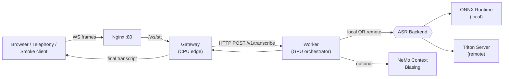
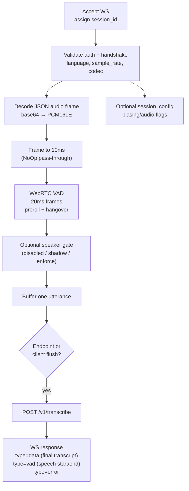
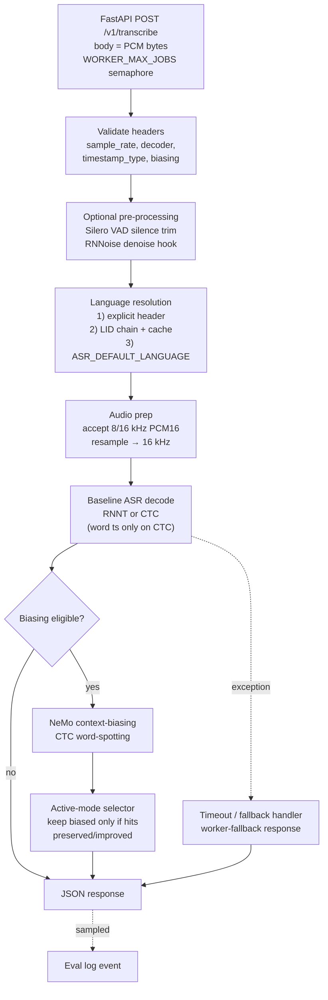
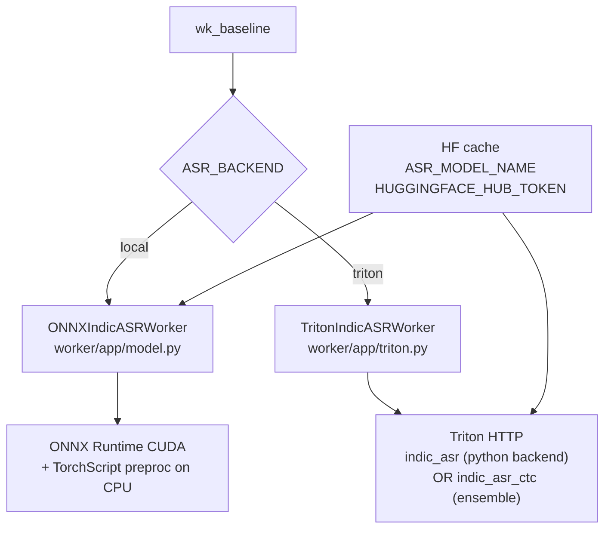
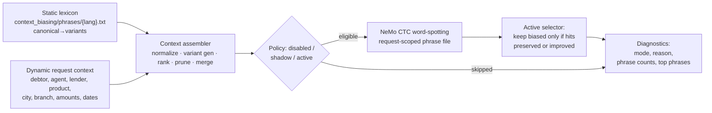
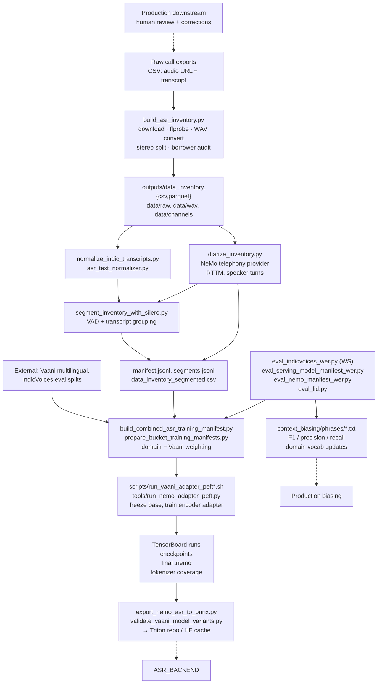
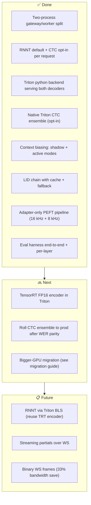

# CredResolve Streaming ASR Architecture

> Companion narrative to [docs/flowchart.mmd](flowchart.mmd).

---

## Part 1: System at a Glance

CredResolve is a **production streaming ASR system** for Indian languages, built around the IndicConformer 600M model. Audio enters over a WebSocket, gets gated by VAD, is decoded by NeMo (locally or via Triton), optionally rescored with phrase-level context biasing, and returned as a final transcript per utterance.



> [!IMPORTANT]
> The system is **streaming-ish**, not full streaming-output. Audio streams in continuously, but transcripts are emitted **per VAD-delimited utterance**, not as live partials. This is by design for the dialer use case.

### Two-process split, why?

| Process | Concerns | Why separated |
|---|---|---|
| **Gateway** | WebSocket lifecycle, auth, VAD, framing | CPU-bound, scales horizontally, no GPU dependency |
| **Worker** | Model loading, ASR inference, biasing, LID | GPU-bound, expensive to start, limited replicas |

The HTTP boundary lets you bounce/redeploy ASR without dropping client WebSockets, and lets multiple gateways share one worker pool.

---

## Part 2: Client & Ingress

### What sends audio

| Client | What it is | Where |
|---|---|---|
| Browser UI | React app, mic capture or WAV upload | [frontend/src/App.tsx](../frontend/src/App.tsx) |
| Audio helpers | Permission, PCM16 framing, file prep | [frontend/src/lib/](../frontend/src/lib/), [frontend/src/utils/](../frontend/src/utils/) |
| Telephony / partner | JSON audio envelopes (Sarvam-like contract) | external |
| Smoke / eval clients | CLI testers and WER harnesses | [tools/ws_client_send_wav.py](../tools/ws_client_send_wav.py), [tools/load_ws.py](../tools/load_ws.py), [tools/eval_indicvoices_wer.py](../tools/eval_indicvoices_wer.py) |

### The wire contract

```
WS connect → /ws/stt?language=hi&model=...&mode=...&sample_rate=16000&input_audio_codec=pcm_s16le
Header: Api-Subscription-Key OR token via subprotocol
```

After the handshake, the client sends **JSON frames** with base64-encoded PCM (or WAV), and may send a `session_config` message to toggle context biasing or audio processing flags mid-session.

### Ingress proxy

[nginx/](../nginx/) reverse-proxies port 80:
- `/` → frontend
- `/ws/stt` → gateway (with WebSocket upgrade headers)

This is also the seam where TLS termination lives in deployed environments.

---

## Part 3: Gateway — CPU Edge

The gateway is a FastAPI service that owns the WebSocket. **It never touches the model.**

### What it does, in order



### Key files

| Concern | File |
|---|---|
| Service entrypoint, WS handler | [gateway/app/main.py](../gateway/app/main.py) |
| Config (env knobs) | [gateway/app/config.py](../gateway/app/config.py) |
| Pipeline orchestration | [gateway/app/pipeline.py](../gateway/app/pipeline.py) |
| WebRTC VAD wrapper | [gateway/app/vad.py](../gateway/app/vad.py), [vad_gate.py](../gateway/app/vad_gate.py) |
| Audio pre-processing module | [gateway/app/apm.py](../gateway/app/apm.py) |
| Speaker gate (opt) | [gateway/app/speaker_gate.py](../gateway/app/speaker_gate.py), [speaker_backends.py](../gateway/app/speaker_backends.py) |
| HTTP client to worker | [gateway/app/worker_client.py](../gateway/app/worker_client.py) |
| Prometheus metrics | [gateway/app/metrics.py](../gateway/app/metrics.py) |

### Headers it sends to the worker

The worker contract is **header-driven**; the body is raw PCM. This keeps the gateway simple — no JSON marshaling on the hot path.

| Header | Meaning |
|---|---|
| `X-Sample-Rate` | 8000 or 16000 |
| `X-Decoder` | `ctc` or `rnnt` |
| `X-Language` | BCP47-ish, e.g. `hi`, `en` |
| `X-Mode` | utterance / final |
| `X-Session-Id` | stable per WS session |
| `X-Utterance-Id` | per-utterance unique |
| `X-Context-Biasing-Request` | JSON blob with dynamic phrases |
| `X-Vad-Enabled`, `X-Denoise-Enabled` | toggle worker-side preprocessing |

### Why VAD lives in the gateway, not the worker

The gateway VAD has **two jobs**: gate audio (don't waste worker GPU on silence) and **define utterance boundaries**. Pushing VAD downstream would either lose the boundary semantics or force the worker to also own the WebSocket. Keeping VAD at the edge lets the worker stay stateless across utterances.

For the full gateway VAD + worker Silero/RNNoise flow, see [docs/audio_pipeline.md](audio_pipeline.md).

---

## Part 4: Worker — GPU Orchestrator

The worker is the brains. It owns the model, language ID, biasing, and the inference timeout.

### Request lifecycle



### Key files

| Concern | File |
|---|---|
| HTTP entrypoint, header parsing | [worker/app/main.py](../worker/app/main.py) |
| Env config (single source of truth) | [worker/app/config.py](../worker/app/config.py) |
| Local-backend NeMo wrapper | [worker/app/model.py](../worker/app/model.py) |
| Triton client + dispatch + CTC ensemble | [worker/app/triton.py](../worker/app/triton.py) |
| Triton helpers (string tensors etc.) | [worker/app/triton_helpers.py](../worker/app/triton_helpers.py) |
| Audio resampling/normalization | [worker/app/audio_processing.py](../worker/app/audio_processing.py) |
| Language ID chain + cache | [worker/app/lid.py](../worker/app/lid.py) |
| Context biasing runtime | [worker/app/context_biasing.py](../worker/app/context_biasing.py) |
| Phrase assembly + ranking | [worker/app/context_assembler.py](../worker/app/context_assembler.py), [phrase_ranker.py](../worker/app/phrase_ranker.py), [variant_generator.py](../worker/app/variant_generator.py) |
| Hindi transliteration (variants) | [worker/app/hindi_transliteration.py](../worker/app/hindi_transliteration.py) |
| Eval logging (sampled events) | [worker/app/eval_logging.py](../worker/app/eval_logging.py) |
| Prometheus metrics | [worker/app/metrics.py](../worker/app/metrics.py) |

### Concurrency control

`WORKER_MAX_JOBS` (semaphore in [main.py](../worker/app/main.py)) caps in-flight inferences. This prevents GPU OOM under burst traffic — extra requests queue at the HTTP layer instead of crashing the worker.

### Where the response shape is set

```json
{
  "text": "...",
  "language": "hi",
  "language_source": "client | lid | fallback | worker-fallback",
  "timestamps": [ /* word-level, only when decoder=ctc */ ],
  "context_biasing": {
    "mode": "shadow | active | disabled",
    "reason": "...",
    "phrase_count": N,
    "top_phrases": [...]
  }
}
```

---

## Part 5: ASR Backend Selection

The worker has **two backends** behind a common interface, picked by `ASR_BACKEND`.



### Local backend (`ASR_BACKEND=local`)

`ONNXIndicASRWorker` (in [worker/app/model.py](../worker/app/model.py)) does `snapshot_download` from Hugging Face, loads ONNX graphs into ORT CUDA sessions, and runs the TorchScript mel preprocessor on CPU. Simpler dev setup; no external server.

### Triton backend (`ASR_BACKEND=triton`, default in `docker-compose.triton.yml`)

`TritonIndicASRWorker` is a thin adapter — validates supported languages, forwards to Triton over HTTP. Inside Triton, two model paths exist:

| Triton model | Backend | Handles |
|---|---|---|
| `indic_asr` | Python backend | RNNT (and CTC fallback) |
| `indic_asr_ctc` | Native ensemble | CTC fast path (preproc + encoder + ctc_decoder) |

Routing between the two lives in `_TritonDispatchModel` ([worker/app/triton.py:311](../worker/app/triton.py#L311)). The split is documented in [docs/decoders.md](decoders.md) and [docs/triton_native_serving_plan.md](triton_native_serving_plan.md).

### Triton model repository layout

```
triton/model_repository/
├── indic_asr/              ← Python backend, RNNT + CTC fallback
├── indic_asr_preproc/      ← LibTorch (mel filterbank)
├── indic_asr_encoder/      ← ONNX Runtime (600M conformer)
├── indic_asr_ctc_decoder/  ← ONNX Runtime (CTC head)
└── indic_asr_ctc/          ← Ensemble wiring the above 3
```

For TensorRT compilation of the encoder (the ~90% compute), see [docs/triton_tensorrt_notes.md](triton_tensorrt_notes.md).

### Model artifacts

`HF_HOME` + `ASR_MODEL_NAME` + `HUGGINGFACE_HUB_TOKEN` define where weights live and which model is loaded. Both backends read from the same cache, so a single `snapshot_download` populates both paths.

---

## Part 6: Context Biasing

Boost domain phrases (debtor names, lender, branch, amounts) without retraining. Implemented as **per-request** runtime decoding on top of the baseline ASR.

### Phrase sources



### Modes

| Mode | What happens |
|---|---|
| `disabled` | Baseline ASR only. No biasing call. |
| `shadow` | Run biased decode in parallel, return baseline, log both. Used to validate without affecting users. |
| `active` | Use biased text **only if** phrase hits are preserved or improved vs baseline. Otherwise return baseline. |

> [!NOTE]
> Biasing is gated to **explicit-language** requests in v1 — auto-LID requests skip biasing because the wrong-language phrase file would degrade output. See [worker/app/context_biasing.py](../worker/app/context_biasing.py) for the policy code.

### Decoder-aware config

NeMo's CTC and RNNT heads expose decoding configs at different paths (`cfg.aux_ctc.decoding` vs `cfg.decoding`). The biasing runtime introspects the model and picks the right one — see [`_resolve_decoder_type()`](../worker/app/context_biasing.py#L565-L607).

### Why CTC for biasing

Word-spotting biasing relies on the CTC frame-aligned token grid — it can score where a phrase candidate would land. RNNT's variable-iteration loop doesn't expose the same per-frame structure cleanly.

---

## Part 7: Observability & Local Deployment

### Compose stack

| Service | Compose file | Role |
|---|---|---|
| nginx | [docker-compose.yml](../docker-compose.yml) | Edge proxy |
| frontend | [docker-compose.yml](../docker-compose.yml) | React UI |
| gateway | [docker-compose.yml](../docker-compose.yml) | WS edge |
| worker | [docker-compose.yml](../docker-compose.yml) | ASR orchestrator |
| prometheus | [docker-compose.yml](../docker-compose.yml) | Metrics scrape |
| grafana | [docker-compose.yml](../docker-compose.yml) | Dashboards |
| node-exporter, dcgm-exporter | [docker-compose.yml](../docker-compose.yml) | Host + GPU metrics |
| triton (overlay) | [docker-compose.triton.yml](../docker-compose.triton.yml) | Inference server (opt) |
| context biasing (overlay) | [docker-compose.context_biasing.yml](../docker-compose.context_biasing.yml) | Pin biasing flags |
| diarization (overlay) | [docker-compose.diarization.yml](../docker-compose.diarization.yml) | Offline diarization deps |

### Health & metrics endpoints

| Endpoint | Service | Use |
|---|---|---|
| `/healthz` | gateway | liveness |
| `/healthz` | worker | liveness (model loaded) |
| `/v2/health/ready` | Triton | model load status |
| `/metrics` | gateway | Prometheus |
| `/metrics` | worker | Prometheus |
| `:8102` | Triton | Triton-native metrics |

### Logs

Structured JSON to stdout + tailing files in `/home/ubuntu/logs`. Sampled eval events go to a separate file via [worker/app/eval_logging.py](../worker/app/eval_logging.py) for offline mining.

### Env contract

`.env` (template at [.env.example](../.env.example)) is the **single knob surface**: backend selection, model names, timeouts, language list, biasing mode defaults, LID toggles, Triton endpoint and model names, HF token. Both gateway and worker read from it; no other config files at runtime.

---

## Part 8: Offline Data, Training & Evaluation Loop

This is the **continuous-improvement flywheel**. Production traffic feeds back into training data and phrase packs.



### Inventory pipeline

[build_asr_inventory.py](../build_asr_inventory.py) is the entrypoint for ingesting raw call data: pulls audio, ffprobes metadata, retains MP3/raw, converts to mono WAV, splits stereo, and runs a borrower-channel audit. Outputs land in `outputs/` and `data/`.

### Segmentation & diarization

| Tool | Purpose |
|---|---|
| [tools/segment_inventory_with_silero.py](../tools/segment_inventory_with_silero.py) | VAD-driven utterance splits + transcript grouping |
| [tools/diarize_inventory.py](../tools/diarize_inventory.py) | Optional speaker diarization via NeMo telephony provider |

Diarization adds speaker-aware fields to the manifests; it's optional but recommended for two-party telephony data.

### Training (PEFT-only)

The base IndicConformer is **frozen**; only an encoder adapter is trained. This:
- Keeps each fine-tune small (MB, not GB)
- Lets you stack adapters per domain
- Avoids catastrophic forgetting on the base languages

Entry points:
- [scripts/run_vaani_adapter_peft.sh](../scripts/run_vaani_adapter_peft.sh) — 16 kHz wide-band
- [scripts/run_vaani_adapter_peft_8khz.sh](../scripts/run_vaani_adapter_peft_8khz.sh) — 8 kHz telephony
- [tools/run_nemo_adapter_peft.py](../tools/run_nemo_adapter_peft.py) — underlying trainer

### Export → serving

[tools/export_nemo_asr_to_onnx.py](../tools/export_nemo_asr_to_onnx.py) converts the `.nemo` checkpoint to ONNX graphs that drop into the Triton model repo. [tools/validate_vaani_model_variants.py](../tools/validate_vaani_model_variants.py) checks each variant before promotion.

### Evaluation suite

| Tool | Tests what |
|---|---|
| [tools/eval_indicvoices_wer.py](../tools/eval_indicvoices_wer.py) | End-to-end WER over the WebSocket (full system test) |
| [tools/eval_serving_model_manifest_wer.py](../tools/eval_serving_model_manifest_wer.py) | Serving-side WER on a manifest (worker layer) |
| [tools/eval_nemo_manifest_wer.py](../tools/eval_nemo_manifest_wer.py) | Pure-NeMo WER (model layer, no infra) |
| [tools/eval_lid.py](../tools/eval_lid.py) | Language ID accuracy |
| [tools/compare_indicvoices_iterations.py](../tools/compare_indicvoices_iterations.py) | Diff WER between two model iterations |

### Phrase-pack iteration

Errors mined from evals → updated `context_biasing/phrases/{lang}.txt` files → measured by precision/recall/F1 on keywords. Static phrase packs ship with the repo; dynamic phrases are sent per-request.

---

## Part 9: Cross-Cutting Concerns

### Languages

- Default: `hi` (Hindi)
- Supported: configured via `ASR_SUPPORTED_LANGS` env var
- Per-request: `language` query param on WS, `X-Language` header on worker call
- Auto-LID: opt-in via `ASR_ENABLE_LID`, with a fallback chain (primary → fallback) cached per session

### Sample rate

Currently **16 kHz only** at the WS contract; worker accepts 8 kHz PCM and resamples internally for the model. Telephony 8 kHz training uses a separate adapter (the `_8khz` PEFT script).

### Codecs accepted

`wav`, `pcm_s16le`, `pcm_l16`, `pcm_raw` — all collapse to PCM16LE inside the gateway.

### Auth

`Api-Subscription-Key` header **or** token via WebSocket subprotocol. See [docs/websocket_auth_migration.md](websocket_auth_migration.md).

### Failure modes & fallbacks

| Failure | Behavior |
|---|---|
| Model not ready | 503; gateway returns `type=error` |
| Inference timeout | `worker-fallback` response with empty text + tagged source |
| Triton ensemble error (CTC) | Fall back to python-backend `indic_asr` |
| LID error / low confidence | Fall back to `ASR_DEFAULT_LANGUAGE`; tag `language_source` |
| Biasing exception | Return baseline transcript with `mode=disabled, reason=error` |

The pattern: **never fail the request because of an optional optimization**. Optimizations have safety nets back to the simpler path.

---

## Part 10: Glossary

| Term | Meaning |
|---|---|
| **VAD** | Voice Activity Detection. WebRTC VAD on gateway; Silero VAD on worker (optional). |
| **LID** | Language Identification — predicts language when client doesn't send one. |
| **PEFT** | Parameter-Efficient Fine-Tuning. Here: encoder-adapter only, base model frozen. |
| **Adapter** | Small trainable module inserted into a frozen backbone. NeMo-native concept. |
| **Context biasing** | Phrase-level decoding boost for domain vocab. Per-request, no retraining. |
| **Word-spotting** | NeMo's CTC-based biasing decode that scores phrase candidates against the lattice. |
| **Phrase pack** | A `{lang}.txt` file of canonical phrases + comma-separated variants. |
| **Variant** | A spelling/script alternative for a phrase (e.g. transliteration). |
| **Endpointing** | Deciding when an utterance has ended (VAD hangover + flush). |
| **Speaker gate** | Optional filter that drops audio from non-target speakers (shadow / enforce). |
| **Diarization** | Splitting audio into per-speaker turns. Used offline for training data, not at inference. |
| **Inventory** | The normalized table of (audio, transcript, metadata) ingested from raw call exports. |
| **Manifest** | NeMo-format JSONL feeding training/eval. |
| **Bucket manifest** | Manifest split by audio-duration buckets for efficient batched training. |
| **`.nemo`** | NeMo's checkpoint archive (config + weights + tokenizer). |
| **Snapshot download** | `huggingface_hub` call that pins a model revision and caches under `HF_HOME`. |

---

## Part 11: Where to Start Reading (by goal)

| If you want to... | Start here |
|---|---|
| Trace a request end-to-end | [gateway/app/main.py](../gateway/app/main.py) → [gateway/app/pipeline.py](../gateway/app/pipeline.py) → [gateway/app/worker_client.py](../gateway/app/worker_client.py) → [worker/app/main.py](../worker/app/main.py) |
| Change a knob | [.env.example](../.env.example) → [gateway/app/config.py](../gateway/app/config.py) / [worker/app/config.py](../worker/app/config.py) |
| Switch decoders | [docs/decoders.md](decoders.md) |
| Make Triton faster | [docs/triton_native_serving_plan.md](triton_native_serving_plan.md), [docs/triton_tensorrt_notes.md](triton_tensorrt_notes.md) |
| Fine-tune the model | [docs/vaani_adapter_peft.md](vaani_adapter_peft.md), [scripts/run_vaani_adapter_peft.sh](../scripts/run_vaani_adapter_peft.sh) |
| Tune context biasing | [context_biasing/README.md](../context_biasing/README.md), [docs/context_biasing.md](context_biasing.md), [worker/app/context_biasing.py](../worker/app/context_biasing.py) |
| Run an eval | [tools/eval_indicvoices_wer.py](../tools/eval_indicvoices_wer.py) |
| Migrate to a bigger GPU | [docs/bigger_gpu_migration_guide.md](bigger_gpu_migration_guide.md) |
| Understand the IndicConformer model | [docs/indicconformer_module_reference.md](indicconformer_module_reference.md) |
| See system design rationale | [docs/production_system_design.md](production_system_design.md) |

---

## Part 12: Current State & Roadmap



---

## TL;DR

- **Two-process system**: a CPU gateway owns the WebSocket, VAD, and framing; a GPU worker owns the model, LID, and biasing. They talk over HTTP with PCM bodies and headers.
- **Streaming-ish**: audio streams in, transcripts come out per VAD-delimited utterance.
- **Two ASR backends** behind one interface: local ONNX Runtime, or Triton (with a fast-path CTC ensemble + python-backend RNNT).
- **Per-request decoder choice**: RNNT for accuracy (default), CTC for latency and word timestamps.
- **Context biasing** is per-request, decoder-aware, and gated to explicit-language requests; runs in shadow or active modes with a safety net back to baseline.
- **Continuous-improvement loop**: production data → inventory → segmented manifests → adapter PEFT → ONNX export → Triton repo, with WER eval gates at every step.
- **Optional everything has a fallback**: ensemble → python backend, LID → default language, biasing → baseline. The request never fails because of an optimization.
