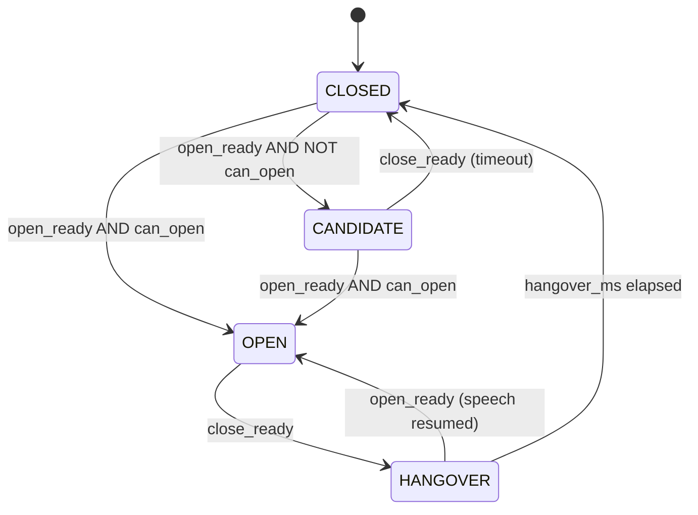

# Noise Cancellation Layer — Complete Deep Dive

> **Scope:** Everything between raw PCM arriving at the WebSocket gateway and clean speech bytes reaching the ASR model. Two distinct processing planes: the **Gateway real-time VAD gate** and the **Worker batch AudioPreprocessor** (Silero VAD + DeepFilterNet3 denoiser, with RNNoise as fallback).

---

## 1. Architecture Overview

The system runs noise-suppression and voice-activity detection in **two separate stages**, on two separate services, with different engines and different goals.

```
Browser (getUserMedia — AEC+NS applied at device/browser layer)
    │  raw PCM 16 kHz mono via WebSocket
    ▼
┌──────────────────────────────────────────────────────────────┐
│  GATEWAY  (CPU node)                                         │
│                                                              │
│  1. NoOpAudioProcessor  — 10 ms framing only                 │
│  2. webrtcvad (mode=3)  — per-frame voiced/unvoiced          │
│  3. VADGateStateMachine — CLOSED/CANDIDATE/OPEN/HANGOVER     │
│  4. SpeakerVerificationGate — dormant; intentionally OFF     │
│  5. Ring-buffer preroll — 600 ms lookback, wired             │
│                                                              │
│  Streams raw PCM (gate-open frames only)                     │
│      ──► HTTP POST /v1/transcribe ──► Worker                 │
└──────────────────────────────────────────────────────────────┘
    │  raw PCM bytes (entire buffered utterance)
    ▼
┌──────────────────────────────────────────────────────────────┐
│  WORKER  (GPU node)                                          │
│                                                              │
│  AudioPreprocessor (if vad_enabled / denoise_enabled)        │
│                                                              │
│  Stage A — Silero VAD (PyTorch neural)                       │
│    → speech_timestamps[]                                     │
│    → segment selection: concat | loudest                     │
│                                                              │
│  Stage B — DeepFilterNet3 (PyTorch, 48 kHz mono)            │
│    → deep-learning noise suppression (default)               │
│    → RNNoise (C library, 48 kHz framed loop) as fallback     │
│    → resample back to session sample_rate                    │
│                                                              │
│  Clean PCM → NeMo / Triton ASR inference                     │
└──────────────────────────────────────────────────────────────┘
```

**Key design decision:** The gateway does **not** run noise suppression — only voice-activity gating. The `apm_enabled` flag (historically present) has been fully removed; `NoOpAudioProcessor` is the only audio processor wired in the gateway today (see [apm-decision.md](apm-decision.md)). Noise suppression lives exclusively in the worker, with **DeepFilterNet3** as the default backend and **RNNoise** retained as a one-release fallback (selectable via `DENOISER=rnnoise`).

**Implementation status after code verification:**
- **Ring-buffer preroll** is wired in `StreamingSpeechPipeline` (`deque(maxlen=config.ring_buffer_frames)`, append while closed/candidate, flush on open). Verified in production.
- **`SpeakerVerificationGate`** is wired into the pipeline state-machine path but is **intentionally kept disabled in production** — this is a product decision, not a missing implementation. Real customer calls routinely involve speaker handoffs (the person who answers passes the phone to a family member, an agent transfers the call, multiple household members participate). An `ENFORCE`-mode cosine gate against a single enrolled embedding would silently drop the second speaker's utterances and make the call appear to "stop transcribing" mid-conversation, which is worse than no gate. The class therefore stays as dormant scaffolding behind `SPEAKER_VERIFICATION_MODE=disabled`; no production embedding backend will be wired.

---

## 2. Gateway Layer — Real-Time VAD Gate

**Files:** `gateway/app/apm.py`, `gateway/app/vad_gate.py`, `gateway/app/vad.py`, `gateway/app/pipeline.py`, `gateway/app/speaker_gate.py`

### 2.1 Audio Framing — `NoOpAudioProcessor`

```python
# gateway/app/apm.py
FRAME_MS    = 10
SAMPLE_RATE = 16000
FRAME_BYTES = int(16000 * (10 / 1000.0) * 2)  # = 320 bytes
```

Every PCM chunk arriving via WebSocket is split into **10 ms / 320-byte frames**. `NoOpAudioProcessor.process_frame()` performs zero signal processing — its sole job is ensuring bytes are correctly sized before reaching the VAD. The `AudioProcessor` Protocol abstraction exists so a real NS/AGC backend could be slotted in behind the same interface.

### 2.2 WebRTC VAD — per-frame voiced/unvoiced classification

```python
# gateway/app/pipeline.py  line 102
self._vad_detector = webrtcvad.Vad(config.vad.vad_mode)  # mode=3

# per 20 ms frame (line 185)
is_speech = bool(self._vad_detector.is_speech(frame, self.config.sample_rate))
```

- **Engine:** `py-webrtcvad` — wraps Google's C++ WebRTC VAD (DSP, no GPU, microsecond latency).
- **Mode 3** is the most aggressive setting: maximises the chance of labelling a frame as non-speech, minimising false-positive gate opens on phone noise/hold music.
- The VAD itself operates on 20 ms frames; the pipeline re-slices the `_vad_buffer` after the 10 ms framing stage.

### 2.3 `VADGateStateMachine` — hysteresis state machine

**File:** `gateway/app/vad_gate.py`

The gate prevents noisy single-frame blips from triggering utterances using two sliding windows and four states.

#### States

| State | Meaning |
|---|---|
| `CLOSED` | No speech; frames enter ring-buffer only |
| `CANDIDATE` | Speech pattern seen but speaker not yet authorized |
| `OPEN` | Active utterance; frames forwarded to ASR stream |
| `HANGOVER` | Silence after speech; grace window before finalizing |

#### Open condition

```python
open_ready = (
    len(self._open_window) == open_window_frames           # 3 frames
    and sum(voiced_in_window) >= open_required_voiced      # ≥ 2 of 3 voiced
)
```

At least **2 voiced frames in the last 3** before the gate opens. A single noise blip cannot trigger an utterance.

#### Close condition

```python
close_ready = (
    len(self._close_window) == close_window_frames         # 5 frames
    and sum(unvoiced_in_window) >= close_required_unvoiced # ≥ 4 of 5 unvoiced
)
```

The gate does not close on first silence — it needs **4 unvoiced frames out of 5** before entering `HANGOVER`.

#### HANGOVER — short-pause tolerance

When `close_ready` fires from `OPEN`, gate moves to `HANGOVER` for `hangover_ms = 200 ms` (10 frames at 20 ms each):
- Speech resumes → return to `OPEN` (same utterance continues, no split).
- 200 ms elapses → move to `CLOSED`, finalize utterance.

This prevents natural inter-word pauses from splitting one utterance into many.

#### CANDIDATE — speaker-throttled open

When `SpeakerVerificationGate` is in `ENFORCE` mode and speaker not yet authorized (`can_open=False`), a speech pattern moves state to `CANDIDATE` instead of `OPEN`. Gate waits; if silence wins first (`close_ready`) it discards back to `CLOSED`.

#### State Transition Diagram



### 2.4 Ring Buffer — Preroll

```python
self._ring_buffer = deque(maxlen=config.ring_buffer_frames)
# ring_buffer_frames = 600 ms / 20 ms = 30 frames
```

While gate is `CLOSED` or `CANDIDATE`, every frame is appended to the ring buffer (capped at 600 ms). When gate transitions to `OPEN`, the **entire ring buffer is flushed as preroll** to the ASR stream — ensuring word beginnings are never clipped.

**Wiring status:** verified wired in `gateway/app/pipeline.py`. The default lookback is 600 ms via `STREAMING_RING_BUFFER_MS`; `gateway/app/config.py` clamps this to at least 600 ms.

### 2.5 `VADSegmenter` — alternative utterance boundary detector

**File:** `gateway/app/vad.py`

A second, simpler webrtcvad-backed boundary detector usable independently of the gate state machine.

| Parameter | Default | Meaning |
|---|---|---|
| `frame_ms` | 20 ms | Frame resolution |
| `end_silence_ms` | 320 ms | Continuous silence needed to close segment |
| `keep_silence_ms` | 120 ms | Trailing silence to retain (natural word endings) |
| `max_utt_ms` | 12 000 ms | Hard utterance cap — prevents GPU OOM on long audio |

The 12-second cap fires a forced `max_utt` flush regardless of silence — crucial protection against an unbroken background noise stream holding a GPU slot indefinitely.

### 2.6 `SpeakerVerificationGate` — identity-aware gating

**File:** `gateway/app/speaker_gate.py`

Runs in parallel with the VAD gate. In `ENFORCE` mode it withholds `can_open=True` until cosine similarity between voiced audio and an enrolled embedding crosses `threshold` (default 0.70).

```python
embedding   = _normalize_embedding(embedder.compute_embedding(chunk, sample_rate=16000))
similarity  = float(np.dot(embedding, self._enrolled_embedding))
accepted    = similarity >= self.config.threshold
```

**Scoring schedule:**
1. **First decision:** after `decision_window_ms` (360 ms) of voiced audio.
2. **Rescoring:** every `rescore_interval_ms` (200 ms) thereafter.

| Mode | Behavior |
|---|---|
| `DISABLED` | `allows_open()` always `True`; no audio stored |
| `SHADOW` | Scores computed and logged; `can_open` always `True` |
| `ENFORCE` | Withholds `can_open` until similarity ≥ threshold |

**Wiring status:** the gate class, cosine scoring, metrics, and VAD state-machine integration are present. Production verification is not wired because `gateway/app/main.py::build_speaker_embedder()` only supports `SPEAKER_VERIFICATION_BACKEND=debug_fixed_similarity`; the real embedding backend is still a TODO. `SHADOW` / `ENFORCE` should therefore be treated as debug-only until a real `SpeakerEmbedder` and enrollment path are bound.

### 2.7 Full Gateway Frame Processing Path

```
push_audio(pcm_bytes)
    │
    ├─ Framing buffer → 10 ms NoOp frames → pass-through
    │
    ├─ VAD buffer → 20 ms VAD frames
    │
    └─ _process_vad_frame(frame)
           │
           ├─ webrtcvad.is_speech()              ← DSP classification
           ├─ track utterance_started_at          ← first voiced frame
           ├─ VADSignalEvent("speech_start")      ← if first voiced frame
           │
           ├─ ring_buffer.append(frame)           ← if NOT open/hangover
           │
           ├─ speaker_gate.process_frame()        ← cosine scoring
           ├─ gate.process_frame(is_speech, can_open)
           │
           ├─ [if gate just OPENED]
           │       flush ring_buffer as preroll → ASR stream
           │
           ├─ [if gate OPEN or HANGOVER]
           │       push frame → ASR stream
           │
           ├─ maybe_collect_partial()             ← poll every 900 ms
           │
           └─ [if gate just CLOSED]
                   end_stream() → final transcript
                   VADSignalEvent("speech_end")
```

---

## 3. Worker Layer — Batch AudioPreprocessor

**File:** `worker/app/audio_processing.py`

Activated only when gateway forwards `X-VAD-Enabled: true` or `X-Denoise-Enabled: true` headers (session flags `vad_enabled` / `denoise_enabled`). Defaults: `STREAMING_VAD_ENABLED=false`, `STREAMING_DENOISE_ENABLED=true`.

A module-level singleton is provided via `get_audio_preprocessor()` (LRU-cached, maxsize=1). Called via `asyncio.to_thread()` to avoid blocking the event loop.

### 3.1 Stage A — Silero VAD (PyTorch neural)

```python
self.vad_model, self.utils = torch.hub.load(
    repo_or_dir="snakers4/silero-vad",
    model="silero_vad",
    force_reload=False,
)
```

**Input conversion:**

```python
audio_float32 = audio_int16.astype(np.float32) / 32768.0
audio_tensor  = torch.from_numpy(audio_float32)
```

**Inference:**

```python
get_speech_timestamps = self.utils[0]
speech_timestamps = get_speech_timestamps(
    audio_tensor, self.vad_model, sampling_rate=16000
)
# Returns: [{"start": int, "end": int}, ...]  — sample-index spans
```

**Early-exit on silence:** If `speech_timestamps` is empty, `process_with_stats()` returns `b""` immediately. The worker then returns `language_source: "vad_filtered"` — no ASR call is made.

### 3.2 Segment Selection — `_select_segments()`

Two modes controlled by `VAD_SELECT_MODE` env var:

#### `concat` (default, recommended)

```python
padding = np.zeros(vad_concat_padding_ms * sr // 1000, dtype=np.int16)  # 100 ms zeros

pieces = []
for ts in speech_timestamps:
    segment = audio_int16[ts["start"]:ts["end"]]
    if pieces and padding is not None:
        pieces.append(padding)   # gap between segments
    pieces.append(segment)

return np.concatenate(pieces)
```

All speech segments concatenated in time order with a configurable zero-padding gap (default 100 ms). Preserves multi-segment utterances like "Yes — [pause] — I agree." fully.

#### `loudest` (legacy, not recommended)

```python
for ts in speech_timestamps:
    rms = get_rms(audio_int16[ts["start"]:ts["end"]])
    if rms > max_rms:
        loudest_segment = segment

return loudest_segment
```

Keeps only the highest-RMS segment, discarding all other speech. Known to lose legitimate content in multi-segment utterances. `concat` is preferred for production.

### 3.3 Stage B — Denoiser (DeepFilterNet3 default, RNNoise fallback)

All denoiser adapters operate at **48 kHz mono int16 PCM** and share the same byte-in / byte-out contract. The caller (`AudioPreprocessor`) handles resampling around the adapter.

```python
target_sr = 48000

with self._denoise_lock:           # adapters are stateful / not documented thread-safe
    pcm_48k     = resample_int16(pcm_bytes, sample_rate, target_sr)
    cleaned_48k = self.rnnoise.process(pcm_48k)   # field name is historical; holds DFN3 by default
    pcm_bytes   = resample_int16(cleaned_48k, target_sr, sample_rate)
```

Steps:
1. **Upsample** session sample-rate → 48 kHz via `resample_int16` (soxr, HQ quality). `resample_int16` is a no-op when input and output rates match.
2. **Denoise** through whichever adapter is loaded (see selection logic below).
3. **Downsample** 48 kHz → session sample-rate via `resample_int16`.
4. `_denoise_lock` serializes the entire upsample → denoise → downsample block. DeepFilterNet3 wraps a PyTorch model (`enhance()` is not safe to call concurrently with shared state); RNNoise's C wrappers are also stateful and not documented as thread-safe.

> **Field naming note:** `self.rnnoise` on `AudioPreprocessor` predates the DeepFilterNet3 swap. It now holds whichever adapter was selected by `_load_denoiser()` — usually `_DeepFilterNetDenoiser`. The name is preserved to avoid touching call sites, not because the engine is RNNoise.

#### Backend selection — `_load_denoiser()`

Driven by the `DENOISER` env var (validated in `worker/app/config.py`; default **`deepfilternet`**, also accepts `rnnoise`):

```python
choice = (config.DENOISER or "rnnoise").strip().lower()
if choice == "deepfilternet":
    try:    return _DeepFilterNetDenoiser()
    except: log.warning("...falling back to RNNoise"); 
return self._load_rnnoise()    # tries pyrnnoise, then rnnoise_wrapper
```

| Order | Adapter | Underlying lib | Notes |
|---|---|---|---|
| 1 (default) | `_DeepFilterNetDenoiser` | `deepfilternet>=0.5.6` (PyTorch — `df.enhance.init_df` / `enhance`) | Whole-utterance call: int16 → float32 in [-1,1] → `(1, samples)` tensor → `enhance()` → clip → int16. 48 kHz only; raises if `df_state.sr() != 48000`. |
| 2 | `_PyRNNoiseDenoiser` | `pyrnnoise==0.4.3` (kept as one-release fallback) | `RNNoise.denoise_chunk(audio, partial=True)` — library handles internal framing |
| 3 | `_RNNoiseWrapperDenoiser` | `rnnoise_wrapper` (legacy) | Manual 480-sample (10 ms @ 48 kHz) frame loop, tail zero-padded; uses `process_frame` / `filter_frame` whichever the wrapper exposes |

If `DENOISER=deepfilternet` but the package isn't installed (or DFN init throws), the loader logs a warning and falls through to `_load_rnnoise()`. If no backend imports, `self.rnnoise` is `None`, the worker logs a warning, and the denoise stage is silently skipped (audio passes through unchanged).

#### Build-time Rust toolchain (worker image)

`deepfilterlib` (the Rust extension inside `deepfilternet`) is compiled from
source during `docker build` because the PyTorch CUDA base image does not
include Rust/Cargo. `worker/Dockerfile` installs rustup, runs `pip install`
with Cargo on `PATH`, then removes the entire toolchain in the same `RUN`
layer so it never lands in the runtime image. Full details — dependency chain,
Dockerfile layer rationale, all rustup flags, runtime adapter behaviour, thread
safety model, fallback chain, and verification steps — are in
[deepfilternet-build.md](deepfilternet-build.md). End-to-end image validation
is in [`scripts/verify_worker_image.sh`](../../scripts/verify_worker_image.sh).

#### Resampler note

`audioop` was previously used for 16 ↔ 48 kHz conversion but has been replaced with [`worker/app/_audio_ops.py`](../../worker/app/_audio_ops.py) (`soxr`-backed `resample_int16`). The shared helper is also used by `tools/benchmarks/audio_bench` so the production path and the bench path cannot drift. This unblocks Python 3.13 (where `audioop` is removed) and yields higher-quality resampling than `audioop.ratecv`'s linear interpolation.

### 3.4 `process_with_stats()` — execution flow

```
process_with_stats(pcm_bytes, sample_rate, vad_enabled, denoise_enabled)
    │
    ├─ pcm_bytes → int16 numpy array
    │
    ├─ [if vad_enabled AND model loaded]
    │   ├─ int16 → float32 → torch tensor
    │   ├─ Silero VAD → speech_timestamps[]
    │   ├─ [if empty] → return b"", stats  (early exit, no ASR call)
    │   ├─ _select_segments() → speech-only int16 array
    │   └─ stats: vad_seconds, vad_segments, speech_ratio
    │
    ├─ [if denoise_enabled AND denoiser loaded]
    │   ├─ resample_int16 (soxr) upsample → 48 kHz
    │   ├─ DeepFilterNet3 adapter (or RNNoise fallback) → denoised 48 kHz PCM
    │   ├─ resample_int16 (soxr) downsample → original sample_rate
    │   └─ stats: denoise_seconds, denoise_input/output_samples
    │
    └─ return (pcm_bytes, stats)
```

---

## 4. Configuration Reference

### Gateway (`gateway/app/config.py`)

| Env Variable | Default | Description |
|---|---|---|
| `STREAMING_VAD_ENABLED` | `false` | Per-session default for worker-side Silero VAD |
| `STREAMING_DENOISE_ENABLED` | `true` | Per-session default for RNNoise |
| `STREAMING_VAD_MODE` | `3` | webrtcvad aggressiveness (0=least, 3=most aggressive) |
| `STREAMING_RING_BUFFER_MS` | `600` | Lookback preroll before gate open |
| `STREAMING_GATE_OPEN_WINDOW_FRAMES` | `3` | Sliding window size for open check |
| `STREAMING_GATE_OPEN_REQUIRED_VOICED_FRAMES` | `2` | Min voiced frames in window to open |
| `STREAMING_GATE_CLOSE_WINDOW_FRAMES` | `5` | Sliding window size for close check |
| `STREAMING_GATE_CLOSE_REQUIRED_UNVOICED_FRAMES` | `4` | Min unvoiced frames in window to close |
| `STREAMING_HANGOVER_MS` | `200` | Grace window before gate finalizes utterance |
| `SPEAKER_VERIFICATION_MODE` | `disabled` | `disabled` / `shadow` / `enforce` |
| `SPEAKER_VERIFICATION_BACKEND` | `external` | Backend selector; only `debug_fixed_similarity` is implemented today |
| `SPEAKER_VERIFICATION_ENROLLED_EMBEDDING_PATH` | empty | Required for non-debug production verification, but no production embedder is wired yet |
| `SPEAKER_VERIFICATION_THRESHOLD` | `0.70` | Cosine similarity threshold for accept |
| `SPEAKER_VERIFICATION_FIRST_DECISION_MS` | `360` | ms of voiced audio before first score |
| `SPEAKER_VERIFICATION_RESCORE_MS` | `200` | Rescore interval after first decision |

### Worker (`worker/app/config.py`)

| Env Variable | Default | Description |
|---|---|---|
| `VAD_SELECT_MODE` | `concat` | Segment selection: `concat` or `loudest` |
| `VAD_CONCAT_PADDING_MS` | `100` | Zero-padding between concatenated speech segments |
| `DENOISER` | `deepfilternet` | Denoiser backend: `deepfilternet` (default) or `rnnoise` (fallback). Invalid values fall back to `deepfilternet`. |

### Per-request overrides (WebSocket query params / `session.update`)

| Parameter | Type | Description |
|---|---|---|
| `vad_enabled` | bool | Enable Silero VAD on worker for this session |
| `denoise_enabled` | bool | Enable RNNoise on worker for this session |

---

## 5. Prometheus Metrics

### Gateway (`gateway/app/metrics.py`)

| Metric | Type | Description |
|---|---|---|
| `asr_vad_frames_total{state}` | Counter | Frames labelled `speech` / `non_speech` by webrtcvad |
| `asr_gate_transitions_total{from_state,to_state,reason}` | Counter | VAD gate state machine transitions |
| `asr_time_to_first_gate_open_seconds` | Histogram | First speech frame → first `OPEN` |
| `asr_final_transcript_latency_seconds` | Histogram | First speech frame → final transcript |
| `asr_speaker_similarity` | Histogram | Speaker cosine similarity distribution |
| `asr_speaker_score_events_total{mode,decision}` | Counter | Speaker accept/reject decisions |
| `asr_speaker_false_accepts_total` | Counter | Manually recorded false accepts |
| `asr_speaker_false_rejects_total` | Counter | Manually recorded false rejects |

### Worker (`worker/app/metrics.py`)

| Metric | Type | Labels | Description |
|---|---|---|---|
| `asr_worker_audio_stage_seconds` | Histogram | `stage`, `vad_select_mode`, `denoise_enabled` | Per-stage latency: `vad`, `denoise`, `total` |
| `asr_worker_audio_vad_segments` | Histogram | `vad_select_mode` | Detected speech segments per call |
| `asr_worker_audio_frames_total` | Counter | `stage`, `direction` | Sample counts in/out of vad and denoise stages |
| `asr_worker_audio_speech_ratio` | Histogram | `vad_select_mode` | Post-VAD sample ratio vs input |

---

## 6. End-to-End Data Flow

```
1. Browser captures audio
   getUserMedia({ echoCancellation:true, noiseSuppression:true })
   └─ AEC + NS applied at device layer — not duplicated server-side

2. WebSocket frames (raw PCM 16kHz mono) arrive at Gateway

3. NoOpAudioProcessor: chunks sliced into 10 ms / 320-byte frames

4. webrtcvad (mode=3): per 20 ms frame → voiced: true/false

5. VADGateStateMachine:
   CLOSED  → frames → ring buffer (600 ms lookback)
   OPEN    → frames → BufferedWorkerRNNTStream.push_audio()
   HANGOVER → frames forwarded, countdown to CLOSED

6. SpeakerVerificationGate (if ENFORCE mode; debug backend only today):
   withholds can_open until cosine similarity ≥ 0.70

7. Gate opens → ring buffer preroll flushed + new frames → stream

8. Gate closes → stream.end_stream() → HTTP POST /v1/transcribe

9. Worker receives PCM (full utterance buffer)

10. AudioPreprocessor (if vad_enabled or denoise_enabled):
    Stage A: Silero VAD → speech_timestamps → segment concat/loudest
    Stage B: DeepFilterNet3 at 48 kHz (RNNoise fallback) → noise suppression

11. Clean PCM → NeMo/Triton ASR → transcript text
```

---

## 7. Known Gaps and Planned Improvements

| # | Gap | Severity | Planned Fix |
|---|---|---|---|
| 1 | `torch.hub.load` hits network on first boot | Medium | Pin Silero weights locally via `pip install silero-vad` |
| 2 | DeepFilterNet3 calls `enhance()` on the whole utterance under a global lock — denoise latency is utterance-length-bound and not amortized across sessions | Medium | Per-session/per-thread denoiser pool, or move DFN to a streaming/chunked call |
| 3 | RNNoise fallback path: wrapper-fallback frame loop is pure Python (slow on long audio); `pyrnnoise.denoise_chunk` is the fast path. Only exercised when DFN3 fails to load. | Low | Kept as one-release safety net; remove once DFN3 is proven stable in production |
| 4 | No streaming denoiser — worker operates on the complete utterance buffer only | Medium | Per-session `StreamingAudioProcessor` (P3) |
| 5 | `loudest` mode drops multi-segment speech | Low | `concat` is now default; `loudest` may be removed |
| 6 | Audio preprocessor coverage is mostly unit-level (see `worker/tests/test_audio_processing.py`) | Medium | Add integration/load tests around real Silero/DeepFilterNet/RNNoise availability and long utterances |
| 7 | Single `AudioPreprocessor` instance + `_denoise_lock` serializes denoise across all sessions | Medium | Per-thread instance pool, or replace with a thread-safe denoiser |
| 8 | Denoiser instance is shared across utterances (singleton); cross-utterance state bleed is theoretically possible (DFN3 keeps `df_state`; RNNoise wrappers are stateful) | Low | Reset adapter state per utterance, or instantiate per-call |
| 9 | Production speaker embedding backend is not wired; speaker verification works only with `debug_fixed_similarity` today | High | Bind a real `SpeakerEmbedder`, enrollment storage/loading, calibration, and integration tests before enabling `SHADOW` / `ENFORCE` in production |

---

## 8. File Reference

| File | Role |
|---|---|
| `gateway/app/apm.py` | `NoOpAudioProcessor` — 10 ms framing, zero signal change |
| `gateway/app/vad_gate.py` | `VADGateStateMachine` — four-state gate with hysteresis |
| `gateway/app/vad.py` | `VADSegmenter` — buffer, speech_end, 12s max_utt cap |
| `gateway/app/pipeline.py` | `StreamingSpeechPipeline` — joins framing → VAD → speaker gate → RNNT |
| `gateway/app/speaker_gate.py` | `SpeakerVerificationGate` — cosine similarity speaker identity gate; production backend not wired yet |
| `gateway/app/config.py` | All gateway config knobs for VAD/denoise/speaker |
| `gateway/app/metrics.py` | Gateway Prometheus metrics |
| `worker/app/audio_processing.py` | `AudioPreprocessor`, `_PyRNNoiseDenoiser`, `_RNNoiseWrapperDenoiser`, `get_audio_preprocessor()` LRU singleton |
| `worker/app/_audio_ops.py` | `resample_int16` (soxr) + `audioop` replacements shared with the bench harness |
| `worker/app/config.py` | `VAD_SELECT_MODE`, `VAD_CONCAT_PADDING_MS`, worker toggle defaults |
| `worker/app/metrics.py` | Worker audio-stage Prometheus metrics |
| `worker/app/main.py` `/v1/transcribe` handler | Reads `X-VAD-Enabled` / `X-Denoise-Enabled` headers and calls `get_audio_preprocessor().process()` via `asyncio.to_thread` (~lines 796–841) |
| `worker/app/main_v2.py` | gRPC/v2 path also calls `get_audio_preprocessor().process()` |
| `worker/tests/test_audio_processing.py` | Unit coverage for VAD select modes and stat shape |
| [apm-decision.md](apm-decision.md) | Historical rationale for removing `apm_enabled` from public schema |
| [../plan_for_audio_processing_backend.md](../plan_for_audio_processing_backend.md) | Phased roadmap for audio pipeline improvements |
| [../vad_pipeline_comparison.md](../vad_pipeline_comparison.md) | Test-script vs production VAD pipeline comparison |
