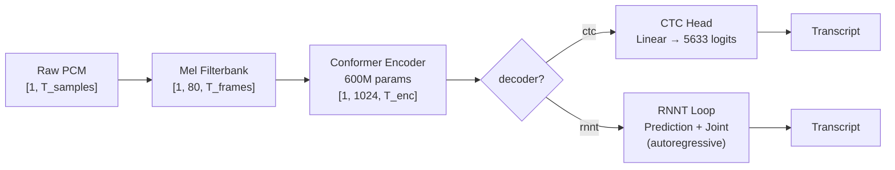
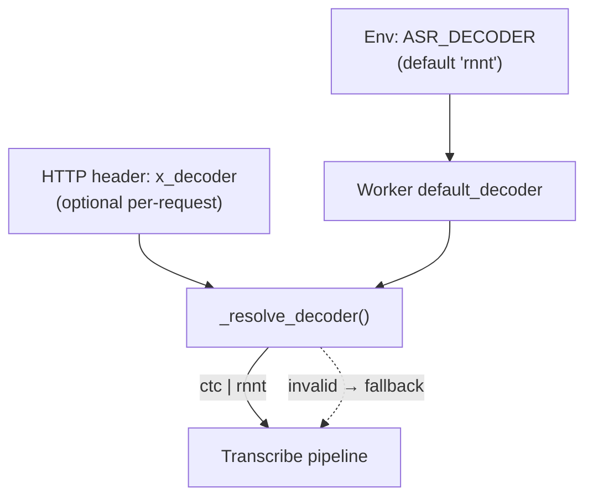
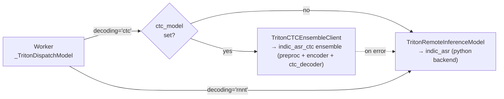
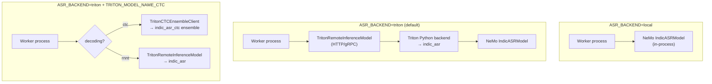
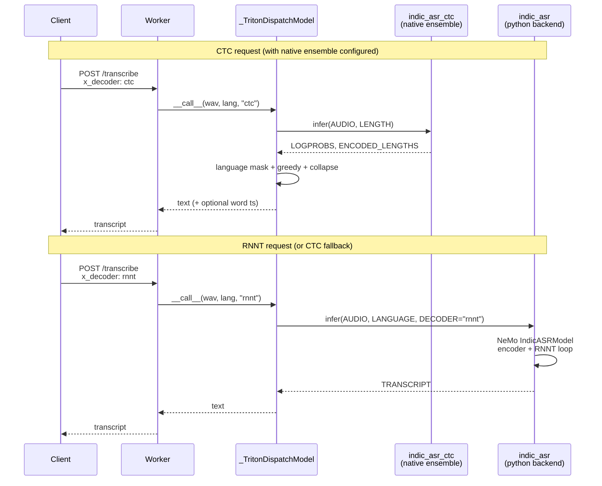
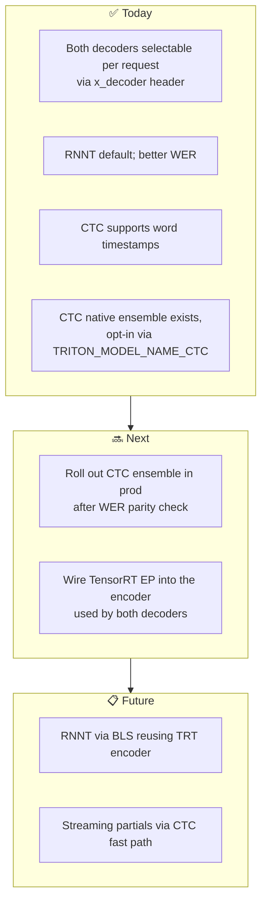

# CTC & RNNT Decoders — Complete Deep-Dive

> Contextualized to your **IndicConformer 600M Streaming ASR** pipeline.

---

## Part 1: The Two Decoders

### What is a "decoder" here?

The IndicConformer model is a **two-headed network**: a shared 600M-parameter Conformer **encoder** produces acoustic embeddings, and one of two **decoder heads** turns those embeddings into text. You pick which head runs at request time.



> [!IMPORTANT]
> The encoder is **the same** for both decoders. The decoder choice only changes which head runs after the encoder, not what runs before it.

### Conceptual Difference (1-minute version)

| | CTC | RNNT |
|---|---|---|
| **Output style** | Frame-aligned token grid | Streaming emission of tokens per frame |
| **Math per frame** | Single argmax over vocab logits | Inner loop: emit tokens until `<blank>` |
| **Graph shape** | Static feed-forward | **Data-dependent loop** |
| **Latency** | Lower (one matmul + collapse) | Higher (variable iterations) |
| **Accuracy** | Slightly lower | Slightly higher (default in this repo) |
| **Word timestamps** | ✅ Supported here | ❌ Not supported here |

This explains why your CTC path can be flattened into a static Triton ensemble, but **RNNT cannot** — see [Part 4](#part-4-why-rnnt-cant-be-an-ensemble).

---

## Part 2: How a Request Picks a Decoder

### The selection chain



### Where it happens in code

| Step | File | Lines | What it does |
|---|---|---|---|
| Env default | [worker/app/config.py](../worker/app/config.py#L75) | 75 | `ASR_DECODER` env var, defaults to `"rnnt"` |
| Per-request override | [worker/app/main.py](../worker/app/main.py#L660) | 660 | Reads `x_decoder` header from HTTP request |
| Pass to pipeline | [worker/app/main.py](../worker/app/main.py#L839) | 839 | Forwards decoder choice to `transcribe()` |
| Validation | [worker/app/model.py](../worker/app/model.py#L410-L416) | 410–416 | `_resolve_decoder()` — anything not in `{ctc, rnnt}` falls back to `rnnt` |
| Triton input | [triton/.../model.py](../triton/model_repository/indic_asr/1/model.py#L99-L115) | 99–115 | Reads `DECODER` tensor input on the Python backend |

### The actual call site

Both the local NeMo path and the Python-backend Triton path converge on a single, shared call signature:

```python
# worker/app/model.py:670-674
model_kwargs = {"decoding": dec}            # dec ∈ {"ctc", "rnnt"}
if requested_timestamp_type == "word":
    model_kwargs["compute_timestamps"] = "w"  # CTC-only
with torch.inference_mode():
    out = self.model(wav_t, resolved_language, **model_kwargs)
```

```python
# triton/model_repository/indic_asr/1/model.py:118-123
wav_t = torch.from_numpy(audio)
model_kwargs = {"decoding": decoder}
if compute_timestamps:
    model_kwargs["compute_timestamps"] = compute_timestamps
with torch.inference_mode():
    out = self.model(wav_t, language, **model_kwargs)
```

The IndicConformer wrapper picks the right head internally based on `decoding=`.

---

## Part 3: The CTC Path — Two Variants

CTC has **two execution paths**, depending on whether the native Triton ensemble is configured.

### Variant A — Python backend (default fallback)

CTC runs through the same Python-backend `indic_asr` model that handles RNNT. Encoder + CTC head + post-processing all happen inside the Python class.

### Variant B — Native ensemble (`TRITON_MODEL_NAME_CTC` set)

A purpose-built Triton ensemble (preproc → encoder → ctc_decoder) handles the heavy GPU work; the worker only does language masking, greedy collapse, and vocab lookup.



### Routing in code

[worker/app/triton.py:311-345](../worker/app/triton.py#L311-L345):

```python
class _TritonDispatchModel:
    def __call__(self, wav_t, resolved_language, decoding, compute_timestamps=None):
        if decoding == "ctc" and self.ctc_model is not None:
            try:
                return self.ctc_model(wav_t, resolved_language,
                                       decoding=decoding,
                                       compute_timestamps=compute_timestamps)
            except Exception as exc:
                # Ensemble is the optimization; python backend is the safety net.
                log.warning(...)
        return self.fallback_model(...)
```

### What the ensemble client does

[worker/app/triton.py:201-273](../worker/app/triton.py#L201-L273):

```python
# 1. Send raw audio + length to the indic_asr_ctc ensemble
result = client.infer(model_name="indic_asr_ctc",
                       inputs=[audio_input, length_input],
                       outputs=["LOGPROBS", "ENCODED_LENGTHS"])

# 2. Gather only the logits for the requested language
mask = self.language_masks[language]      # e.g. 257 Hindi token indices
masked = logprobs[:, :, mask]             # [1, T, V_lang]

# 3. Log-softmax + greedy argmax over masked vocab
masked_t = torch.from_numpy(masked).log_softmax(dim=-1)
path = masked_t[0][:T].argmax(dim=-1)     # [T] token IDs

# 4. CTC collapse: drop consecutive duplicates + blanks
collapsed = torch.unique_consecutive(path)
hyp_tokens = [vocab_lang[i] for i in collapsed if i != self.blank_id]
hyp = "".join(hyp_tokens).replace("▁", " ").strip()
```

### CTC-only feature: word timestamps

CTC's frame-aligned output makes it trivial to derive per-word timing by tracking the frame index where each token-streak starts and ends. RNNT can't do this in this codebase:

```python
# worker/app/model.py:646-647
if requested_timestamp_type == "word" and dec != "ctc":
    raise ValueError("timestamp_type=word requires decoder=ctc")
```

The frame-to-word conversion lives at [worker/app/triton.py:275-308](../worker/app/triton.py#L275-L308).

---

## Part 4: The RNNT Path

### Why RNNT can't be an ensemble

RNNT does **autoregressive emission**: at each encoder frame, it loops calling `prediction_network(prev_token)` → `joint(enc, pred)` → `argmax`, emitting tokens until it predicts `<blank>`, then advances to the next frame.

```
For each encoder frame t:
    while True:
        pred  = prediction_net(last_token)
        joint = joint_net(enc[t], pred)
        tok   = argmax(joint)
        if tok == BLANK: break
        emit(tok); last_token = tok
```

The number of inner-loop iterations is **data-dependent**. Triton ensembles are static DAGs — they cannot express loops. So RNNT stays inside the Python-backend `indic_asr` model, which orchestrates the loop in Python and calls the encoder/joint/prediction ONNX graphs from there.

### Where RNNT actually runs

| Path | Where | Notes |
|---|---|---|
| Local backend | [worker/app/model.py:670-674](../worker/app/model.py#L670-L674) | NeMo `IndicASRModel(...).__call__(decoding="rnnt")` |
| Triton backend | [triton/model_repository/indic_asr/1/model.py:118-123](../triton/model_repository/indic_asr/1/model.py#L118-L123) | Same call, but the model is loaded inside Triton's Python backend |
| Worker dispatch | [worker/app/triton.py:321](../worker/app/triton.py#L321) | RNNT bypasses the ensemble check and goes straight to `fallback_model` |

### What you give up vs CTC

- **No word timestamps** — gated at the worker layer ([model.py:646-647](../worker/app/model.py#L646-L647)).
- **Higher per-frame compute** — the inner loop runs serially per frame.
- **No native ensemble speedup** — pays Python-backend overhead.

### What you gain

- **Better WER** in most regimes (this is why `ASR_DECODER` defaults to `rnnt` at [config.py:75](../worker/app/config.py#L75)).
- **Streaming-friendly token stream** — emits tokens as it goes, not just at the end.

---

## Part 5: Side-by-Side — Worker vs Triton

The decoder selection logic is **mirrored** on both sides because the same NeMo wrapper is used in two places: directly in the worker (when `ASR_BACKEND=local`) and inside the Triton Python backend.

| Concern | Worker (local) | Triton Python backend |
|---|---|---|
| Decoder source | HTTP header → `_resolve_decoder()` | `DECODER` input tensor |
| Default | `ASR_DECODER` env (`rnnt`) | hardcoded `"rnnt"` |
| Validation fallback | non-`{ctc, rnnt}` → `rnnt` | non-`{ctc, rnnt}` → `rnnt` |
| Call signature | `model(wav, lang, decoding=..., compute_timestamps=...)` | identical |
| CTC ensemble route | Optional via `TRITON_MODEL_NAME_CTC` | N/A (already inside Triton) |



---

## Part 6: Context Biasing — Decoder-Aware

Context biasing (boosting custom phrases like product names) needs to attach to the decoder's internal `decoding` config, and that config differs by head. The worker introspects the loaded NeMo model to figure out which it is.

[worker/app/context_biasing.py:565-607](../worker/app/context_biasing.py#L565-L607):

```python
def _resolve_decoder_type(self) -> str:
    cfg = getattr(self.model, "cfg", None) or getattr(self.model, "_cfg", None)
    if getattr(cfg, "aux_ctc", None) is not None or hasattr(self.model, "aux_ctc"):
        return "ctc"
    model_name = type(self.model).__name__.lower()
    if "ctc" in model_name:  return "ctc"
    if "rnnt" in model_name or hasattr(self.model, "joint"): return "rnnt"
    return "ctc"

def _build_decoding_cfg(self, *, phrase_file):
    decoder_type = self._resolve_decoder_type()
    cfg_root = self.model.cfg
    source_cfg = cfg_root.decoding
    if decoder_type == "ctc":
        aux_ctc = getattr(cfg_root, "aux_ctc", None)
        if aux_ctc is not None and aux_ctc.decoding is not None:
            source_cfg = aux_ctc.decoding              # ← CTC pulls from aux_ctc.decoding
    decoding_cfg = OmegaConf.create(...)
    decoding_cfg.apply_context_biasing = True
    decoding_cfg.context_file = str(phrase_file)
    return decoder_type, decoding_cfg
```

> [!NOTE]
> CTC's decoding config is nested under `model.cfg.aux_ctc.decoding`, while RNNT's is at `model.cfg.decoding`. This is a NeMo convention for hybrid CTC-RNNT models.

---

## Part 7: Configuration Cheat Sheet

### Environment variables

| Variable | Default | Effect |
|---|---|---|
| `ASR_BACKEND` | `local` | `local` → in-process NeMo. `triton` → Triton client. |
| `ASR_DECODER` | `rnnt` | Default decoder when no `x_decoder` header is sent. |
| `ASR_TRITON_PROTOCOL` | `grpc` | Triton client protocol (`grpc` uses port `8001`; `http` uses port `8000`). |
| `TRITON_URL` | `triton:8001` | Triton server endpoint for the default gRPC path. |
| `TRITON_MODEL_NAME` | `indic_asr` | Python-backend model (handles both decoders). |
| `TRITON_MODEL_NAME_CTC` | _(empty)_ | If set (e.g. `indic_asr_ctc`), CTC requests use the native ensemble. |
| `TRITON_MODEL_VERSION_CTC` | _(empty)_ | Version pin for the CTC ensemble. |

### Per-request override

```http
POST /v1/transcribe
x_decoder: ctc          # or "rnnt"; missing/invalid → falls back to ASR_DECODER
```

### Decision matrix

| Goal | Set |
|---|---|
| Lowest latency, has phrase boundaries | `ASR_DECODER=ctc` + `TRITON_MODEL_NAME_CTC=indic_asr_ctc` |
| Lowest latency + word timestamps | header `x_decoder: ctc`, request `timestamp_type=word` |
| Best WER (default) | `ASR_DECODER=rnnt` (no extra config) |
| Mixed traffic | leave `ASR_DECODER=rnnt`, let clients send `x_decoder: ctc` when they need timestamps |

---

## Part 8: End-to-End Sequence (CTC vs RNNT side by side)



---

## Part 9: Glossary

| Term | Meaning |
|---|---|
| **CTC** | Connectionist Temporal Classification. One emission per encoder frame, then collapse duplicates and blanks. Frame-aligned, fast, easy timestamps. |
| **RNNT** | Recurrent Neural Network Transducer. Per frame, loops emitting tokens until `<blank>`. Higher accuracy, autoregressive, no static graph. |
| **Decoder head** | The trainable network on top of the encoder that maps embeddings → tokens. Here: CTC linear head OR RNNT prediction+joint network. |
| **`aux_ctc`** | NeMo's convention for the auxiliary CTC head on a hybrid CTC-RNNT model. Its decoding config lives at `model.cfg.aux_ctc.decoding`. |
| **Greedy collapse** | CTC post-processing: take argmax per frame, then drop consecutive duplicates and the blank token. |
| **BLANK_ID** | Sentinel token in CTC vocab used to separate emissions; also RNNT's stop-emitting signal per frame. |
| **Language mask** | Per-language index list that gathers the relevant slice of the 5633-token logit vector before argmax. |
| **Ensemble** | Triton's static DAG of models — the CTC fast path. Cannot represent RNNT's data-dependent loop. |
| **Python backend** | Triton backend that runs a `TritonPythonModel` class — used here for RNNT (and as CTC fallback). |
| **Dispatch model** | [`_TritonDispatchModel`](../worker/app/triton.py#L311) — picks ensemble vs python backend based on `decoding=`. |

---

## Part 10: Current State & Where to Look



### Key files (one-liners)

| File | Why look here |
|---|---|
| [worker/app/config.py](../worker/app/config.py#L73-L86) | All ASR/Triton env knobs in one place |
| [worker/app/model.py](../worker/app/model.py#L410-L416) | `_resolve_decoder()` and the actual `model(...)` call |
| [worker/app/triton.py](../worker/app/triton.py#L122-L345) | CTC ensemble client + dispatch routing |
| [triton/model_repository/indic_asr/1/model.py](../triton/model_repository/indic_asr/1/model.py#L93-L140) | Triton Python backend that handles both decoders |
| [worker/app/context_biasing.py](../worker/app/context_biasing.py#L565-L607) | Decoder-type detection for context biasing |
| [docs/triton_native_serving_plan.md](triton_native_serving_plan.md) | Why the CTC ensemble exists + deploy runbook |

---

## TL;DR

- **Both decoders share the same encoder and the same call signature.** Decoder is just a `decoding=` kwarg, set per request via the `x_decoder` header.
- **RNNT is the default** because it has slightly better WER; it always runs through the Python backend (the autoregressive loop can't be a static ensemble).
- **CTC has a fast path** via the native `indic_asr_ctc` ensemble, opt-in by setting `TRITON_MODEL_NAME_CTC`. If unset (or it errors), CTC falls back to the Python backend.
- **Word timestamps require CTC.** The worker enforces this with a hard error.
- **Context biasing reads different config keys** depending on decoder type (`cfg.aux_ctc.decoding` for CTC, `cfg.decoding` for RNNT).
