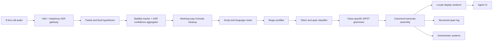
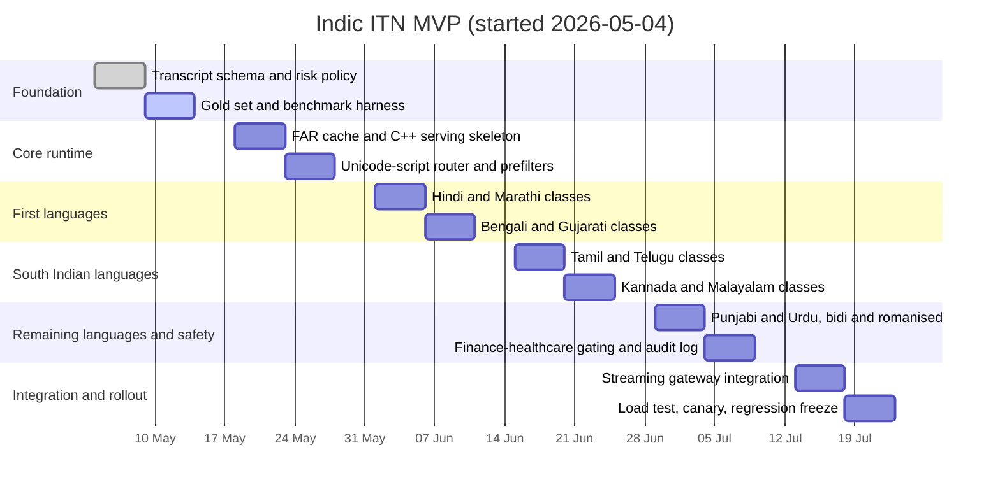

# Production plan for low-latency Indic TN and ITN in live telephony ASR

## Executive summary

For live 8 kHz telephony calls with an Indic Conformer 600 M ASR, the production-safe answer is **not** an end-to-end generative formatter in the hot path. It is a **deterministic inverse text normalisation (ITN) stack**: Unicode-safe preprocessing, token and span classification, per-class WFST grammars, and locale rendering built from CLDR/ICU data.

In standard speech-system terminology, **text normalisation (TN)** is written-to-spoken conversion (used in TTS), while **inverse text normalisation (ITN)** is spoken-to-written conversion (used after ASR). NeMo documents the same split and places ITN as a post-ASR step.

The architecture to ship is a **WFST-first hybrid**: author grammars with Pynini on top of OpenFst, export FAR archives, and serve them in a compiled C++ runtime such as Sparrowhawk. Use ICU/CLDR for locale-aware digits, numbering systems, date/time/currency rendering and parsing rules; use Indic NLP utilities for Unicode and script cleanup; use IndicLID and IndicXlit only as secondary aids for romanised or mixed-script spans, not as the main normaliser.

This design follows the same classification-and-verbalisation pattern used by NeMo and Kestrel-derived tooling. It is auditable, testable, and deployable without GPUs.

---

## Output policy

Three output fields, not one:

| Field | Purpose | Policy |
|---|---|---|
| `raw_asr_text` | Audit, debugging, legal review | Exactly what the decoder emitted, with timings — never rewritten |
| `canonical_text` | Search, NER, analytics, CRM ingestion | Stable Latin digits, explicit separators, no decorative locale shaping |
| `display_text` | Agent UI / customer-facing transcript | Locale-rendered digits and punctuation via ICU/CLDR |
| `normalization_spans[]` | Provenance | Source tokens, class, rule id, confidence, locale, alternatives |

Keeping canonical text stable and locale rendering only in the display layer avoids downstream ambiguity and makes finance/healthcare reviews auditable: the reviewer can always inspect both the raw spoken surface and the normalised output.

---

## Recommended architecture

### Processing layers

| Layer | What runs here | Notes |
|---|---|---|
| Pre-ASR | Audio routing, locale metadata lookup, hotword/bias lists | No text normalisation here; only metadata and biasing |
| During ASR | Partial hypothesis stability tracking, word confidence aggregation, language posterior capture | Only allow low-risk, prefix-stable display updates on partials |
| Post-ASR | Main ITN, punctuation, canonical transcript assembly, UI rendering | Where almost all numeric/date/time/currency/phone/ID work happens |

### Approach comparison

| Approach | Strengths | Weaknesses | Live-call verdict |
|---|---|---|---|
| Regex only | Fastest to implement for trivial patterns | Brittle, hard to scale, poor ambiguity handling | Prefilter only |
| WFST / Pynini / OpenFst | Deterministic, auditable, compositional, fast | Grammar authoring effort | **Best core approach** |
| Seq2seq ITN | Can learn context and non-local patterns | Hallucinations, harder debugging, data hunger | Not primary live path |
| LLM / small LLM | Strong few-shot performance, low grammar authoring effort | Variable latency, non-determinism, weak auditability | Not acceptable in hot path |
| Hybrid WFST + guarded tagger | Best compromise for ambiguous spans | Extra operational complexity | Secondary fallback only |

WFSTs are the right centre of gravity: OpenFst is designed for construction, optimisation, and searching of weighted transducers; Pynini compiles rewrite rules and grammars into that runtime; NeMo uses the same stack for production TN/ITN; and indic-punct shows the same pattern already works for Indic ITN.

Small LLMs are acceptable for **offline grammar authoring, error analysis, and candidate generation**, but not for the live call path unless you can tolerate variable latency, higher infra cost, and unrecoverable formatting errors. NVIDIA's Thutmose Tagger paper is explicit that seq2seq ITN systems are prone to hallucinations; their later GPT-based TN work shows strong research results but the practical conclusion remains: use LLMs **off-path**, not **in-path**.

RAG is mostly irrelevant here. Numeric, date, time, currency, phone, and ID formatting are **symbol rewriting problems**, not knowledge retrieval problems. The only valid use of RAG is fetching **customer-specific dictionaries** — bank product names, claim prefixes, branch codes — and compiling them into deterministic rules out of band, never by calling a retrieval pipeline during every streaming hypothesis.

---

## End-to-end pipeline



### Component plan

| Component | What it does | Implementation |
|---|---|---|
| ASR gateway | Emits partials, finals, timings, confidences, language posterior | Keep unchanged except for stability metadata |
| Working-copy normaliser | Creates a safe internal copy for classification | Unicode NFC for Indic text; targeted compatibility folding for full-width digits, minus signs, exotic separators, currency symbol aliases |
| Script and language router | Chooses grammar pack and digit maps | ASR language hint first; then ICU script histogram; IndicLID only on sufficiently long final spans or romanised spans |
| Regex prefilter | Cheaply detects obvious spans | Currency symbol, decimal separators, digit runs, percent, phone-length candidates, alnum ID candidates |
| Span classifier | Assigns semiotic class | Deterministic rules first; optional tiny tagger only for ambiguous classes after endpointing |
| WFST normaliser | Rewrites spoken to canonical written form | One compiled FAR per language, shared common grammars, locale-specific verbalisers |
| Locale renderer | Produces UI display text | ICU/CLDR digit shaping and localisation on top of canonical text |
| Provenance logger | Records why a rewrite happened | Span offsets, class, rule id, ASR confidence, language, ambiguity count, fallback flag |

The reason to keep a **working copy** separate from the raw transcript is practical: NeMo's inverse normaliser expects mostly lower-cased text with little punctuation, so the runtime should maintain a classifier-friendly copy while leaving the raw text untouched for storage and review.

---

## Confidence gating and fallback

| Class | Auto-normalise if | Defer if |
|---|---|---|
| Cardinal integer | Single unambiguous parse, high class/rule confidence, acceptable ASR confidence | Multiple parses or unstable partial |
| Decimal / percentage | Explicit decimal or percent marker present | Decimal separator ambiguous or weak ASR confidence |
| Currency | Currency symbol or clear lexical cue plus unique parse | Amount words uncertain, decimal paise uncertain, or no currency cue |
| Time | AM/PM or strong lexical cue (`baje`, `ghante`, `mani`, `clock`) plus valid clock parse | Bare "five thirty" with no context |
| Date | Month word, year cue, or trusted locale prior; numeric-only if locale is known day-first | Purely numeric date with unresolved order |
| Phone | Exact digit-count pattern and phone/mobile/OTP context, or stable digit-run span | Could also be ID/account/amount |
| ID / account / policy / claim | Strong preceding context and checksum/length rule; usually only separator cleanup | Any uncertainty at all |

For partial display: only rewrite spans that have been **stable for at least two consecutive partial hypotheses** and that do not require right context. For anything financial, medical, or identifier-like, wait for the **segment final** or a **speech endpoint**.

---

## Latency avoidance

| Technique | Why it matters |
|---|---|
| Precompile grammars into FAR files at build time | Avoid grammar compilation in request path |
| Load FARs once at process start | Avoid per-request disk and initialisation overhead |
| Route by language and script before normalisation | Prevent touching irrelevant grammars |
| Keep common grammars shared, locale variants thin | Reduces memory pressure and startup time |
| Cap permutation generation aggressively | Prevents combinatorial slowdowns on long ambiguous spans |
| Endpoint normalisation by default | Avoids repeated rewrites on unstable partials |
| Prefix-stable partial formatting only for simple classes | Minimises UI churn and rollback edits |
| Use C++ runtime in production, Python in development | Keeps authoring easy and serving fast |
| Cache frequent rewrites | Helps repeated IVR-like phrases and common numeric surfaces |

NeMo's deployment path exports Pynini grammars into FAR archives for Sparrowhawk, and its inverse normaliser exposes a maximum-permutation cap for a reason: uncontrolled candidate generation is a real latency risk.

---

## Logging and evaluation

A production ITN service should log **spans**, not just final strings.

Minimum per-span fields: `raw_span`, `canonical_span`, `class`, `language`, `script`, `rule_id`, `alternatives_count`, `asr_confidence`, `classifier_confidence`, `fallback_reason`, `ui_display_span`.

### Metrics

| Metric | Why it matters |
|---|---|
| Sentence exact match | End-user transcript quality |
| Class exact match | Tracks money/date/time/phone failures directly |
| Digit accuracy for phone and IDs | Small mistakes are catastrophic |
| Unsafe rewrite rate | Most important business metric |
| Ambiguity deferral rate | Measures whether the system is being conservative enough |
| p50 / p95 normalisation latency | Verifies live-call suitability |
| Partial rollback rate | Verifies streaming UI stability |

For finance and healthcare, add a manual review set scoring **wrong decimal point**, **wrong date order**, **wrong account digit**, **wrong dosage/unit**, and **lost currency sign** separately — these are the errors that matter operationally.

---

## Indic-specific handling

The hardest production issue is not "how do I spell 1000". It is: **which representation do I keep internally, which do I show, and when do I refuse to guess**.

CLDR is clear that a locale can have different default, native, and traditional numbering systems:

- Hindi: `latn` and `deva`
- Bangla: `latn` and `beng`
- Tamil: `latn`, `tamldec`, and traditional `taml`
- Urdu: `latn` and `arabext`

**Do not** bake a single "native digit" policy into storage. Keep canonical text stable; render native digits only in the display layer.

For mixed-script traffic, use a **span-level policy**: convert native digits from any supported script into a canonical internal digit form first; keep Latin letters in IDs as Latin; then render the final UI string in the chosen locale. Use ICU script properties for Unicode script detection, Indic NLP normalisers for script-specific cleanup (nukta, ZWJ/ZWNR), and IndicLID only when ASR metadata is absent and the span is long enough to classify.

**Date ambiguity** requires a hard policy. `12/05/2026` should only become "12 May 2026" if the call's locale policy is already confirmed as **day-first**. Otherwise keep the numeric surface or convert to a structured internal representation with `day=12, month=5, year=2026` once you have unambiguous evidence.

**Urdu** needs special care: CLDR's native numbering system for Urdu is `arabext`, with Arabic punctuation and percent variants plus bidi handling requirements. Keep canonical transcript plain and predictable; handle right-to-left display in the UI renderer. Do not inject bidi control characters into stored text unless you have a rendering bug you cannot solve elsewhere.

The example tables below are **deterministic seed forms for grammar authoring**, not normative linguistic standards. In production, pick one canonical spoken target per language, keep a small alias list for common variants, and only add colloquial compressions like "डेढ़ हज़ार" when your domain requires them.

---

## Seed examples

### Numbers

Canonical storage uses Latin digits. Native-digit display is a renderer concern only.

| Language | `1,000` | `1,500` | `1,25,000` |
|---|---|---|---|
| Hindi | एक हज़ार | एक हज़ार पाँच सौ | एक लाख पच्चीस हज़ार |
| Marathi | एक हजार | एक हजार पाचशे | एक लाख पंचवीस हजार |
| Bengali | এক হাজার | এক হাজার পাঁচশো | এক লক্ষ পঁচিশ হাজার |
| Tamil | ஆயிரம் | ஆயிரத்து ஐந்நூறு | ஒரு லட்சத்து இருபத்தைந்து ஆயிரம் |
| Telugu | వెయ్యి | వెయ్యి ఐదు వందలు | ఒక లక్ష ఇరవై ఐదు వేల |
| Kannada | ಒಂದು ಸಾವಿರ | ಒಂದು ಸಾವಿರ ಐನೂರು | ಒಂದು ಲಕ್ಷ ಇಪ್ಪತ್ತೈದು ಸಾವಿರ |
| Malayalam | ആയിരം | ആയിരത്തി അഞ്ഞൂറ് | ഒരു ലക്ഷം ഇരുപത്തയ്യായിരം |
| Gujarati | એક હજાર | એક હજાર પાંચસો | એક લાખ પચીસ હજાર |
| Punjabi | ਇੱਕ ਹਜ਼ਾਰ | ਇੱਕ ਹਜ਼ਾਰ ਪੰਜ ਸੌ | ਇੱਕ ਲੱਖ ਪੱਚੀ ਹਜ਼ਾਰ |
| Urdu | ایک ہزار | ایک ہزار پانچ سو | ایک لاکھ پچیس ہزار |

CLDR compact-number examples confirm that thousand and lakh/crore behaviour is locale-specific and must not be hard-coded from one language into another.

### Date, time, and currency

Assumes a **day-first locale policy**.

| Language | `12/05/2026` (spoken) | `5:30 PM` (spoken) | `₹1,250` (spoken) |
|---|---|---|---|
| Hindi | बारह मई दो हज़ार छब्बीस | शाम पाँच बजकर तीस मिनट | एक हज़ार दो सौ पचास रुपये |
| Marathi | बारा मे दोन हजार सव्वीस | सायंकाळी पाच वाजून तीस मिनिटे | एक हजार दोनशे पन्नास रुपये |
| Bengali | বারো মে দুই হাজার ছাব্বিশ | বিকেল পাঁচটা ত্রিশ | এক হাজার দুইশো পঞ্চাশ টাকা |
| Tamil | பன்னிரண்டு மே இரண்டு ஆயிரத்து இருபத்தாறு | மாலை ஐந்து முப்பது | ஆயிரத்து இருநூற்று ஐம்பது ரூபாய் |
| Telugu | పన్నెండు మే రెండు వేల ఇరవై ఆరు | సాయంత్రం ఐదు ముప్పై | వెయ్యి రెండువందల యాభై రూపాయలు |
| Kannada | ಹನ್ನೆರಡು ಮೇ ಎರಡು ಸಾವಿರ ಇಪ್ಪತ್ತಾರು | ಸಂಜೆ ಐದು ಮೂವತ್ತು | ಒಂದು ಸಾವಿರ ಎರಡುನೂರು ಐವತ್ತು ರೂಪಾಯಿ |
| Malayalam | പന്ത്രണ്ട് മേയ് രണ്ട് ആയിരത്തി ഇരുപത്താറ് | വൈകുന്നേരം അഞ്ച് മുപ്പത് | ആയിരത്തി ഇരുനൂറ് അമ്പത് രൂപ |
| Gujarati | બાર મે બે હજાર છવીસ | સાંજે પાંચ ત્રીસ | એક હજાર બે સો પચાસ રૂપિયા |
| Punjabi | ਬਾਰਾਂ ਮਈ ਦੋ ਹਜ਼ਾਰ ਛੱਬੀ | ਸ਼ਾਮ ਪੰਜ ਵੱਜ ਕੇ ਤੀਹ ਮਿੰਟ | ਇੱਕ ਹਜ਼ਾਰ ਦੋ ਸੌ ਪੰਜਾਹ ਰੁਪਏ |
| Urdu | بارہ مئی دو ہزار چھبیس | شام پانچ بج کر تیس منٹ | ایک ہزار دو سو پچاس روپے |

Use ICU/CLDR for rendered date, time, and currency separators, symbols, and digit shaping. CLDR number and currency patterns also document bidi considerations for right-to-left scripts, which matters for Urdu UI rendering.

### Phone, percentage, and alphanumeric IDs

For phone numbers and IDs, the safest spoken canonical form is **digit-by-digit**, not compact number words.

| Language | `9876543210` | `12.5%` | `AB1234` |
|---|---|---|---|
| Hindi | नौ आठ सात छह पाँच चार तीन दो एक शून्य | बारह दशमलव पाँच प्रतिशत | ए बी एक दो तीन चार |
| Marathi | नऊ आठ सात सहा पाच चार तीन दोन एक शून्य | बारा दशांश पाच टक्के | ए बी एक दोन तीन चार |
| Bengali | নয় আট সাত ছয় পাঁচ চার তিন দুই এক শূন্য | বারো দশমিক পাঁচ শতাংশ | এ বি এক দুই তিন চার |
| Tamil | ஒன்பது எட்டு ஏழு ஆறு ஐந்து நான்கு மூன்று இரண்டு ஒன்று பூஜ்ஜியம் | பன்னிரண்டு புள்ளி ஐந்து சதவீதம் | ஏ பி ஒன்று இரண்டு மூன்று நான்கு |
| Telugu | తొమ్మిది ఎనిమిది ఏడు ఆరు ఐదు నాలుగు మూడు రెండు ఒకటి సున్నా | పన్నెండు దశాంశ ఐదు శాతం | ఏ బీ ఒకటి రెండు మూడు నాలుగు |
| Kannada | ಒಂಬತ್ತು ಎಂಟು ಏಳು ಆರು ಐದು ನಾಲ್ಕು ಮೂರು ಎರಡು ಒಂದು ಸೊನ್ನೆ | ಹನ್ನೆರಡು ದಶಮಾಂಶ ಐದು ಪ್ರತಿಶತ | ಎ ಬಿ ಒಂದು ಎರಡು ಮೂರು ನಾಲ್ಕು |
| Malayalam | ഒൻപത് എട്ട് ഏഴ് ആറ് അഞ്ച് നാല് മൂന്ന് രണ്ട് ഒന്ന് പൂജ്യം | പന്ത്രണ്ട് ദശാംശം അഞ്ച് ശതമാനം | എ ബി ഒന്ന് രണ്ട് മൂന്ന് നാല് |
| Gujarati | નવ આઠ સાત છ પાંચ ચાર ત્રણ બે એક શૂન્ય | બાર દશાંશ પાંચ ટકા | એ બી એક બે ત્રણ ચાર |
| Punjabi | ਨੌਂ ਅੱਠ ਸੱਤ ਛੇ ਪੰਜ ਚਾਰ ਤਿੰਨ ਦੋ ਇਕ ਸਿਫ਼ਰ | ਬਾਰਾਂ ਦਸ਼ਮਲਵ ਪੰਜ ਪ੍ਰਤੀਸ਼ਤ | ਏ ਬੀ ਇਕ ਦੋ ਤਿੰਨ ਚਾਰ |
| Urdu | نو آٹھ سات چھ پانچ چار تین دو ایک صفر | بارہ اعشاریہ پانچ فیصد | اے بی ایک دو تین چار |

The main production rule for IDs: **never compress or improve identifiers** unless both context and format are highly certain. Normalising `AB1234` to anything other than exactly `AB1234` is almost always a mistake.

---

## Implementation blueprint

### Tool stack

| Tool | Role | Notes |
|---|---|---|
| NeMo-text-processing | Grammar authoring model and production export path for WFST TN/ITN | Exposes Hindi and Marathi ITN directly; extend for broader Indic coverage |
| Pynini | Grammar authoring | Best development-time DSL for WFST grammars |
| OpenFst | Runtime graph operations | Production FST backbone |
| Sparrowhawk | C++ serving path | Good template for low-latency deployment |
| ICU / CLDR | Locale rendering, digits, dates, currencies, spellout | Do not rely on bundled spellout data alone for all locales |
| Indic NLP Library | Unicode cleanup, script handling, romanisation utilities | Preprocessing helper, not a full ITN engine |
| indic-punct | Open-source Indic punctuation + WFST ITN reference | Useful starter for 11 Indic languages |
| IndicXlit | Romanised/native transliteration | Secondary repair of romanised spans |
| IndicLID | Native + romanised Indic LID | Fallback when ASR language hints are weak |
| indic-numtowords | Seed cardinal spellout lexicon | Useful for tests and canonical seed forms |

### Repository layout

```text
itn_service/
  configs/
    policy.yaml
    locales.yaml
    thresholds.yaml
  grammars/
    common/
      digit_maps.tsv
      separators.tsv
      currency_aliases.tsv
      class_labels.tsv
      id_prefixes.tsv
    hi/
      cardinal.py
      decimal.py
      money.py
      date.py
      time.py
      percent.py
      phone.py
      id.py
      verbalize_final.py
    mr/ bn/ ta/ te/ kn/ ml/ gu/ pa/ ur/
      ...
  runtime/
    normalizer.py
    stream_state.py
    script_router.py
    confidence_gate.py
    display_renderer.py
    far_cache.py
  cxx_runtime/
    far_loader.cc
    normalizer_service.cc
  tests/
    gold/
      hi/ mr/ bn/ ta/ te/ kn/ ml/ gu/ pa/ ur/
    regression/
    latency/
  tools/
    export_far.sh
    benchmark_latency.py
    build_gold_from_csv.py
```

Language addition: **copy a shared class skeleton**, swap only language-specific lexica, connectors, digit maps, month names, and ambiguity rules. NeMo's grammar-customisation workflow is exactly this: modify grammars, add tests, export FARs, run both Python and deployment-path tests.

### Grammar pattern (Pynini sketch)

```python
import pynini
from pynini.lib import pynutil

DEVANAGARI_TO_LATN = pynini.string_map([
    ("०", "0"), ("१", "1"), ("२", "2"), ("३", "3"), ("४", "4"),
    ("५", "5"), ("६", "6"), ("७", "7"), ("८", "8"), ("९", "9"),
])

COMMON_CURRENCY = pynini.union("₹", "rs", "Rs", "रुपये", "रुपया")
COMMA = pynini.accep(",")
DOT   = pynini.accep(".")

digit              = pynini.union(*"0123456789")
native_or_latn     = DEVANAGARI_TO_LATN | digit
integer            = pynini.closure(native_or_latn, 1)
grouped_integer    = integer + pynini.closure(COMMA + integer)
decimal            = grouped_integer + DOT + pynini.closure(digit, 1)

money = (
    pynutil.insert('money { currency: "INR" amount: "') +
    (decimal | grouped_integer) +
    pynutil.insert('" }')
)

percent = (
    pynutil.insert('percent { value: "') +
    (decimal | grouped_integer) +
    pynutil.insert('" }') +
    pynini.union("%", "percent", "प्रतिशत")
)

phone10 = (
    pynutil.insert('phone { digits: "') +
    pynini.closure(digit, 10, 10) +
    pynutil.insert('" }')
)

# Final classify graph unions all class graphs then optimises.
CLASSIFY = (money | percent | phone10).optimize()
```

This mirrors the NeMo/Kestrel style: classify spans into structured forms first, then verbalise or render them separately.

### Streaming-safe Python skeleton

```python
from dataclasses import dataclass
from typing import List, Optional

@dataclass
class Token:
    text: str
    start_ms: int
    end_ms: int
    conf: float

@dataclass
class Span:
    cls: str
    raw: str
    canonical: str
    rule_id: str
    conf: float
    ambiguous: bool = False

@dataclass
class SegmentResult:
    raw_text: str
    canonical_text: str
    display_text: str
    spans: List[Span]
    deferred: bool

class StreamState:
    def __init__(self):
        self.last_partial = ""
        self.stable_count = 0

    def update_stability(self, partial_text: str) -> int:
        if partial_text == self.last_partial:
            self.stable_count += 1
        else:
            self.stable_count = 1
            self.last_partial = partial_text
        return self.stable_count

def unicode_working_copy(text: str) -> str:
    return fold_targeted_symbols(nfc(text))

def detect_script(text: str) -> str:
    counts = uscript_histogram(text)
    return max(counts, key=counts.get) if counts else "Common"

def classify_tokens(tokens: List[Token], lang_hint: Optional[str]) -> List[Span]:
    # 1. Regex prefilter for cheap obvious classes
    # 2. Route to language/script FAR
    # 3. Run class-specific WFSTs
    # 4. Emit spans with ambiguity markers
    return run_wfst_pipeline(tokens, lang_hint)

def normalize_date(raw: str, locale_policy: str, context: dict) -> Optional[str]:
    parsed = try_parse_date(raw, locale_policy, context)
    if not parsed or parsed.ambiguous:
        return None
    return parsed.canonical

def render_display(canonical_text: str, locale_code: str) -> str:
    return icu_render(canonical_text, locale_code)

def normalize_segment(
    raw_text: str,
    tokens: List[Token],
    is_final: bool,
    state: StreamState,
    lang_hint: Optional[str],
    locale_policy: str,
) -> SegmentResult:
    stable = state.update_stability(raw_text)
    if not is_final and stable < 2:
        return SegmentResult(raw_text, raw_text, raw_text, [], deferred=True)

    working = unicode_working_copy(raw_text)
    spans   = classify_tokens(tokens, lang_hint)

    if not is_final:
        spans = [s for s in spans if s.cls in {"cardinal", "money", "percent"} and not s.ambiguous]

    safe_spans = []
    for span in spans:
        if span.ambiguous:
            continue
        if span.cls in {"account", "policy_id", "health_dose"} and span.conf < 0.95:
            continue
        if span.cls in {"date", "time"} and span.conf < 0.90:
            continue
        safe_spans.append(span)

    canonical = apply_spans(working, safe_spans)
    display   = render_display(canonical, locale_policy)

    return SegmentResult(
        raw_text=raw_text,
        canonical_text=canonical,
        display_text=display,
        spans=safe_spans,
        deferred=not is_final,
    )

def on_stream_event(event, state: StreamState):
    result = normalize_segment(
        raw_text=event.text,
        tokens=event.tokens,
        is_final=event.is_final,
        state=state,
        lang_hint=event.lang_hint,
        locale_policy=event.locale_policy,
    )
    publish_ui(result.display_text)
    if event.is_final:
        persist_raw_and_canonical(result)
```

This pattern is intentionally conservative: no LLM call, no whole-utterance transliteration before classification, no forced date guesses, and no in-place destruction of raw text.

---

## MVP timeline

A realistic MVP for ten core languages and the main semiotic classes is **8 weeks** with 2 NLP engineers, 1 backend engineer, and part-time native-speaker QA. Budget roughly **16–20 engineering weeks** plus **3–5 language-QA weeks** for the first production cut.



---

## Next steps

1. **Freeze the output contract** — raw text, canonical text, display text, and span provenance. Get sign-off before writing any grammar.
2. **Build a vertical slice** for Hindi + English code-switching: integers, decimals, currency, percent, phone, date, time, and conservative alphanumeric IDs.
3. **Integrate after endpointing**, with only low-risk partial display updates on stable spans.
4. **Build a gold evaluation set** with adversarial cases: ambiguous dates, account numbers, rupee amounts, and mixed-script tokens.
5. **Expand by script family and shared grammar skeletons**, not by writing each language from scratch.

---

## What not to do

- Do **not** put a small LLM on every partial hypothesis.
- Do **not** auto-resolve numeric-only dates without a confirmed locale prior.
- Do **not** store only locale-rendered native-digit text as your canonical form.
- Do **not** silently transliterate whole utterances before class detection.
- Do **not** rewrite high-risk IDs, account numbers, policy numbers, claim codes, medicine dosages, or amounts unless both context and confidence are strong.

The systems literature is consistent: unrecoverable formatting errors are exactly why production TN/ITN has historically remained rule-first.

---

## Final recommendation

**Ship a deterministic WFST ITN layer, not a generative one.**

- Keep raw, canonical, and display transcripts separate.
- Endpoint-normalise by default.
- Use ICU/CLDR for rendering, Pynini/OpenFst for rewriting, and Indic-specific libraries only as targeted helpers.
- Treat ambiguity as a reason to defer, not to guess.

That is the most practical, lowest-risk path to production for live Indic telephony ASR.
