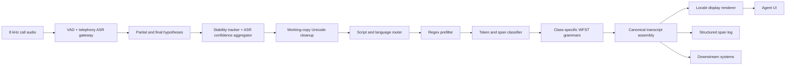
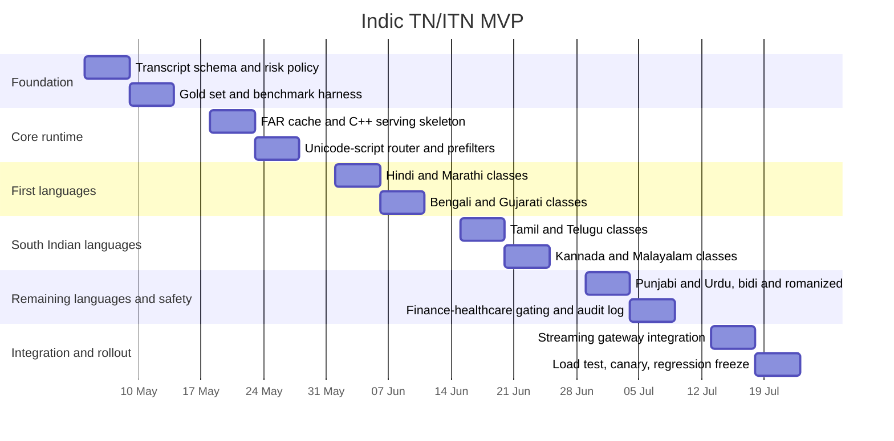

# Production plan for low-latency Indic TN and ITN in live telephony ASR

## Executive summary

For live 8 kHz telephony calls with an Indic Conformer 600M ASR, the production-safe answer is **not** an end-to-end generative formatter in the hot path. It is a **deterministic inverse text normalisation stack**: Unicode-safe preprocessing, token and span classification, per-class WFST grammars, and locale rendering built from CLDR/ICU data. In standard speech-system terminology, **text normalisation (TN)** is written-to-spoken conversion for TTS, while **inverse text normalisation (ITN)** is spoken-to-written conversion for ASR output; NeMo documents the same split and places ITN after ASR. citeturn21view0turn23search1turn31view2

The architecture I would ship is a **WFST-first hybrid**: author grammars with Pynini on top of OpenFst, export FAR archives, and serve them in a compiled C++ runtime such as Sparrowhawk or an equivalent thin OpenFst service. Use ICU/CLDR for locale-aware digits, numbering systems, date/time/currency rendering and parsing rules; use Indic NLP utilities for Unicode and script cleanup; use IndicLID and IndicXlit only as secondary aids for romanised or mixed-script spans, not as the main normaliser. This design follows the same classification-and-verbalisation pattern used by NeMo and Kestrel-derived tooling, and it is auditable, testable, and deployable without GPUs. citeturn21view1turn21view3turn21view4turn22search0turn38view0turn38view1turn21view7turn37view0

Your transcript policy should have **three outputs**, not one. Keep **raw ASR text** for audit, debugging, and legal review. Produce a **canonical written transcript** for downstream systems, using a stable machine-friendly policy such as Latin digits and predictable separators. Then optionally produce a **locale display transcript** that renders native digits or script conventions for the UI. This separation is exactly how ICU recommends thinking about formatting and parsing: internal value, locale-sensitive display, and explicit formatting rules, rather than ad hoc string munging. citeturn38view3turn38view2turn38view0

Small LLMs and other neural text-formatting models are acceptable for **offline grammar authoring, error analysis, and candidate generation**, but not for the live call path unless you have an explicit reason to tolerate variable latency, higher infra cost, and unrecoverable formatting errors. NVIDIA’s Thutmose Tagger paper is explicit that seq2seq ITN systems are prone to hallucinations that can create unacceptable errors; at the same time, NVIDIA’s later GPT-based TN work shows that LLMs can be strong in research settings. That combination leads to a practical conclusion: use them **off-path**, not **in-path**. citeturn31view3turn24search10turn10search3

## Recommended architecture and output policy

The cleanest deployment model is:

| Layer | What runs here | Recommendation |
|---|---|---|
| Pre-ASR | Audio routing, locale metadata lookup, hotword/bias lists, optional known number lexica | No text normalisation here; only metadata and biasing. |
| During ASR | Partial hypothesis stability tracking, word confidence aggregation, language posterior capture | Do **not** run heavy rewriting on every partial; only allow low-risk, prefix-stable display updates. |
| Post-ASR | Main ITN, punctuation, canonical transcript assembly, UI rendering | This is where almost all numeric/date/time/currency/phone/ID work should happen. |

That split matches established TN/ITN practice. NeMo defines ITN as ASR post-processing; Kestrel/NeMo-style WFST systems separate token classification and verbalisation; and streaming ITN research still treats low-latency streaming formatting as a specialised problem because of ambiguity and right-context requirements. citeturn21view0turn31view2turn33view0

The approach choice is straightforward:

| Approach | Strengths | Weaknesses | Live-call verdict |
|---|---|---|---|
| Regex only | Fastest to implement for trivial patterns | Brittle, hard to scale across languages, poor ambiguity handling | Useful only as a prefilter |
| WFST / Pynini / OpenFst | Deterministic, auditable, compositional, fast, production deployment path | Grammar authoring effort | **Best core approach** |
| Seq2seq ITN | Can learn context and non-local patterns | Hallucinations, harder debugging, data hunger | Not primary live path |
| LLM / small LLM | Strong few-shot research performance, low grammar authoring effort | Variable latency, tokenisation quirks, non-determinism, weak auditability | Not acceptable in hot path |
| Hybrid WFST + guarded tagger | Best compromise for ambiguous spans | Extra operational complexity | Secondary fallback only |

WFSTs are the right centre of gravity because OpenFst is explicitly designed for construction, optimisation, and searching of weighted transducers; Pynini compiles rewrite rules and grammars into that runtime; NeMo uses the same stack for production TN/ITN; and indic-punct shows that the same pattern already works for Indic ITN. Seq2seq and tagging models remain useful as bounded helpers, not as primary decision-makers. citeturn22search0turn21view4turn21view1turn27view1turn31view3

RAG is mostly irrelevant to the actual normalisation problem. Numeric, date, time, currency, phone and ID formatting are **symbol rewriting problems**, not knowledge retrieval problems. The only good use of RAG here is to fetch **customer-specific dictionaries** such as bank product names, claim prefixes, branch codes, or organisation-specific abbreviations and then compile or cache them into deterministic rules. That should happen **out of band**, never by calling a retrieval pipeline during every streaming hypothesis. This is an engineering inference from how TN/ITN tooling is designed and from the narrow scope of the task itself. citeturn21view0turn31view2turn38view3

My recommended output policy is therefore:

| Output field | Purpose | Example policy |
|---|---|---|
| `raw_asr_text` | Audit and recovery | Preserve exactly what the decoder emitted, with timings |
| `canonical_text` | Search, NER, analytics, CRM ingestion | Stable Latin digits, explicit separators, no decorative locale shaping |
| `display_text` | Agent UI / customer-facing transcript | Locale-rendered digits and punctuation via ICU/CLDR |
| `normalization_spans[]` | Provenance | Source tokens, class, rule id, confidence, locale, alternatives |

This policy sharply reduces downstream ambiguity and makes finance and healthcare reviews safer because the operator can always inspect both the raw spoken surface and the normalised output. citeturn38view3turn21view0

## End-to-end pipeline

The runtime should follow the same **classify → parse → generate permutations → verbalise** pattern described by the NeMo ITN paper and the Indic indic-punct implementation. That architecture exists for a reason: it keeps token recognition separate from output rendering, which is exactly what you want in a multilingual, low-latency system with high error costs. citeturn31view2turn27view1



A concrete component plan that will actually survive production traffic is shown below.

| Component | What it does | Practical implementation |
|---|---|---|
| ASR gateway | Emits partials, finals, timings, confidences, language posterior if available | Keep this unchanged except for adding stability metadata |
| Working-copy normaliser | Creates a safe internal copy of text for classification | Unicode NFC for Indic script text; targeted compatibility folding for full-width digits, minus signs, exotic separators, and currency symbol aliases only |
| Script and language router | Chooses grammar pack and digit maps | Prefer ASR language hint first; then script histogram from ICU; use IndicLID only on sufficiently long final spans or romanised spans |
| Regex prefilter | Cheaply detects easy spans | Currency symbol, decimal separators, digit runs, percent, phone-length candidates, alnum ID candidates |
| Span classifier | Assigns semiotic class | Deterministic rules first; optional tiny tagger only for ambiguous classes after endpointing |
| WFST normaliser | Rewrites spoken to canonical written form | One compiled FAR per language, with shared common grammars and locale-specific verbalisers |
| Locale renderer | Produces UI display text | ICU/CLDR digit shaping and localisation on top of canonical text |
| Provenance logger | Records why a rewrite happened | Span offsets, class, rule id, ASR confidence, language, ambiguity count, fallback flag |

The reason to keep a **working copy** separate from the raw transcript is practical. NeMo’s inverse normaliser explicitly expects mostly lower-cased text with little punctuation, so your runtime should maintain a classifier-friendly copy while leaving the raw text untouched for storage and review. citeturn34view0

### Confidence gating and fallback

Use these thresholds as a starting point, and tune them on your own data:

| Class | Auto-normalise if | Fallback if |
|---|---|---|
| Cardinal integer | Single unambiguous parse, class score or rule confidence high, ASR confidence acceptable | Multiple parses or unstable partial |
| Decimal / percentage | Explicit “point / dot / decimal” or percent marker present | Decimal separator ambiguous or weak ASR confidence |
| Currency | Currency symbol or clear lexical cue (`rupees`, `रुपये`, `ರೂಪಾಯಿ`, etc.) plus unique parse | Amount words uncertain, decimal paise uncertain, or no currency cue |
| Time | AM/PM or strong lexical cue (`baje`, `ghante`, `mani`, `clock`) plus valid clock parse | Bare “five thirty” with no context in final text |
| Date | Month word, year cue, or trusted locale prior; numeric-only only if locale is known day-first | Purely numeric date with unresolved order |
| Phone | Exact digit-count pattern and phone/mobile/OTP context, or stable digit-run span | Could also be ID/account/amount |
| ID / account / policy / claim | Strong preceding context and checksum/length rule; usually only separator cleanup | Any uncertainty at all |

For low-risk partial display, only rewrite spans that have been stable for at least **two consecutive partial hypotheses** and that do not require right context. For anything financial, medical, or identifier-like, prefer waiting for the **segment final** or for a **speech endpoint**. Streaming ITN research shows the problem can be done in low latency, but it remains sensitive to available context. citeturn33view0

### Latency avoidance techniques

This is where most real deployments succeed or fail:

| Technique | Why it matters |
|---|---|
| Precompile grammars into FAR files at build time | Avoid grammar compilation in request path |
| Load FARs once at process start | Avoid per-request disk and initialisation overhead |
| Route by language and script before normalisation | Prevent unnecessarily touching irrelevant grammars |
| Keep common grammars shared and locale variants thin | Reduces memory pressure and startup time |
| Cap permutation generation aggressively | Prevents combinatorial slowdowns on long ambiguous spans |
| Endpoint normalisation by default | Avoids repeated rewrites on unstable partials |
| Prefix-stable partial formatting only for simple classes | Minimises UI churn and rollback edits |
| Use C++ runtime in production, Python in development | Keeps authoring easy and serving fast |
| Cache frequent rewrites | Helps repeated IVR-like phrases and common numeric surfaces |

NeMo’s deployment path is already built around exporting Pynini grammars into FAR archives for Sparrowhawk, and its inverse normaliser exposes a maximum-permutation cap for a reason: uncontrolled candidate generation is a real latency risk. Grammar authoring and testing are also designed around cached FARs. citeturn21view1turn30view0turn34view0

### Logging and evaluation

A production TN/ITN service should log **spans**, not just final strings. At minimum log: `raw_span`, `canonical_span`, `class`, `language`, `script`, `rule_id`, `alternatives_count`, `asr_confidence`, `classifier_confidence`, `fallback_reason`, and `ui_display_span`.

Evaluate on class-specific metrics, not only full-sentence exact match:

| Metric | Why it matters |
|---|---|
| Sentence exact match | End-user transcript quality |
| Class exact match | Directly tracks money/date/time/phone failures |
| Digit accuracy for phone and IDs | Small mistakes are catastrophic here |
| Unsafe rewrite rate | Most important business metric |
| Ambiguity deferral rate | Measures whether the system is being conservative enough |
| p50 / p95 normalisation latency | Verifies live-call suitability |
| Partial rollback rate | Verifies streaming UI stability |

For finance and healthcare, add a manual review set where reviewers specifically score **wrong decimal point**, **wrong date order**, **wrong account digit**, **wrong dosage/unit**, and **lost currency sign** separately. Those are the errors that matter operationally.

## Indic-specific handling and examples

The hardest production issue is not “how do I spell 1000”. It is “**which representation do I keep internally, which representation do I show, and when do I refuse to guess**”. CLDR is very clear that a locale can have different **default**, **native**, and **traditional** numbering systems. Hindi exposes `latn` and `deva`, Bangla exposes `latn` and `beng`, Tamil differentiates `latn`, `tamldec`, and traditional `taml`, and Urdu exposes `latn` and `arabext`. That means you should **not** bake a single “native digit” policy into storage. Keep canonical text stable; render native digits only in the display layer if the product wants them. citeturn38view0turn17view0turn17view3turn19view0turn17view5

For mixed-script traffic, use a **span-level policy**. Convert native digits from any supported script into a canonical internal digit form first; keep Latin letters in IDs as Latin; then render the final UI string in the chosen locale. Use ICU script properties for Unicode script detection, Indic NLP normalisers for script-specific cleanup such as nukta and ZWJ/ZWNR behaviour, and IndicLID or fastText only when ASR metadata is absent and the span is long enough to classify. For romanised Indic spans, IndicXlit is a good secondary tool, but it should not silently rewrite the whole utterance before classification. citeturn21view9turn21view7turn37view0turn36view4turn36view1

Date ambiguity deserves a hard policy. ICU’s own documentation stresses that date formatting is locale-sensitive, and purely numeric dates are interpreted differently across locales. Therefore, `12/05/2026` should only become “12 May 2026” if you already know the policy is **day-first** for that call, product, or tenant. Otherwise, keep the numeric surface or convert only to a structured internal representation with `day=12, month=5, year=2026` once you have unambiguous evidence. citeturn38view2turn38view3

Urdu needs special care. CLDR shows Urdu’s native numbering system as `arabext`, documents Arabic punctuation and percent variants, and specifically calls out bidi handling considerations for number and currency patterns. In practice, that means your canonical transcript should remain plain and predictable, while your UI renderer should handle right-to-left display; do **not** inject extra bidi control characters into stored text unless you have a rendering bug you cannot solve elsewhere. citeturn39view0turn39view2turn38view1

The example tables below are **deterministic seed forms for grammar authoring**, not normative linguistic standards. That matters because number-spellout libraries legitimately expose variants, and ICU itself notes that locale spellout rules are not complete for every locale. In production, pick **one canonical spoken target** per language, keep a **small alias list** for common variants, and only add colloquial compressions like “डेढ़ हज़ार” when your domain requires them. citeturn11view0turn36view5

### Seed examples for numbers

The written side below uses a **canonical storage form**. If you want a native-digit UI, do that in the display layer.

| Language | `1000` | `1500` | `1,25,000` |
|---|---|---|---|
| Hindi | एक हज़ार → `1,000` | एक हज़ार पाँच सौ → `1,500` | एक लाख पच्चीस हज़ार → `1,25,000` |
| Marathi | एक हजार → `1,000` | एक हजार पाचशे → `1,500` | एक लाख पंचवीस हजार → `1,25,000` |
| Bengali | এক হাজার → `1,000` | এক হাজার পাঁচশো → `1,500` | এক লক্ষ পঁচিশ হাজার → `1,25,000` |
| Tamil | ஆயிரம் → `1,000` | ஆயிரத்து ஐந்நூறு → `1,500` | ஒரு லட்சத்து இருபத்தைந்து ஆயிரம் → `1,25,000` |
| Telugu | వెయ్యి → `1,000` | వెయ్యి ఐదు వందలు → `1,500` | ఒక లక్ష ఇరవై ఐదు వేల → `1,25,000` |
| Kannada | ಒಂದು ಸಾವಿರ → `1,000` | ಒಂದು ಸಾವಿರ ಐನೂರು → `1,500` | ಒಂದು ಲಕ್ಷ ಇಪ್ಪತ್ತೈದು ಸಾವಿರ → `1,25,000` |
| Malayalam | ആയിരം → `1,000` | ആയിരത്തി അഞ്ഞൂറ് → `1,500` | ഒരു ലക്ഷം ഇരുപത്തയ്യായിരം → `1,25,000` |
| Gujarati | એક હજાર → `1,000` | એક હજાર પાંચસો → `1,500` | એક લાખ પચીસ હજાર → `1,25,000` |
| Punjabi | ਇੱਕ ਹਜ਼ਾਰ → `1,000` | ਇੱਕ ਹਜ਼ਾਰ ਪੰਜ ਸੌ → `1,500` | ਇੱਕ ਲੱਖ ਪੱਚੀ ਹਜ਼ਾਰ → `1,25,000` |
| Urdu | ایک ہزار → `1,000` | ایک ہزار پانچ سو → `1,500` | ایک لاکھ پچیس ہزار → `1,25,000` |

CLDR compact-number examples confirm that thousand and lakh/crore behaviour is locale-specific and must not be hard-coded from one language into another; Hindi, Gujarati and Urdu explicitly expose lakh/crore compact forms, while Tamil and Kannada compact conventions differ. That is another reason to separate **spoken grammar rules** from **UI compact-display rules**. citeturn42view0turn40search0turn40search1turn42view1turn42view3

### Seed examples for date, time and currency

Assume a **day-first locale policy** for the date row below.

| Language | `12/05/2026` | `5:30 PM` | `₹1,250` |
|---|---|---|---|
| Hindi | बारह मई दो हज़ार छब्बीस → `12/05/2026` | शाम पाँच बजकर तीस मिनट → `5:30 PM` | एक हज़ार दो सौ पचास रुपये → `₹1,250` |
| Marathi | बारा मे दोन हजार सव्वीस → `12/05/2026` | सायंकाळी पाच वाजून तीस मिनिटे → `5:30 PM` | एक हजार दोनशे पन्नास रुपये → `₹1,250` |
| Bengali | বারো মে দুই হাজার ছাব্বিশ → `12/05/2026` | বিকেল পাঁচটা ত্রিশ → `5:30 PM` | এক হাজার দুইশো পঞ্চাশ টাকা → `₹1,250` |
| Tamil | பன்னிரண்டு மே இரண்டு ஆயிரத்து இருபத்தாறு → `12/05/2026` | மாலை ஐந்து முப்பது → `5:30 PM` | ஆயிரத்து இருநூற்று ஐம்பது ரூபாய் → `₹1,250` |
| Telugu | పన్నెండు మే రెండు వేల ఇరవై ఆరు → `12/05/2026` | సాయంత్రం ఐదు ముప్పై → `5:30 PM` | వెయ్యి రెండువందల యాభై రూపాయలు → `₹1,250` |
| Kannada | ಹನ್ನೆರಡು ಮೇ ಎರಡು ಸಾವಿರ ಇಪ್ಪತ್ತಾರು → `12/05/2026` | ಸಂಜೆ ಐದು ಮೂವತ್ತು → `5:30 PM` | ಒಂದು ಸಾವಿರ ಎರಡುನೂರು ಐವತ್ತು ರೂಪಾಯಿ → `₹1,250` |
| Malayalam | പന്ത്രണ്ട് മേയ് രണ്ട് ആയിരത്തി ഇരുപത്താറ് → `12/05/2026` | വൈകുന്നേരം അഞ്ച് മുപ്പത് → `5:30 PM` | ആയിരത്തി ഇരുനൂറ് അമ്പത് രൂപ → `₹1,250` |
| Gujarati | બાર મે બે હજાર છવીસ → `12/05/2026` | સાંજે પાંચ ત્રીસ → `5:30 PM` | એક હજાર બે સો પચાસ રૂપિયા → `₹1,250` |
| Punjabi | ਬਾਰਾਂ ਮਈ ਦੋ ਹਜ਼ਾਰ ਛੱਬੀ → `12/05/2026` | ਸ਼ਾਮ ਪੰਜ ਵੱਜ ਕੇ ਤੀਹ ਮਿੰਟ → `5:30 PM` | ਇੱਕ ਹਜ਼ਾਰ ਦੋ ਸੌ ਪੰਜਾਹ ਰੁਪਏ → `₹1,250` |
| Urdu | بارہ مئی دو ہزار چھبیس → `12/05/2026` | شام پانچ بج کر تیس منٹ → `5:30 PM` | ایک ہزار دو سو پچاس روپے → `₹1,250` |

Use ICU/CLDR for actual rendered date, time and currency separators, symbols and digit shaping. Note that CLDR number and currency patterns also document bidi considerations for right-to-left scripts, which matters for Urdu UI rendering. citeturn38view1turn38view2turn39view0

### Seed examples for phone, percentage and alphanumeric IDs

For phone numbers and IDs, the safest spoken canonical form is usually **digit-by-digit**, not compact number words.

| Language | `9876543210` | `12.5%` | `AB1234` |
|---|---|---|---|
| Hindi | नौ आठ सात छह पाँच चार तीन दो एक शून्य → `9876543210` | बारह दशमलव पाँच प्रतिशत → `12.5%` | ए बी एक दो तीन चार → `AB1234` |
| Marathi | नऊ आठ सात सहा पाच चार तीन दोन एक शून्य → `9876543210` | बारा दशांश पाच टक्के → `12.5%` | ए बी एक दोन तीन चार → `AB1234` |
| Bengali | নয় আট সাত ছয় পাঁচ চার তিন দুই এক শূন্য → `9876543210` | বারো দশমিক পাঁচ শতাংশ → `12.5%` | এ বি এক দুই তিন চার → `AB1234` |
| Tamil | ஒன்பது எட்டு ஏழு ஆறு ஐந்து நான்கு மூன்று இரண்டு ஒன்று பூஜ்ஜியம் → `9876543210` | பன்னிரண்டு புள்ளி ஐந்து சதவீதம் → `12.5%` | ஏ பி ஒன்று இரண்டு மூன்று நான்கு → `AB1234` |
| Telugu | తొమ్మిది ఎనిమిది ఏడు ఆరు ఐదు నాలుగు మూడు రెండు ఒకటి సున్నా → `9876543210` | పన్నెండు దశాంశ ఐదు శాతం → `12.5%` | ఏ బీ ఒకటి రెండు మూడు నాలుగు → `AB1234` |
| Kannada | ಒಂಬತ್ತು ಎಂಟು ಏಳು ಆರು ಐದು ನಾಲ್ಕು ಮೂರು ಎರಡು ಒಂದು ಸೊನ್ನೆ → `9876543210` | ಹನ್ನೆರಡು ದಶಮಾಂಶ ಐದು ಪ್ರತಿಶತ → `12.5%` | ಎ ಬಿ ಒಂದು ಎರಡು ಮೂರು ನಾಲ್ಕು → `AB1234` |
| Malayalam | ഒൻപത് എട്ട് ഏഴ് ആറ് അഞ്ച് നാല് മൂന്ന് രണ്ട് ഒന്ന് പൂജ്യം → `9876543210` | പന്ത്രണ്ട് ദശാംശം അഞ്ച് ശതമാനം → `12.5%` | എ ബി ഒന്ന് രണ്ട് മൂന്ന് നാല് → `AB1234` |
| Gujarati | નવ આઠ સાત છ પાંચ ચાર ત્રણ બે એક શૂન્ય → `9876543210` | બાર દશાંશ પાંચ ટકા → `12.5%` | એ બી એક બે ત્રણ ચાર → `AB1234` |
| Punjabi | ਨੌਂ ਅੱਠ ਸੱਤ ਛੇ ਪੰਜ ਚਾਰ ਤਿੰਨ ਦੋ ਇਕ ਸਿਫ਼ਰ → `9876543210` | ਬਾਰਾਂ ਦਸ਼ਮਲਵ ਪੰਜ ਪ੍ਰਤੀਸ਼ਤ → `12.5%` | ਏ ਬੀ ਇਕ ਦੋ ਤਿੰਨ ਚਾਰ → `AB1234` |
| Urdu | نو آٹھ سات چھ پانچ چار تین دو ایک صفر → `9876543210` | بارہ اعشاریہ پانچ فیصد → `12.5%` | اے بی ایک دو تین چار → `AB1234` |

The main production rule here is simple: **never compress or “improve” identifiers** unless both context and format are highly certain. Normalising `AB1234` to anything other than exactly `AB1234` is almost always a mistake.

## Implementation blueprint

The tool stack to use is clear:

| Tool | Role in your system | Practical note |
|---|---|---|
| NeMo-text-processing | Authoring model and production export path for WFST TN/ITN | Upstream currently exposes Hindi and Marathi ITN directly in its CLI choices; you will extend beyond that for broader Indic coverage |
| Pynini | Grammar authoring | Best development-time DSL for WFST grammars |
| OpenFst | Runtime graph operations | Production FST backbone |
| Sparrowhawk | C++ serving path | Good template for low-latency deployment |
| ICU / CLDR | Locale rendering, digits, dates, currencies, spellout support where available | Do not rely on bundled spellout data alone for all locales |
| Indic NLP Library | Unicode cleanup, script handling, romanisation utilities | Good preprocessing helper, not a full ITN engine |
| indic-punct | Open-source Indic punctuation + WFST ITN reference | Useful starter for 11 Indic languages |
| IndicXlit | Romanised/native transliteration | Good for secondary repair of romanised spans |
| IndicLID | Native + romanised Indic LID | Good fallback when ASR language hints are weak |
| indic-numtowords | Seed cardinal spellout lexicon | Useful for tests and canonical seed forms |

All of the above are supported directly by official docs or public repositories, and together they form the most practical open-source stack for this problem. citeturn34view0turn30view0turn21view4turn22search0turn21view1turn36view5turn21view7turn27view1turn36view4turn37view0turn11view0

A sensible repository layout is:

```text
itn_service/
  configs/
    policy.yaml
    locales.yaml
    thresholds.yaml
  grammars/
    common/
      digit_maps.tsv
      separators.tsv
      currency_aliases.tsv
      class_labels.tsv
      id_prefixes.tsv
    hi/
      cardinal.py
      decimal.py
      money.py
      date.py
      time.py
      percent.py
      phone.py
      id.py
      verbalize_final.py
    mr/
      ...
    bn/
      ...
    ta/
      ...
    te/
      ...
    kn/
      ...
    ml/
      ...
    gu/
      ...
    pa/
      ...
    ur/
      ...
  runtime/
    normalizer.py
    stream_state.py
    script_router.py
    confidence_gate.py
    display_renderer.py
    far_cache.py
  cxx_runtime/
    far_loader.cc
    normalizer_service.cc
  tests/
    gold/
      hi/
      mr/
      bn/
      ta/
      te/
      kn/
      ml/
      gu/
      pa/
      ur/
    regression/
    latency/
  tools/
    export_far.sh
    benchmark_latency.py
    build_gold_from_csv.py
```

Language addition should be done by **copying a shared class skeleton**, swapping only the language-specific lexica, connectors, digit maps, month names, and ambiguity rules. NeMo’s own grammar-customisation workflow is exactly this: modify grammars, add tests, export FARs, and run both Python and deployment-path tests. citeturn30view0

A schematic Pynini pattern for Indic numeric normalisation looks like this:

```python
import pynini
from pynini.lib import pynutil

# Example only: a real implementation will have full maps and class grammars.
DEVANAGARI_TO_LATN = pynini.string_map([
    ("०", "0"), ("१", "1"), ("२", "2"), ("३", "3"), ("४", "4"),
    ("५", "5"), ("६", "6"), ("७", "7"), ("८", "8"), ("९", "9"),
])

COMMON_CURRENCY = pynini.union("₹", "rs", "Rs", "रुपये", "रुपया")
COMMA = pynini.accep(",")
DOT = pynini.accep(".")

digit = pynini.union(*"0123456789")
native_or_latn_digit = DEVANAGARI_TO_LATN | digit

integer = pynini.closure(native_or_latn_digit, 1)
grouped_integer = integer + pynini.closure(COMMA + integer)
decimal = grouped_integer + DOT + pynini.closure(digit, 1)

money = (
    pynutil.insert('money { currency: "INR" amount: "') +
    (decimal | grouped_integer) +
    pynutil.insert('" }')
)

percent = (
    pynutil.insert('percent { value: "') +
    (decimal | grouped_integer) +
    pynutil.insert('" }') +
    pynini.union("%", "percent", "प्रतिशत")
)

phone10 = (
    pynutil.insert('phone { digits: "') +
    pynini.closure(digit, 10, 10) +
    pynutil.insert('" }')
)

# Final classify graph would union all class graphs and optimise.
CLASSIFY = (money | percent | phone10).optimize()
```

This mirrors the documented NeMo/Kestrel style: classify spans into structured forms first, then verbalise or render them later. citeturn31view2turn21view1

A streaming-safe Python pseudo-implementation should look like this:

```python
from dataclasses import dataclass
from typing import List, Optional

@dataclass
class Token:
    text: str
    start_ms: int
    end_ms: int
    conf: float

@dataclass
class Span:
    cls: str
    raw: str
    canonical: str
    rule_id: str
    conf: float
    ambiguous: bool = False

@dataclass
class SegmentResult:
    raw_text: str
    canonical_text: str
    display_text: str
    spans: List[Span]
    deferred: bool

class StreamState:
    def __init__(self):
        self.last_partial = ""
        self.stable_count = 0

    def update_stability(self, partial_text: str) -> int:
        if partial_text == self.last_partial:
            self.stable_count += 1
        else:
            self.stable_count = 1
            self.last_partial = partial_text
        return self.stable_count

def unicode_working_copy(text: str) -> str:
    # Use NFC for Indic text plus targeted compatibility folding
    # for separators, full-width digits, currency aliases, etc.
    return fold_targeted_symbols(nfc(text))

def detect_script(text: str) -> str:
    # Use ICU UScript or an equivalent Unicode script histogram.
    counts = uscript_histogram(text)
    return max(counts, key=counts.get) if counts else "Common"

def classify_tokens(tokens: List[Token], lang_hint: Optional[str]) -> List[Span]:
    # 1. Regex prefilter for cheap obvious classes
    # 2. Route to language/script FAR
    # 3. Run class-specific WFSTs
    # 4. Emit spans with ambiguity markers
    return run_wfst_pipeline(tokens, lang_hint)

def normalize_number_indic(raw: str, lang: str) -> str:
    # Canonical machine form; preserve Indian grouping if that is your product policy.
    digits = native_digits_to_latn(raw, lang)
    return canonical_grouping(digits, lang)

def normalize_date(raw: str, locale_policy: str, context: dict) -> Optional[str]:
    # Refuse ambiguous purely numeric dates unless locale/context resolves them.
    parsed = try_parse_date(raw, locale_policy, context)
    if not parsed or parsed.ambiguous:
        return None
    return parsed.canonical  # e.g. 12/05/2026 or ISO 2026-05-12

def render_display(canonical_text: str, locale_code: str) -> str:
    # ICU/CLDR display layer only; never use display text as canonical storage.
    return icu_render(canonical_text, locale_code)

def normalize_segment(
    raw_text: str,
    tokens: List[Token],
    is_final: bool,
    state: StreamState,
    lang_hint: Optional[str],
    locale_policy: str,
) -> SegmentResult:
    stable = state.update_stability(raw_text)
    if not is_final and stable < 2:
        return SegmentResult(raw_text, raw_text, raw_text, [], deferred=True)

    working = unicode_working_copy(raw_text)
    spans = classify_tokens(tokens, lang_hint)

    if not is_final:
        spans = [s for s in spans if s.cls in {"cardinal", "money", "percent"} and not s.ambiguous]

    safe_spans = []
    for span in spans:
        if span.ambiguous:
            continue
        if span.cls in {"account", "policy_id", "health_dose"} and span.conf < 0.95:
            continue
        if span.cls in {"date", "time"} and span.conf < 0.90:
            continue
        safe_spans.append(span)

    canonical = apply_spans(working, safe_spans)
    display = render_display(canonical, locale_policy)

    return SegmentResult(
        raw_text=raw_text,
        canonical_text=canonical,
        display_text=display,
        spans=safe_spans,
        deferred=not is_final,
    )

def on_stream_event(event, state: StreamState):
    # event contains text, tokens, final flag, language hint, locale policy
    result = normalize_segment(
        raw_text=event.text,
        tokens=event.tokens,
        is_final=event.is_final,
        state=state,
        lang_hint=event.lang_hint,
        locale_policy=event.locale_policy,
    )
    publish_ui(result.display_text)
    if event.is_final:
        persist_raw_and_canonical(result)
```

This pattern is intentionally conservative: no LLM call, no whole-utterance transliteration before classification, no forced date guesses, and no in-place destruction of raw text.

## MVP timeline and final recommendation

Because deployment infrastructure and target latency budget are unspecified, the safest MVP assumption is a **CPU-first stateless normalisation service** running beside the streaming ASR gateway. A realistic MVP for ten core languages and the requested classes is about **8 weeks** with **2 NLP engineers, 1 backend engineer, and part-time native-speaker QA**. I would budget roughly **16–20 engineering weeks** plus **3–5 language-QA weeks** for the first production cut.



The exact next steps I recommend are these. First, freeze the **output contract**: raw text, canonical text, display text, and span provenance. Second, build a **vertical slice** for Hindi plus English code-switching: integers, decimal numbers, currency, percent, phone, date, time, and conservative alphanumeric IDs. Third, integrate the runtime **after endpointing**, with only low-risk partial display updates. Fourth, create a **gold evaluation set** with adversarial cases for ambiguous dates, account numbers, rupee amounts, and mixed-script tokens. Fifth, expand language coverage by **script family and shared grammar skeletons**, not by writing each language from scratch. This exactly matches the grammar-customisation-and-test workflow that NeMo documents and is the fastest route to something robust. citeturn30view0turn21view1

What **not** to do is equally important. Do **not** put a small LLM on every partial hypothesis. Do **not** auto-resolve numeric-only dates without a locale prior. Do **not** store only locale-rendered native-digit text. Do **not** silently transliterate whole utterances before class detection. Do **not** rewrite high-risk IDs, account numbers, policy numbers, claim codes, medicine dosages, or amounts unless both context and confidence are strong. The systems literature is clear that unrecoverable formatting errors are exactly why production TN/ITN has historically remained rule-first. citeturn31view3turn21view0turn27view1

The final recommendation is therefore precise: **ship a deterministic WFST ITN layer, not a generative one; keep raw, canonical, and display transcripts separate; endpoint-normalise by default; use ICU/CLDR for rendering, Pynini/OpenFst for rewriting, and Indic-specific libraries only as targeted helpers; and treat ambiguity as a reason to defer, not to guess.** That is the most practical, lowest-risk path to production for live Indic telephony ASR. citeturn21view1turn21view4turn38view0turn37view0