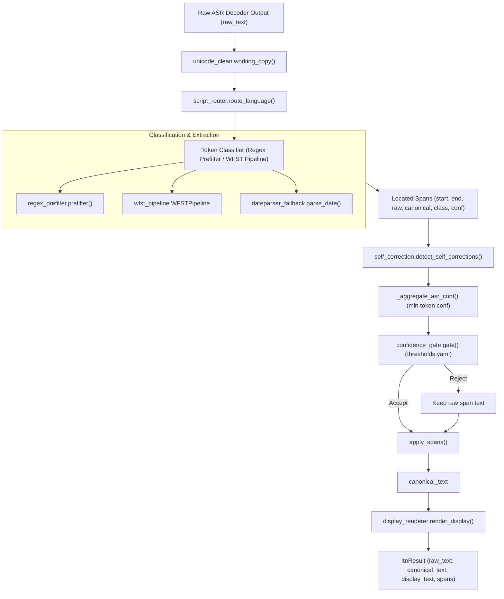

# Inverse Text Normalization (ITN) — Comprehensive Deepdive & Technical Reference

> **Scope:** Architecture, runtime execution pipeline, confidence gating, WFST & regex grammar engines, 11 Indic language grammars, tenant locale policies, dateparser fallbacks, gRPC contract, compilation toolchains, and fail-safe production integration for the Inverse Text Normalization (ITN) service.

---

## 1. Executive Summary & Core Design Invariants

The Inverse Text Normalization (ITN) service transforms verbatim, spoken-form ASR outputs (e.g., *"pandra hazar char sau rupees"*, *"do baje"*, *"dus percent"*) into canonical and formatted written representations (e.g., *"₹15,400"*, *"2:00 PM"*, *"10%"*). 

Designed for high-concurrency Indic voice applications (debt resolution, collection calls, banking workflows), the ITN service enforces five strict system invariants:

1. **Immutable Verbatim Raw Text:** The original transcript (`raw_text`) generated by the ASR decoder is **never modified or discarded**. It is preserved verbatim throughout the pipeline and returned in the output contract.
2. **Zero Non-Deterministic Generation (No LLMs):** Normalization relies strictly on deterministic Weighted Finite-State Transducers (WFSTs) and fast-path regex prefilters. No Generative AI or LLMs are used in the core normalization loop, eliminating hallucination risks.
3. **Lazy FAR Compilation & In-Memory Caching:** Finite-State Archive (FAR) grammar files are compiled ahead of time or loaded lazily on first access and cached in memory per process, avoiding runtime disk I/O and graph construction overheads.
4. **Dual Representation (Canonical vs. Display):** Spans are stored internally using standard Latin digits and ICU-canonical separators (`canonical_text`), while locale-specific rendering (such as Indian numbering formats `₹1,50,000` or Devanagari script preferences) is handled downstream by [`display_renderer.py`](file:///Users/aditya/CredResolve_Production_grade_Streaming_ASR/itn_service/runtime/display_renderer.py).
5. **Zero Allocations on Request Path:** Policy tables ([`configs/thresholds.yaml`](file:///Users/aditya/CredResolve_Production_grade_Streaming_ASR/itn_service/configs/thresholds.yaml), [`configs/locales.yaml`](file:///Users/aditya/CredResolve_Production_grade_Streaming_ASR/itn_service/configs/locales.yaml)) and classifier closures are loaded once at process startup; per-request graph compiling or file reading is strictly forbidden.

---

## 2. End-to-End Pipeline & Architecture

The normalization lifecycle operates on individual text segments arriving either from real-time streaming audio partials or final ASR transcriptions.

### 2.1 Component Flowchart



### 2.2 Execution Stages

1. **Working Copy Normalization ([`unicode_clean.py`](file:///Users/aditya/CredResolve_Production_grade_Streaming_ASR/itn_service/runtime/unicode_clean.py)):** Strips zero-width characters, normalizes Unicode NDFC forms, and normalizes space boundaries on a working copy string. The original `raw_text` remains untouched.
2. **Language Routing ([`script_router.py`](file:///Users/aditya/CredResolve_Production_grade_Streaming_ASR/itn_service/runtime/script_router.py)):** Determines the primary script/language route using `lang_hint` passed from upstream LID (Language Identification) or falls back to IndicLID script classification.
3. **Token Classification ([`normalizer.py`](file:///Users/aditya/CredResolve_Production_grade_Streaming_ASR/itn_service/runtime/normalizer.py)):** Extracts entity candidate spans (`start`, `end`, `class_name`, `canonical`, `confidence`).
4. **Spoken Self-Correction Detection ([`self_correction.py`](file:///Users/aditya/CredResolve_Production_grade_Streaming_ASR/itn_service/runtime/self_correction.py)):** Scans extracted spans for spoken correction markers (*"nahi nahi"*, *"sorry"*, *"no wait"*) and resolves superseding quantities.
5. **Confidence Gating ([`confidence_gate.py`](file:///Users/aditya/CredResolve_Production_grade_Streaming_ASR/itn_service/runtime/confidence_gate.py)):** Evaluates candidate spans against strict confidence thresholds and required lexical cues configured in [`configs/thresholds.yaml`](file:///Users/aditya/CredResolve_Production_grade_Streaming_ASR/itn_service/configs/thresholds.yaml).
6. **Span Splicing:** Replaces accepted spans while preserving un-gated text regions, constructing `canonical_text`.
7. **Display Rendering ([`display_renderer.py`](file:///Users/aditya/CredResolve_Production_grade_Streaming_ASR/itn_service/runtime/display_renderer.py)):** Applies locale-aware formatting rules (e.g., `en_IN` comma grouping `1,50,000` vs `en_US` `150,000`).

---

## 3. Classification & Grammar Engines

The service features a dual-engine architecture: a fast-path **Regex Prefilter** and a multi-lingual **WFST Tagger/Verbalizer Engine**.

### 3.1 Fast-Path Regex Prefilter ([`regex_prefilter.py`](file:///Users/aditya/CredResolve_Production_grade_Streaming_ASR/itn_service/runtime/regex_prefilter.py))

Designed for ultra-fast pattern matching without binary FST overhead. It identifies structural patterns:

* **Cardinals / Numbers:** Standard digit sequences (`12345`).
* **Decimals & Percentages:** Digit patterns with explicit decimal point or percent signs (`10.5%`).
* **Dates & Times:** Standard ISO or slash-separated dates (`12/05/2026`, `14:30`).
* **Financial Compliance IDs:** Fixed-pattern identifiers:
  * **PAN:** `[A-Z]{5}[0-9]{4}[A-Z]{1}`
  * **IFSC Code:** `[A-Z]{4}0[A-Z0-9]{6}`
  * **Aadhaar:** `[0-9]{4}\s[0-9]{4}\s[0-9]{4}`

> [!NOTE]
> Under the default server setup ([`normalizer.default_classifier`](file:///Users/aditya/CredResolve_Production_grade_Streaming_ASR/itn_service/runtime/normalizer.py)), the prefilter operates in passthrough mode (`canonical == raw`), marking entity spans for downstream evaluation.

### 3.2 WFST Pipeline ([`wfst_pipeline.py`](file:///Users/aditya/CredResolve_Production_grade_Streaming_ASR/itn_service/runtime/wfst_pipeline.py))

Built using Google's **Thrax** grammar compiler and **OpenFST / Pynini**:

* **Tagger Transducer (`classify.far`):** Parses spoken-form text into tokenized semantic categories with attributes.
  * *Input:* `"pandra hazar rupees"`
  * *Tagger Output:* `money { integer: "15000" currency: "INR" }`
* **Verbalizer Transducer (`verbalize.far`):** Converts semantic category tokens into normalized canonical written forms.
  * *Verbalizer Output:* `"₹15,000"`

### 3.3 Multilingual Indic Grammar Support ([`itn_service/grammars/`](file:///Users/aditya/CredResolve_Production_grade_Streaming_ASR/itn_service/grammars))

Grammars are organized by language codes in `itn_service/grammars/`:

| Language Code | Language | Supported Entities |
|---|---|---|
| `hi` | Hindi | Currency (Lakh/Crore/Hazar), Time, Dates, Cardinals, Decimals |
| `bn` | Bengali | Currency (Taka/Lakh/Koti), Numbers, Ordinals |
| `gu` | Gujarati | Currency, Financial amounts, Cardinals |
| `kn` | Kannada | Currency, Numbering systems, Time |
| `ml` | Malayalam | Currency, Financial amounts, Ordinals |
| `mr` | Marathi | Currency (Rupaye/Lakh/Koti), Time, Numbers |
| `pa` | Punjabi | Currency, Cardinals, Dates |
| `ta` | Tamil | Currency, Numbers, Time |
| `te` | Telugu | Currency, Financial amounts, Numbers |
| `ur` | Urdu | Currency, Numbers, Dates |
| `common` | Common Shared | Financial IDs (PAN, Aadhaar, IFSC), ISO Dates, Universal symbols |

### 3.4 Indic Financial & Entity Grammars

Specialized rules handle Indian numbering systems and spoken financial terms across Hindi, Hinglish, and English:

| Entity Category | Spoken Input Examples | Canonical Format | Display Format (`en_IN`) |
|---|---|---|---|
| **Currency / Money** | *"dus hazar pachas rupees"* | `10050 INR` | `₹10,050` |
| **Lakh / Crore** | *"ek lakh pachas hazar"* | `150000` | `1,50,000` |
| **Crore** | *"do crore rupees"* | `20000000 INR` | `₹2,00,00,000` |
| **Time** | *"shaam ke char baje"* | `16:00` | `4:00 PM` |
| **Date** | *"pachis december do hazar chhabis"* | `2026-12-25` | `25/12/2026` |
| **PAN Card** | *"ABCDE ek do teen char F"* | `ABCDE1234F` | `ABCDE1234F` |
| **IFSC Code** | *"SBIN zero zero zero ek do teen"* | `SBIN0000123` | `SBIN0000123` |

---

## 4. Confidence Gate & Policy Thresholds

The confidence gate ([`confidence_gate.py`](file:///Users/aditya/CredResolve_Production_grade_Streaming_ASR/itn_service/runtime/confidence_gate.py)) is the **single authority** governing whether a candidate rewrite is applied or rejected in favor of verbatim fallback.

### 4.1 Gate Evaluation Inputs

For every extracted span, the gate checks:
1. `span.conf`: Confidence score emitted by the classifier/rule.
2. `asr_conf`: Aggregated minimum token confidence over the span ([`_aggregate_asr_conf()`](file:///Users/aditya/CredResolve_Production_grade_Streaming_ASR/itn_service/runtime/normalizer.py#L92)).
3. `has_lex_cue`: Presence of explicit class cues (e.g., *"rupees"*, *"baje"*, *"percent"*, *"point"*).
4. `is_partial`: Whether the segment is a non-final streaming hypothesis.
5. `span.ambiguous`: Whether multiple competing grammar parses matched with equal weight.

### 4.2 Threshold Policy Table ([`configs/thresholds.yaml`](file:///Users/aditya/CredResolve_Production_grade_Streaming_ASR/itn_service/configs/thresholds.yaml))

```yaml
# Single source of truth for confidence gating
classes:
  cardinal:
    classifier_min: 0.85
    asr_min: 0.70
    require_lex_cue: false
    defer_on_partial: false

  decimal:
    classifier_min: 0.85
    asr_min: 0.75
    require_lex_cue: true     # Requires "point", "dot", etc.
    defer_on_partial: false

  percent:
    classifier_min: 0.85
    asr_min: 0.75
    require_lex_cue: true     # Requires "percent", "%", "pratishat"
    defer_on_partial: false

  currency / money:
    classifier_min: 0.90
    asr_min: 0.80
    require_lex_cue: true     # Requires "rupees", "INR", "₹"
    defer_on_partial: false

  time:
    classifier_min: 0.90
    asr_min: 0.80
    require_lex_cue: true     # Requires "baje", "AM", "PM", "clock"
    defer_on_partial: true    # Wait for segment finalization

  date:
    classifier_min: 0.90
    asr_min: 0.80
    require_lex_cue: true     # Requires month name / year cue
    defer_on_partial: true    # Wait for segment finalization

  phone / id / health_dose:
    classifier_min: 0.95
    asr_min: 0.85-0.90
    require_lex_cue: true
    defer_on_partial: true
```

> [!IMPORTANT]
> If any threshold check fails (e.g., ASR confidence < `asr_min` or missing required lexical cue), the gate rejects the span rewrite and safely emits the verbatim `raw_text` for that span.

---

## 5. Tenant Locale Policies & Date Fallback

### 5.1 Tenant Locale Policy ([`locale_policy.py`](file:///Users/aditya/CredResolve_Production_grade_Streaming_ASR/itn_service/runtime/locale_policy.py) / [`configs/locales.yaml`](file:///Users/aditya/CredResolve_Production_grade_Streaming_ASR/itn_service/configs/locales.yaml))

Different financial institutions and regions have different date and currency formatting requirements:
* **Day-First Preference (`en_IN`, `hi_IN`):** Interprets ambiguous dates like `05/12/2026` as 5th December 2026.
* **Month-First Preference (`en_US`):** Interprets `05/12/2026` as May 12th, 2026.
* **Currency Symbol Position:** Configures symbol prefixes (`₹100`) vs ISO suffixes (`100 INR`).

### 5.2 Dateparser Fallback ([`dateparser_fallback.py`](file:///Users/aditya/CredResolve_Production_grade_Streaming_ASR/itn_service/runtime/dateparser_fallback.py))

When spoken dates contain complex relative or natural language phrases (e.g., *"agla somvar"*, *"next Tuesday"*):
* Evaluates `has_date_cue()` to ensure explicit time anchors exist.
* Parses relative offsets using deterministic date rules.
* Falls back to raw text if ambiguity is detected.

---

## 6. Gateway gRPC Integration & Fail-Safe Design

The ITN service is exposed via gRPC and consumed asynchronously by the WebSocket Gateway ([`gateway/app/itn_client.py`](file:///Users/aditya/CredResolve_Production_grade_Streaming_ASR/gateway/app/itn_client.py)).

### 6.1 Protobuf Protocol Contract (`itn.proto`)

```protobuf
syntax = "proto3";
package itn;

service ItnService {
  rpc Normalize (NormalizeRequest) returns (NormalizeResponse);
  rpc NormalizeStream (stream NormalizeRequest) returns (stream NormalizeResponse);
}

message NormalizeRequest {
  string text = 1;
  bool is_final = 2;
  string lang_hint = 3;
  string locale_policy = 4;
}

message ItnSpan {
  int32 start = 1;
  int32 end = 2;
  string raw = 3;
  string canonical = 4;
  string class_name = 5;
  float confidence = 6;
}

message NormalizeResponse {
  string raw_text = 1;
  string canonical_text = 2;
  string display_text = 3;
  repeated ItnSpan spans = 4;
  string itn_version = 5;
}
```

### 6.2 Gateway Client Execution ([`gateway/app/itn_client.py`](file:///Users/aditya/CredResolve_Production_grade_Streaming_ASR/gateway/app/itn_client.py))

* **Target Configuration:** Configured via `ITN_GRPC_TARGET` (e.g., `localhost:50051`).
* **Timeout Enforcement:** `ITN_TIMEOUT_MS` (default `250 ms`). Wrapped in `asyncio.wait_for()`.
* **Fail-Open Passthrough:** If ITN experiences a gRPC timeout, network drop, or exception, [`ItnResult.passthrough()`](file:///Users/aditya/CredResolve_Production_grade_Streaming_ASR/gateway/app/itn_client.py#L66) is returned immediately:
  * `raw_text == canonical_text == display_text`
  * `spans = ()`
  * Gateway pipeline continues without returning an error to the end user.

```python
# Fail-safe execution pattern in gateway/app/itn_client.py
try:
    response = await asyncio.wait_for(
        self._normalize_once(raw_text, is_final=is_final, lang_hint=lang_hint),
        timeout=self._timeout_s,
    )
    return ItnResult.from_proto(response, raw_fallback=raw_text)
except (asyncio.TimeoutError, Exception) as err:
    log.warning("ITN normalization failed/timed out (%s); returning raw passthrough", err)
    return ItnResult.passthrough(raw_text, lang_hint=lang_hint)
```

---

## 7. Grammar Compilation & Build Toolchain ([`compile.py`](file:///Users/aditya/CredResolve_Production_grade_Streaming_ASR/itn_service/compile.py))

Thrax grammars (`.grm`) are compiled into binary Finite State Archives (`.far`) using OpenFST and Thrax:

```bash
# Compilation entry point
python -m itn_service.compile --lang hi --out-dir build/fars
```

1. **Rule Parsing:** Reads `.grm` definition files from `grammars/<lang>/`.
2. **Thrax Compilation (`thraxcompiler`):** Compiles high-level regex & FST rules into binary FST graphs.
3. **FAR Archive Construction (`farcompilestring`):** Packs individual tagger (`classify.far`) and verbalizer (`verbalize.far`) state machines into binary FAR archives.

---

## 8. Self-Correction Engine & Stream State

### 8.1 Spoken Self-Correction ([`self_correction.py`](file:///Users/aditya/CredResolve_Production_grade_Streaming_ASR/itn_service/runtime/self_correction.py))

In live collection calls, speakers often correct themselves mid-sentence (e.g., *"dus hazar... nahi nahi, pandra hazar rupees"*).

The self-correction module detects spoken edit patterns (`"nahi"`, `"sorry"`, `"no wait"`, `"correcting"`) and replaces preceding candidate quantities with the revised target:
* *Spoken Input:* `"pandra hazar nahi beas hazar rupees"`
* *Detected Correction:* Target `"pandra hazar"` superseded by `"beas hazar"`
* *Normalized Output:* `"₹20,000"`

### 8.2 Streaming Partial State Machine ([`stream_state.py`](file:///Users/aditya/CredResolve_Production_grade_Streaming_ASR/itn_service/runtime/stream_state.py))

For real-time streaming hypotheses:
* Maintains partial span stability across consecutive frames (`partial_stable_min: 2`).
* Holds back high-risk rewrites (`defer_on_partial: true` for dates, times, phone numbers, IDs) until the final utterance boundary (`is_final = True`).

---

## 9. Gap Analysis & Production Deployment Roadmap

As documented in [`itn_live_path_gap_analysis.md`](file:///Users/aditya/CredResolve_Production_grade_Streaming_ASR/docs/itn_live_path_gap_analysis.md):

| Feature / Subsystem | Current Live Status | Target Production State |
|---|---|---|
| **Gateway Hop** | Fully integrated in [`main.py`](file:///Users/aditya/CredResolve_Production_grade_Streaming_ASR/gateway/app/main.py) via `ItnClient` | Active gRPC hop on `is_final` events |
| **Default Classifier** | Prefilter passthrough (`default_classifier`) | Compiled Thrax/OpenFST WFST Classifier |
| **Confidence Gate** | Active with `thresholds.yaml` | Fine-tuned on real call telemetry |
| **Indic Currency (INR)** | Devanagari & Latin regex prefilter | Full `money` WFST Tagger/Verbalizer |
| **Language Hint Routing** | Preserved from upstream Worker LID | Auto-route to language-specific FARs |

---

## 10. Complete File Inventory & Reference Links

* **ITN Core Normalizer:** [`itn_service/runtime/normalizer.py`](file:///Users/aditya/CredResolve_Production_grade_Streaming_ASR/itn_service/runtime/normalizer.py)
* **Confidence Gate:** [`itn_service/runtime/confidence_gate.py`](file:///Users/aditya/CredResolve_Production_grade_Streaming_ASR/itn_service/runtime/confidence_gate.py)
* **Regex Prefilter:** [`itn_service/runtime/regex_prefilter.py`](file:///Users/aditya/CredResolve_Production_grade_Streaming_ASR/itn_service/runtime/regex_prefilter.py)
* **WFST Pipeline:** [`itn_service/runtime/wfst_pipeline.py`](file:///Users/aditya/CredResolve_Production_grade_Streaming_ASR/itn_service/runtime/wfst_pipeline.py)
* **WFST Classifier:** [`itn_service/runtime/wfst_classifier.py`](file:///Users/aditya/CredResolve_Production_grade_Streaming_ASR/itn_service/runtime/wfst_classifier.py)
* **Display Renderer:** [`itn_service/runtime/display_renderer.py`](file:///Users/aditya/CredResolve_Production_grade_Streaming_ASR/itn_service/runtime/display_renderer.py)
* **Script Router:** [`itn_service/runtime/script_router.py`](file:///Users/aditya/CredResolve_Production_grade_Streaming_ASR/itn_service/runtime/script_router.py)
* **Tenant Locale Policy:** [`itn_service/runtime/locale_policy.py`](file:///Users/aditya/CredResolve_Production_grade_Streaming_ASR/itn_service/runtime/locale_policy.py)
* **Dateparser Fallback:** [`itn_service/runtime/dateparser_fallback.py`](file:///Users/aditya/CredResolve_Production_grade_Streaming_ASR/itn_service/runtime/dateparser_fallback.py)
* **Self-Correction Engine:** [`itn_service/runtime/self_correction.py`](file:///Users/aditya/CredResolve_Production_grade_Streaming_ASR/itn_service/runtime/self_correction.py)
* **gRPC Server:** [`itn_service/service/grpc_server.py`](file:///Users/aditya/CredResolve_Production_grade_Streaming_ASR/itn_service/service/grpc_server.py)
* **Gateway ITN Client:** [`gateway/app/itn_client.py`](file:///Users/aditya/CredResolve_Production_grade_Streaming_ASR/gateway/app/itn_client.py)
* **Threshold Configuration:** [`itn_service/configs/thresholds.yaml`](file:///Users/aditya/CredResolve_Production_grade_Streaming_ASR/itn_service/configs/thresholds.yaml)
* **Locale Configuration:** [`itn_service/configs/locales.yaml`](file:///Users/aditya/CredResolve_Production_grade_Streaming_ASR/itn_service/configs/locales.yaml)
* **Grammar Compiler:** [`itn_service/compile.py`](file:///Users/aditya/CredResolve_Production_grade_Streaming_ASR/itn_service/compile.py)
* **Grammars Directory:** [`itn_service/grammars/`](file:///Users/aditya/CredResolve_Production_grade_Streaming_ASR/itn_service/grammars)
