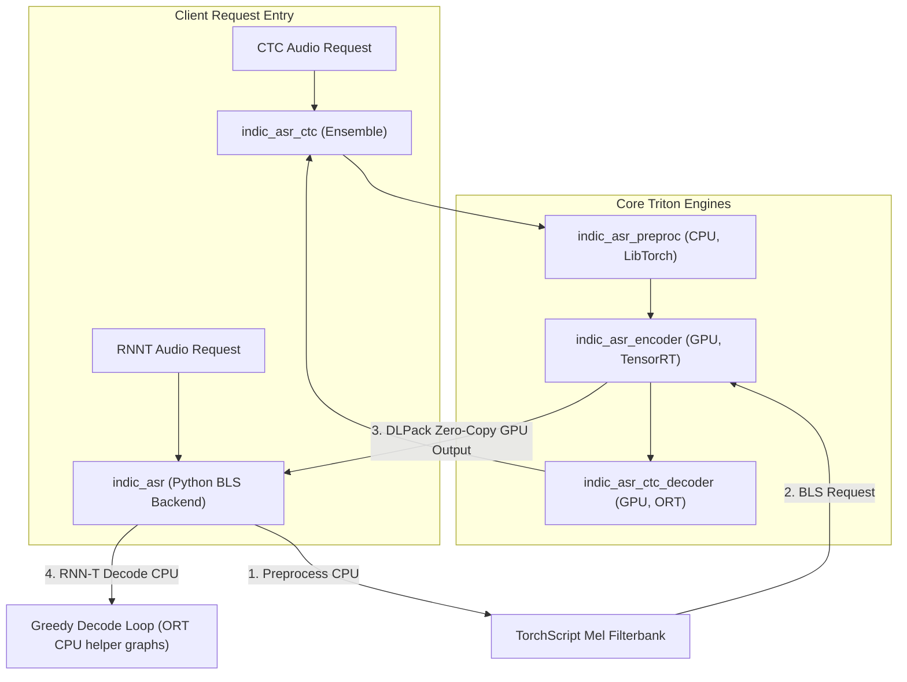

# Triton Business Logic Scripting (BLS) Complete Documentation

This document serves as the comprehensive manual for Triton Inference Server's **Business Logic Scripting (BLS)**. It covers core architectural concepts, detailed Python API syntax, and details the specific production implementation of BLS inside the `CredResolve_Production_grade_Streaming_ASR` codebase.

---

## 1. What is Triton BLS?

**Business Logic Scripting (BLS)** is a powerful feature in NVIDIA Triton Inference Server that enables loaded models to programmatically, dynamically, and efficiently call other models served by the same Triton instance in-process.

Unlike static **Triton Ensembles** (which are defined as static Directed Acyclic Graphs (DAGs) in a `.pbtxt` configuration file), BLS provides full control flow directly in code. This allows for:
* **Loops** (e.g., autoregressive sequence-to-sequence token generation, iterative searches).
* **Conditionals & Branching** (e.g., dynamic model selection based on metadata, confidence metrics, or classification).
* **Dynamic Pre/Postprocessing** (e.g., padding/truncating arrays or routing intermediate outputs).

Triton supports two types of BLS:
1. **Python Backend BLS**: Written in Python using standard PyTorch/NumPy idioms, running in separate Python stub processes managed by Triton. (Flexible, simple, and the focus of this codebase).
2. **C++ Backend BLS**: Written as a custom compiled C++ model backend. (Extremely low latency and minimal overhead, but highly complex to deploy and maintain).

---

## 2. Ensembles vs. Business Logic Scripting (BLS)

| Feature | Triton Ensemble | Business Logic Scripting (BLS) |
| :--- | :--- | :--- |
| **Control Flow** | Static DAG only (no loops, no conditionals). | Dynamic control flow (`while`, `for`, `if-else`). |
| **Definition** | Declarative configuration in `config.pbtxt`. | Imperative Python/C++ code. |
| **Primary Use Case** | Linear pipelines (e.g., `preprocess` -> `inference` -> `postprocess`). | Iterative generation (RNN-T decoder, LLM generation), dynamic routing. |
| **Overhead** | Absolute zero (fully native in Triton C++ core). | Minimal stub-process IPC overhead (Python BLS) or zero (C++ BLS). |
| **Debugging** | Difficult (strictly limited to validation errors). | Native debugging (loggers, standard print lines, and exception stack traces). |

---

## 3. Triton Python BLS API Reference

The Python backend exposes model-to-model requests via `triton_python_backend_utils` (commonly imported as `pb_utils`).

### A. Wrapping Tensors
All variables passed to a target model must be wrapped inside a `pb_utils.Tensor` object alongside a matching target name.
```python
import numpy as np
import triton_python_backend_utils as pb_utils

# Convert NumPy arrays to Triton-compatible Tensors
audio_signal_tensor = pb_utils.Tensor("audio_signal", audio_signal_np)
length_tensor = pb_utils.Tensor("length", length_np)
```

### B. Constructing and Executing the Request
Wrap input tensors in a `pb_utils.InferenceRequest` object, specifying the target model name and requested output names. Execute the request synchronously:
```python
# Construct the request
encoder_request = pb_utils.InferenceRequest(
    model_name="indic_asr_encoder",
    requested_output_names=["outputs", "encoded_lengths"],
    inputs=[audio_signal_tensor, length_tensor]
)

# Execute synchronously in Triton
encoder_response = encoder_request.exec()
```

### C. Checking for Execution Errors
Always verify that the request executed successfully. If it failed, throw a `pb_utils.TritonModelException` to ensure Triton handles the error downstream:
```python
if encoder_response.has_error():
    raise pb_utils.TritonModelException(
        f"BLS request failed: {encoder_response.error().message()}"
    )

# Retrieve the output tensors
outputs_tensor = pb_utils.get_output_tensor_by_name(encoder_response, "outputs")
encoded_lengths_tensor = pb_utils.get_output_tensor_by_name(encoder_response, "encoded_lengths")
```

### D. Zero-Copy DLPack Tensor Sharing
When calling a GPU model (such as a TensorRT engine) via BLS, the output tensor is allocated directly in GPU memory. Copying this memory back to host memory (CPU) is a costly bottleneck. 

To bypass this bottleneck and achieve zero-copy sharing between GPU models and CPU-bound PyTorch/NumPy decoders, utilize **DLPack**:
```python
import torch

def _pb_tensor_to_numpy(tensor, name):
    if tensor is None:
        raise pb_utils.TritonModelException(f"Missing output tensor: {name}")

    # Direct conversion if already on CPU
    try:
        if tensor.is_cpu():
            return tensor.as_numpy()
    except AttributeError:
        return tensor.as_numpy()

    # Move GPU memory zero-copy to PyTorch and detach to host CPU NumPy array
    try:
        torch_tensor = torch.utils.dlpack.from_dlpack(tensor.to_dlpack())
        return torch_tensor.detach().cpu().numpy()
    except Exception as exc:
        raise pb_utils.TritonModelException(
            f"Failed to copy GPU tensor {name!r} to NumPy via DLPack: {exc}"
        ) from exc
```

---

## 4. Architectural Case Study: CredResolve Streaming ASR BLS Design

The ASR pipeline serves two distinct algorithms sharing a heavy GPU-optimized Conformer Encoder:

1. **CTC (Connectionist Temporal Classification)**: Served using a static Triton Ensemble (`indic_asr_ctc`). Linear data path:
   `preprocess (CPU)` → `encoder (GPU TRT)` → `ctc_decoder (GPU ORT)`
2. **RNN-T (Recurrent Neural Network Transducer)**: Requires a data-dependent, frame-by-frame greedy decode loop. Served via `indic_asr` using the Python BLS backend.

### Architectural Solution
Rather than loading duplicate model instances or managing redundant pipelines, `indic_asr` acts as the coordinator. It preprocesses raw audio, makes a **BLS request** to `indic_asr_encoder` on the GPU, intercepts the features zero-copy using DLPack, and feeds them into the RNN-T greedy decode loop on the CPU.

### ASR Pipeline Dataflow Diagram



### Deployed Triton Model Structure
Triton dynamically loads the exact model tree below at startup:
```text
triton/model_repository/
├── indic_asr_preproc/         # TorchScript mel filterbank extraction (CPU)
├── indic_asr_encoder/         # Shared TensorRT Conformer Encoder (GPU)
├── indic_asr_ctc_decoder/     # CTC vocabulary projector and argmax (GPU)
├── indic_asr_ctc/             # CTC Static Ensemble orchestrator
└── indic_asr/                 # RNN-T Python backend (BLS calls indic_asr_encoder)
```

---

## 5. Timing Instrumentation and Performance Monitoring

BLS request crossings cross process boundaries. To track this overhead in production, `indic_asr` implements a sampled `_StageTimer` in `model.py` and `indic_asr_model.py`.

### Measured Stages
* **`preproc`**: Log-mel filterbank extraction (CPU TorchScript).
* **`encoder`**: The **Triton BLS execution block** querying `indic_asr_encoder` (GPU TRT).
* **`decode`**: The RNN-T token greedy decode loop or CTC single-shot argmax.
* **`postproc`**: Vocabulary decoding and text assembly.

### Production Timing Settings (in `docker-compose.triton.yml`)
* `ASR_TIMING_SAMPLE_RATE`: Sample rate for telemetry (e.g. `10` = measure every 10th request). Set to `0` in production to remove all timing overhead.
* `ASR_TIMING_CUDA_SYNC`: `1` = Forces `torch.cuda.synchronize()` before timing boundaries to guarantee true compute measurements instead of async launch delays.

### Sample Telemetry Output
```text
timing audio=4.32s frames=216 tokens=42 lang=hi total=180.5ms | preproc=4.2ms (2%) | encoder=120.3ms (67%) | decode=52.8ms (29%) | postproc=3.2ms (2%)
```

---

## 6. Advanced BLS Best Practices & Gotchas

1. **Avoid Concurrency During Benchmarking**:
   When profiling BLS latency, ensure traffic is run sequentially. Concurrency causes GPU queuing delays inside the target model (`indic_asr_encoder`), which bubbles up as a false increase in the caller's measured BLS timing block.
2. **GPU Memory Allocation Isolation**:
   Keep small helper ONNX graphs (such as CTC projectors and RNN-T Joint nets) pinned to CPU execution (`CPUExecutionProvider`). This leaves the GPU VRAM completely available to the massive Conformer TensorRT plan, avoiding initialization out-of-memory (OOM) failures.
3. **Dynamic Engine Shape Constraints**:
   TensorRT engines tune dynamic execution profiles to strict bounds (e.g., `minShapes`, `optShapes`, `maxShapes`). In your BLS code, ensure preprocessing pads arrays (like padding short audio to at least 100 mel frames) to fit the engine profile and avoid inference validation errors.
4. **Seamless Rollback (The Rollback Lever)**:
   If a GPU TRT plan (`model.plan`) fails numerical parity checks or suffers regressions under stress, you can hot-swap the backend of the BLS target model back to ONNX Runtime (`model.onnx` via CPU/GPU) by changing the `config.pbtxt` of the target model. This provides instant recovery without requiring a deployment restart or modifications to Python BLS files.
