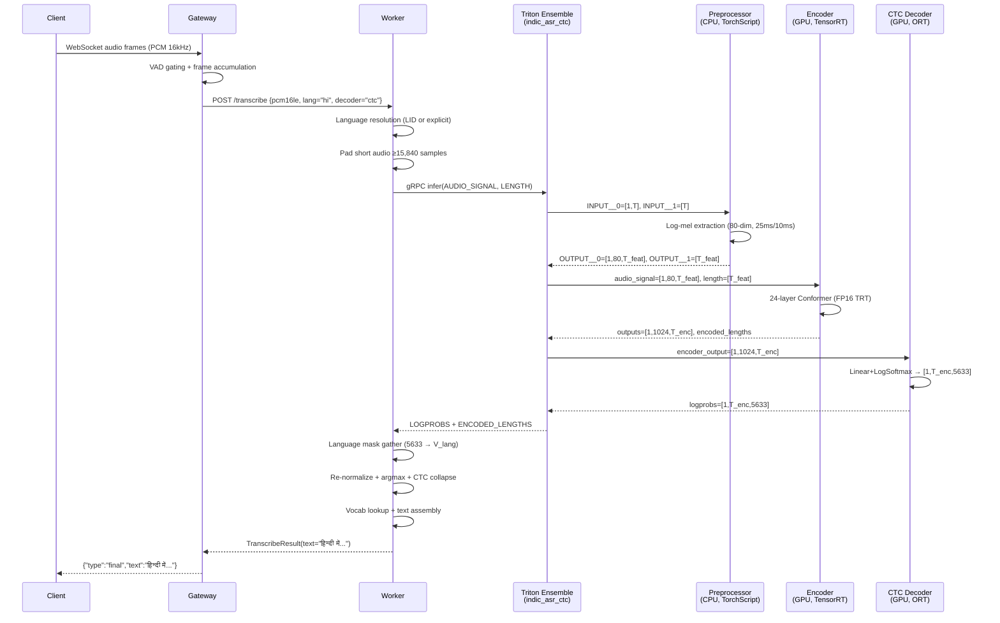
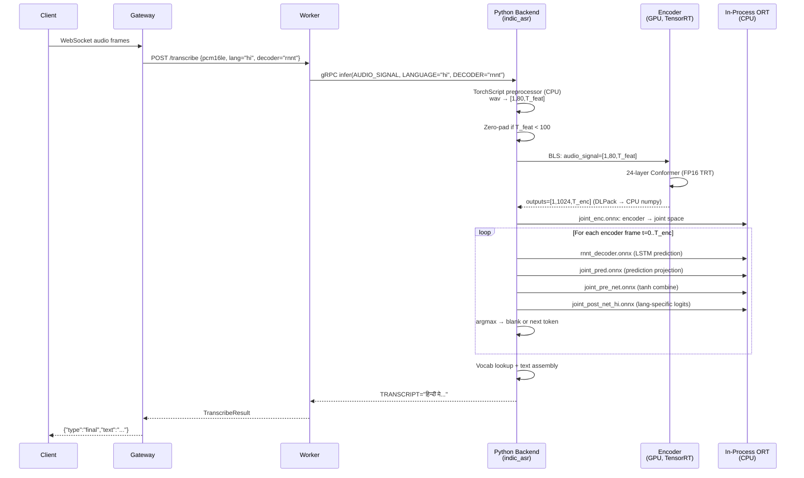

# Complete Flow: IndicConformer-600M Triton ASR Pipeline

> **From raw audio waveform → multilingual native-script transcription**
>
> This document traces every byte of data through the production system, mapping the **conceptual model architecture** to the **actual NVIDIA Triton deployment**, with exact file paths, tensor shapes, and code references.

---

## Architecture Overview

### Conceptual Architecture (What the Model Does)


### Actual Triton Deployment Architecture (How It's Deployed)


---

## System Components Map

| Layer | Conceptual Role | Triton Model | Backend | Device | Key File |
|---|---|---|---|---|---|
| Gateway | WebSocket/HTTP ingress | — | FastAPI | CPU | [main.py](file:///root/CredResolve_Production_grade_Streaming_ASR/gateway/app/main.py) |
| Worker | ASR orchestration client | — | FastAPI | CPU | [triton.py](file:///root/CredResolve_Production_grade_Streaming_ASR/worker/app/triton.py) |
| Orchestrator | BLS coordinator | `indic_asr` | Python | GPU instance | [model.py](file:///root/CredResolve_Production_grade_Streaming_ASR/triton/model_repository/indic_asr/1/model.py) |
| Preprocessor | Log-mel feature extraction | `indic_asr_preproc` | PyTorch/TorchScript | **CPU** | `model.pt` (preprocessor.ts) |
| Encoder | 24-layer Conformer | `indic_asr_encoder` | **TensorRT** | **GPU** | `model.plan` (~2.5 GB) |
| CTC Decoder | CTC logit head | `indic_asr_ctc_decoder` | ONNX Runtime | GPU | `model.onnx` (~23 MB) |
| CTC Ensemble | Preproc→Encoder→CTC pipeline | `indic_asr_ctc` | Ensemble (static) | Mixed | [config.pbtxt](file:///root/CredResolve_Production_grade_Streaming_ASR/triton/model_repository/indic_asr_ctc/config.pbtxt) |
| RNN-T Decoder | Autoregressive decoder | In-process ORT | ONNX Runtime | **CPU** | `rnnt_decoder.onnx`, `joint_*.onnx` |

---

## Complete End-to-End Flow

### ① Client Request (External → Gateway)

```
Client (WebSocket/HTTP)
    │
    │  Raw audio: 16 kHz, mono, 16-bit PCM
    │  + language: "hi" | "ta" | "te" | "bn" | ...
    │  + decoder: "ctc" | "rnnt"
    │
    ▼
┌─────────────────────────────────┐
│   Gateway (FastAPI WebSocket)   │
│   gateway/app/main.py           │
└─────────────────────────────────┘
```

**What happens:** The gateway accepts WebSocket connections, validates API keys, streams audio chunks, applies optional VAD (Voice Activity Detection) to detect speech boundaries, and accumulates PCM frames.

**Key code path** — [gateway/app/main.py](file:///root/CredResolve_Production_grade_Streaming_ASR/gateway/app/main.py):
- Audio arrives as 20ms PCM frames (320 samples × 2 bytes = 640 bytes/frame at 16 kHz)
- Supported codecs: `pcm_s16le`, `pcm_l16`, `pcm_raw`, `wav`
- VAD gating accumulates voiced audio, triggers transcription on speech boundaries
- If 8 kHz audio arrives, it's resampled to 16 kHz via linear interpolation

---

### ② Gateway → Worker (gRPC/HTTP)

```
Gateway
    │
    │  POST /transcribe
    │  Body: { pcm16le bytes, sample_rate, decoder, language, session_id }
    │
    ▼
┌──────────────────────────────────┐
│   Worker (FastAPI REST)          │
│   worker/app/main.py             │
└──────────────────────────────────┘
```

**What happens:** The worker receives accumulated audio from the gateway. It resolves the language (explicit, LID auto-detect, or default), selects the decoder, and routes to the appropriate Triton model.

**Key code path** — [worker/app/main.py:L101-L139](file:///root/CredResolve_Production_grade_Streaming_ASR/worker/app/main.py#L101-L139):

```python
# Backend selection at startup
if ASR_BACKEND == "triton":
    model = TritonIndicASRWorker(
        triton_url=TRITON_URL,              # "triton:8001" (gRPC)
        triton_model_name="indic_asr",       # Python BLS orchestrator
        triton_ctc_model_name="indic_asr_ctc", # Native CTC ensemble
        ...
    )
```

**Two routing paths exist in the worker** — [worker/app/triton.py:L465-L487](file:///root/CredResolve_Production_grade_Streaming_ASR/worker/app/triton.py#L465-L487):

```python
class _TritonDispatchModel:
    """Routes decoding='ctc' to ensemble, other decoders to python-backend."""
    def __call__(self, wav_t, resolved_language, decoding, ...):
        if decoding == "ctc" and self.ctc_model is not None:
            return self.ctc_model(...)   # → indic_asr_ctc ensemble
        return self.fallback_model(...)  # → indic_asr python backend
```

> [!IMPORTANT]
> **CTC requests take the fast path** (native Triton ensemble), while **RNN-T requests use the Python backend** orchestrator which runs in-process ORT sessions for the autoregressive decode loop.

---

### ③ ROUTE A: CTC Path — Native Triton Ensemble

This is the **optimized production path**. The worker calls the `indic_asr_ctc` ensemble directly, and Triton manages the entire preproc → encoder → CTC decoder pipeline internally.

```
Worker (TritonCTCEnsembleClient)
    │
    │  gRPC infer: model="indic_asr_ctc"
    │  AUDIO_SIGNAL: [1, T_samples] FP32
    │  LENGTH: [1] INT64
    │
    ▼
┌──────────────────────────────────────────────────────────────┐
│                  indic_asr_ctc (Ensemble)                    │
│                  platform: "ensemble"                        │
│   config: triton/model_repository/indic_asr_ctc/config.pbtxt│
└──────────────────────────────────────────────────────────────┘
         │                    │                      │
    Step 1              Step 2                 Step 3
         │                    │                      │
         ▼                    ▼                      ▼
```

#### Step 3a: Preprocessing (CPU)

```
┌─────────────────────────────────────────────────┐
│        indic_asr_preproc (TorchScript)          │
│        backend: "pytorch"                        │
│        device: CPU (2 instances)                 │
│        file: model.pt (preprocessor.ts)          │
│                                                  │
│  INPUT__0: [B, T_samples]  FP32  (raw waveform) │
│  INPUT__1: [B]             INT64 (sample count)  │
│                                                  │
│  Function:                                       │
│  ├─ 80-dim mel filterbanks                       │
│  ├─ 25 ms analysis window                        │
│  ├─ 10 ms hop size                               │
│  └─ Log-mel spectrogram extraction               │
│                                                  │
│  OUTPUT__0: [B, 80, T_feat]  FP32 (log-mel)     │
│  OUTPUT__1: [B]              INT64 (feat length) │
└─────────────────────────────────────────────────┘
```

**Config** — [indic_asr_preproc/config.pbtxt](file:///root/CredResolve_Production_grade_Streaming_ASR/triton/model_repository/indic_asr_preproc/config.pbtxt):
- Backend: `pytorch` (TorchScript)
- Device: `KIND_CPU` × 2 instances
- Rationale: Keeps mel-filterbank kernels off GPU to avoid racing with TRT encoder for device memory

> [!NOTE]
> **Conceptual ↔ Deployment mapping:** The conceptual architecture's "Log-Mel Spectrogram Extractor" + "Convolutional Subsampling ×4" are both baked into this single TorchScript module. The ×4 subsampling reduces sequence length and projects features to d=1024 — but this happens inside the TorchScript graph, not as a separate Triton model.

#### Step 3b: Encoder (GPU)

```
┌──────────────────────────────────────────────────────┐
│          indic_asr_encoder (TensorRT)                │
│          backend: "tensorrt"                          │
│          file: model.plan (~2.5 GB)                   │
│          device: GPU × 1 instance                     │
│                                                       │
│  audio_signal: [B, 80, T_feat]  FP32                 │
│  length:       [B]              INT64                 │
│                                                       │
│  Architecture:                                        │
│  ├─ 24 Conformer blocks (layers.0 → layers.23)       │
│  ├─ Each block: FFN → MHA → Conv → FFN (Macaron)     │
│  ├─ Multi-Head Self-Attention (global context)        │
│  ├─ Depthwise Convolution (local patterns)            │
│  └─ FP16/BF16 optimized TensorRT engine               │
│                                                       │
│  outputs:          [B, 1024, T_enc]  FP32             │
│  encoded_lengths:  [B]               INT64            │
│                                                       │
│  ┌──────────────────────────────────────────────┐     │
│  │  Dynamic Shapes Workaround                   │     │
│  │  TRT minShapes profile = audio_signal:1×80×100│    │
│  │  If T_feat < 100 → zero-pad to 100 frames    │     │
│  │  Original length preserved for correct decode │     │
│  └──────────────────────────────────────────────┘     │
└──────────────────────────────────────────────────────┘
```

**Config** — [indic_asr_encoder/config.pbtxt](file:///root/CredResolve_Production_grade_Streaming_ASR/triton/model_repository/indic_asr_encoder/config.pbtxt):
- Backend: `tensorrt` with `default_model_filename: "model.plan"`
- TRT engine build profiles ([build_and_deploy_trt.sh](file:///root/CredResolve_Production_grade_Streaming_ASR/scripts/build_and_deploy_trt.sh#L120-L127)):
  - `minShapes=audio_signal:1x80x100,length:1`
  - `optShapes=audio_signal:1x80x800,length:1`
  - `maxShapes=audio_signal:1x80x3000,length:1`
- External weights: 370 files including `layers.*.weight`, `onnx__MatMul_*`, `onnx__Conv_*`, `pre_encode.*`

> [!NOTE]
> **Conceptual ↔ Deployment mapping:** The conceptual "Indic Conformer Encoder" (L conformer blocks) maps to exactly **24 conformer blocks** in the TRT engine. Each block's Feed-Forward, Multi-Head Attention, and Convolution modules are visible in the external weight files (`layers.N.feed_forward1.*`, `layers.N.conv.pointwise_conv1.*`, etc.).

#### Step 3c: CTC Decoder Head (GPU)

```
┌──────────────────────────────────────────────────┐
│       indic_asr_ctc_decoder (ONNX Runtime)       │
│       backend: "onnxruntime"                      │
│       file: model.onnx (~23 MB)                   │
│       device: GPU × 1 instance                    │
│                                                   │
│  encoder_output: [B, 1024, T_enc]  FP32          │
│                                                   │
│  Function:                                        │
│  ├─ Linear projection: 1024 → 5633               │
│  └─ Log-softmax over full vocabulary              │
│                                                   │
│  logprobs: [B, T_enc, 5633]  FP32                │
│  (unmasked log-probabilities)                     │
└──────────────────────────────────────────────────┘
```

**Config** — [indic_asr_ctc_decoder/config.pbtxt](file:///root/CredResolve_Production_grade_Streaming_ASR/triton/model_repository/indic_asr_ctc_decoder/config.pbtxt):
- Output vocabulary size: **5633 tokens** (shared SentencePiece BPE tokenizer)
- Returns **unmasked** log-probs — language masking happens in the worker

#### Step 3d: Worker-Side CTC Postprocessing (CPU)

After the ensemble returns raw logprobs, the worker performs language-aware decoding:

```
┌──────────────────────────────────────────────────────────────────────────┐
│  Worker CTC Postprocessing (TritonCTCEnsembleClient._postprocess)       │
│  worker/app/triton.py:L401-L462                                         │
│                                                                          │
│  1. Language Mask Gather                                                 │
│     logprobs[:, :, language_masks["hi"]]  →  [B, T_enc, V_lang]         │
│     (Selects only valid tokens for the target language)                  │
│                                                                          │
│  2. Re-normalize (log_softmax over language-filtered vocabulary)          │
│                                                                          │
│  3. Greedy Argmax                                                        │
│     path = logprobs[0, :T].argmax(dim=-1)                               │
│                                                                          │
│  4. CTC Collapse (unique_consecutive + drop blank_id=256)                │
│                                                                          │
│  5. Vocab Lookup + Text Assembly                                         │
│     hyp = "".join([vocab[lang][i] for i in collapsed]).replace("▁"," ") │
│                                                                          │
│  6. (Optional) Word Timestamp Computation                                │
│     Tracks (token, start_frame × 0.08, end_frame × 0.08) tuples         │
└──────────────────────────────────────────────────────────────────────────┘
```

**Key data files** loaded from HuggingFace snapshot:
- `assets/vocab.json` — Per-language token-to-string mappings for 22 Indic languages
- `assets/language_masks.json` — Boolean/index masks filtering the 5633 vocabulary per language

---

### ④ ROUTE B: RNN-T Path — Python Backend BLS Orchestrator

For **RNN-T decoding**, the request goes to the `indic_asr` Python backend model, which coordinates preprocessing, encoder (via BLS), and autoregressive decoding (in-process).

```
Worker (TritonRemoteInferenceModel)
    │
    │  gRPC infer: model="indic_asr"
    │  AUDIO_SIGNAL: [1, T_samples] FP32
    │  LANGUAGE: "hi"  (BYTES)
    │  DECODER: "rnnt"  (BYTES)
    │
    ▼
┌──────────────────────────────────────────────────────────────────────┐
│                   indic_asr (Python Backend)                        │
│    triton/model_repository/indic_asr/1/model.py  →  TritonPythonModel│
│    Loads: indic_asr_model.py  →  IndicASRModel                      │
│    instance_group: KIND_GPU × 1                                      │
└──────────────────────────────────────────────────────────────────────┘
```

**Initialization** — [model.py:L132-L173](file:///root/CredResolve_Production_grade_Streaming_ASR/triton/model_repository/indic_asr/1/model.py#L132-L173):
1. Downloads HuggingFace model snapshot (`ASR_MODEL_NAME`)
2. Loads vendored [indic_asr_model.py](file:///root/CredResolve_Production_grade_Streaming_ASR/triton/model_repository/indic_asr/1/indic_asr_model.py) (not the HF upstream `model_onnx.py`)
3. Creates `IndicASRModel` with TorchScript preprocessor + in-process ORT sessions
4. Forces preprocessor to CPU

**Execution** — [model.py:L175-L253](file:///root/CredResolve_Production_grade_Streaming_ASR/triton/model_repository/indic_asr/1/model.py#L175-L253):
1. Extracts `AUDIO_SIGNAL`, `LANGUAGE`, `DECODER` from request
2. Normalizes audio to FP32 rank-2
3. Calls `self.model(wav_t, language, decoding=decoder)` inside `torch.inference_mode()`
4. Returns `TRANSCRIPT` + `TIMESTAMPS_JSON`

#### Step 4a: Preprocessing (CPU, in-process)

```python
# indic_asr_model.py:L130-L154
audio_signal, length = self.models['preprocessor'](
    input_signal=wav.to(self.d),          # self.d = torch.device('cpu')
    length=torch.tensor([wav.shape[-1]]),
)
# → audio_signal: [B, 80, T_feat] FP32
# → length: [B] INT64
```

Same TorchScript `preprocessor.ts` as the ensemble path, but executed **in-process** rather than via Triton's pytorch backend.

#### Step 4b: Encoder (GPU, via BLS)

```python
# indic_asr_model.py:L156-L182
encoder_request = pb_utils.InferenceRequest(
    model_name='indic_asr_encoder',    # BLS call to TRT encoder
    requested_output_names=['outputs', 'encoded_lengths'],
    inputs=[
        pb_utils.Tensor('audio_signal', audio_signal_np),  # [B, 80, T_feat]
        pb_utils.Tensor('length', length_np),               # [B]
    ],
)
encoder_response = encoder_request.exec()   # Synchronous BLS execution
# → outputs: [B, 1024, T_enc] FP32
# → encoded_lengths: [B] INT64
```

> [!IMPORTANT]
> **BLS (Business Logic Scripting)** is Triton's mechanism for one Python backend model to call another model within the same server process. The encoder runs on GPU via TensorRT; results are copied to CPU (via DLPack → torch → numpy) for the ORT decode sessions.

**Padding workaround** — [indic_asr_model.py:L141-L152](file:///root/CredResolve_Production_grade_Streaming_ASR/triton/model_repository/indic_asr/1/indic_asr_model.py#L141-L152):
```python
_ENCODER_MIN_FRAMES = 100
if feature_frames < _ENCODER_MIN_FRAMES:
    audio_signal_np = np.pad(
        audio_signal_np,
        ((0,0), (0,0), (0, _ENCODER_MIN_FRAMES - feature_frames)),
        mode='constant',
    )
# length_np stays untouched → decode/timestamps reflect original duration
```

#### Step 4c: RNN-T Greedy Decode (CPU, in-process ORT)

```python
# indic_asr_model.py:L273-L329
# All ONNX sessions run on CPUExecutionProvider

# 1. Joint encoder projection
joint_enc = self.models['joint_enc'].run(
    ['output'], {'input': encoder_outputs.transpose(0, 2, 1)}
)[0]  # → [B, T_enc, joint_dim]

# 2. Autoregressive greedy loop
hyp = [SOS=5632]  # Start-of-sequence token
for t in range(T_enc):
    f = joint_enc[:, t, :]  # Encoder frame at time t
    
    while not_blank and symbols_added < RNNT_MAX_SYMBOLS(=10):
        # 2a. Prediction network (2-layer LSTM, hidden=640)
        g, _, dec_state = self.models['rnnt_decoder'].run(...)
        
        # 2b. Joint prediction projection
        g = self.models['joint_pred'].run(['output'], {'input': g})[0]
        
        # 2c. Joint network (tanh activation)
        joint_out = f + g
        joint_out = self.models['joint_pre_net'].run(
            ['output'], {'input': joint_out}
        )[0]
        
        # 2d. Language-specific post-net
        logits = self.models[f'joint_post_net_{lang}'].run(
            ['output'], {'input': joint_out}
        )[0]
        
        # 2e. Greedy argmax
        pred_token = logits.log_softmax(dim=-1).argmax()
        if pred_token == BLANK_ID(=256):
            not_blank = False  # Move to next encoder frame
        else:
            hyp.append(pred_token)
```

**In-process ORT sessions** — [indic_asr_model.py:L32-L38](file:///root/CredResolve_Production_grade_Streaming_ASR/triton/model_repository/indic_asr/1/indic_asr_model.py#L32-L38):

| ONNX Component | File | Purpose |
|---|---|---|
| `ctc_decoder` | `ctc_decoder.onnx` | CTC logit head (used when decoder=ctc) |
| `rnnt_decoder` | `rnnt_decoder.onnx` | 2-layer LSTM prediction network |
| `joint_enc` | `joint_enc.onnx` | Projects encoder output into joint space |
| `joint_pred` | `joint_pred.onnx` | Projects prediction network output into joint space |
| `joint_pre_net` | `joint_pre_net.onnx` | Pre-net (tanh activation) combining enc + pred |
| `joint_post_net_{lang}` | `joint_post_net_hi.onnx`, etc. | 22 language-specific output projection heads |

> [!NOTE]
> **Why CPU for RNN-T decode?** The autoregressive loop has high control-flow overhead (Python `while` loop per frame × per token). Running the small ONNX sessions on CPU avoids CUDA context pressure and GPU memory bloat from many small kernel launches. The encoder (the actual compute bottleneck) stays on GPU.

#### Step 4d: Text Assembly

```python
# CTC path:
hyp = ''.join([
    self.vocab[lang][x] for x in collapsed_indices 
    if x != BLANK_ID
]).replace('▁', ' ').strip()

# RNNT path:
pred_text = ''.join([
    self.vocab[lang][x] for x in hyp 
    if x != SOS
]).replace('▁', ' ').strip()
```

---

### ⑤ Output Flow (Triton → Worker → Gateway → Client)

```
Triton
    │
    │  TRANSCRIPT: "हिन्दी में बात कर रहे हैं"
    │  TIMESTAMPS_JSON: [["हिन्दी", 0.24, 0.72], ...]
    │
    ▼
Worker
    │
    │  TranscribeResult(text=..., language=..., word_timestamps=...)
    │
    ▼
Gateway
    │
    │  WebSocket JSON: {
    │    "type": "final",
    │    "text": "हिन्दी में बात कर रहे हैं",
    │    "language": "hi",
    │    "timestamps": [...]
    │  }
    │
    ▼
Client
```

---

## Detailed Data Flow Diagrams

### CTC Path (Optimized)



### RNN-T Path (Python Backend)



---

## Deployment Infrastructure

### Docker Compose Stack

Defined in [docker-compose.triton.yml](file:///root/CredResolve_Production_grade_Streaming_ASR/docker-compose.triton.yml):

```yaml
services:
  triton:
    image: nvcr.io/nvidia/tritonserver:25.04-py3  # Base image
    volumes:
      - ./triton/model_repository:/models          # Bind-mount model repo
    ports:
      - "8100:8000"   # HTTP
      - "8101:8001"   # gRPC (worker connects here)
      - "8102:8002"   # Metrics
    deploy:
      resources:
        reservations:
          devices:
            - driver: nvidia
              device_ids: ["0"]
              capabilities: ["gpu"]

  worker:
    environment:
      - ASR_BACKEND=triton
      - TRITON_URL=triton:8001           # gRPC endpoint
      - TRITON_MODEL_NAME=indic_asr      # Python BLS (RNNT)
      - TRITON_MODEL_NAME_CTC=indic_asr_ctc  # Native ensemble (CTC)
    depends_on:
      triton:
        condition: service_healthy
```

### Triton Container

[Dockerfile](file:///root/CredResolve_Production_grade_Streaming_ASR/triton/Dockerfile):
- Base: `nvcr.io/nvidia/tritonserver:25.04-py3`
- Python deps: `torch==2.4.1`, `onnxruntime-gpu==1.20.1`, `huggingface_hub`, `transformers`
- Model repo mounted at `/models`
- Startup: `tritonserver --model-repository=/models --model-control-mode=none --strict-readiness=true`

### TensorRT Engine Build

[build_and_deploy_trt.sh](file:///root/CredResolve_Production_grade_Streaming_ASR/scripts/build_and_deploy_trt.sh) — Automated deploy validation gate:

1. **Build** candidate TRT engine from `model.onnx` using `trtexec`
2. **Swap** into live model repository
3. **Restart** Triton and wait for readiness
4. **Validate** with known speech fixtures (both RNNT and CTC decoders)
5. **Revert** if validation fails, **promote** if all checks pass

```bash
trtexec \
  --onnx=/models/indic_asr_encoder/1/model.onnx \
  --noTF32 \                                    # Safe FP32 baseline
  --minShapes=audio_signal:1x80x100,length:1 \  # Min 100 frames
  --optShapes=audio_signal:1x80x800,length:1 \  # Optimal ~6s audio
  --maxShapes=audio_signal:1x80x3000,length:1 \ # Max ~24s audio
  --memPoolSize=workspace:4096 \
  --saveEngine=/models/indic_asr_encoder/1/model.plan
```

---

## Key Design Decisions

### CPU/GPU Split Rationale

| Component | Device | Why |
|---|---|---|
| Preprocessor | CPU | Avoid duplicating mel-filterbank kernels on GPU; memory stable |
| Encoder | GPU (TRT) | Compute-intensive; 24 conformer layers benefit massively from GPU parallelism |
| CTC Decoder | GPU (ORT) | Small linear projection, runs on GPU in native ensemble for data locality |
| RNN-T Decoder | CPU (ORT) | Autoregressive Python `while` loop; many small kernel launches would thrash CUDA context |
| Language Masking | CPU (Worker) | Stateful (per-language mask tables); avoids pulling vocab state into Triton |

### Two Decoder Architecture

The model is a **hybrid CTC/RNN-T** architecture with two parallel decoder heads:

| Property | CTC Head | RNN-T Head |
|---|---|---|
| Type | Auxiliary | Primary |
| Speed | **Fast** (single pass) | Slower (autoregressive loop) |
| Quality | Good | **Better** (context-aware) |
| Triton Path | Native ensemble (`indic_asr_ctc`) | Python BLS (`indic_asr`) |
| GPU Usage | Encoder + CTC head on GPU | Encoder on GPU, decode on CPU |
| Timestamps | ✅ Frame-level word timestamps | ❌ Not implemented |

### Language Conditioning

The model supports **22 Indic languages** via:

1. **Per-language vocabulary masks** (`language_masks.json`): Filter the 5633-token shared vocabulary to valid tokens for each language
2. **Per-language joint post-nets** (RNN-T only): 22 separate `joint_post_net_{lang}.onnx` files, each projecting into the language-specific token space
3. **Shared SentencePiece BPE tokenizer**: 32K vocabulary spanning Indic scripts + English with byte fallback for code-switching

---

## Timing & Observability

The Python backend includes built-in profiling — [model.py:L19-L78](file:///root/CredResolve_Production_grade_Streaming_ASR/triton/model_repository/indic_asr/1/model.py#L19-L78):

```
timing audio=3.50s frames=109 tokens=14 lang=hi total=287.3ms
  | preproc=12.1ms (4%) | encoder=198.7ms (69%) | decode=71.2ms (25%) | postproc=0.3ms (0%)
```

Controlled by:
- `ASR_TIMING_SAMPLE_RATE=10` — Log 1 in 10 requests
- `ASR_TIMING_CUDA_SYNC=1` — Force CUDA sync for accurate GPU timing

Worker-level Prometheus metrics:
- `triton_infer_latency_seconds` — Per-model, per-protocol inference latency
- Circuit breaker state tracking per Triton model

---

## File Index

### Triton Model Repository

| Path | Purpose |
|---|---|
| [indic_asr/config.pbtxt](file:///root/CredResolve_Production_grade_Streaming_ASR/triton/model_repository/indic_asr/config.pbtxt) | Python BLS orchestrator config |
| [indic_asr/1/model.py](file:///root/CredResolve_Production_grade_Streaming_ASR/triton/model_repository/indic_asr/1/model.py) | Triton Python backend entry point |
| [indic_asr/1/indic_asr_model.py](file:///root/CredResolve_Production_grade_Streaming_ASR/triton/model_repository/indic_asr/1/indic_asr_model.py) | Vendored model logic (BLS encoder + in-process ORT decode) |
| [indic_asr_preproc/config.pbtxt](file:///root/CredResolve_Production_grade_Streaming_ASR/triton/model_repository/indic_asr_preproc/config.pbtxt) | TorchScript preprocessor config |
| [indic_asr_encoder/config.pbtxt](file:///root/CredResolve_Production_grade_Streaming_ASR/triton/model_repository/indic_asr_encoder/config.pbtxt) | TensorRT encoder config |
| [indic_asr_ctc_decoder/config.pbtxt](file:///root/CredResolve_Production_grade_Streaming_ASR/triton/model_repository/indic_asr_ctc_decoder/config.pbtxt) | CTC decoder head config |
| [indic_asr_ctc/config.pbtxt](file:///root/CredResolve_Production_grade_Streaming_ASR/triton/model_repository/indic_asr_ctc/config.pbtxt) | Native CTC ensemble (preproc→encoder→ctc) |

### Worker

| Path | Purpose |
|---|---|
| [worker/app/triton.py](file:///root/CredResolve_Production_grade_Streaming_ASR/worker/app/triton.py) | Triton client: dispatch, CTC ensemble client, postprocessing |
| [worker/app/model.py](file:///root/CredResolve_Production_grade_Streaming_ASR/worker/app/model.py) | Base worker model, LID, audio resampling |
| [worker/app/config.py](file:///root/CredResolve_Production_grade_Streaming_ASR/worker/app/config.py) | All environment variable configuration |
| [worker/app/main.py](file:///root/CredResolve_Production_grade_Streaming_ASR/worker/app/main.py) | FastAPI endpoints, model initialization |

### Infrastructure

| Path | Purpose |
|---|---|
| [docker-compose.triton.yml](file:///root/CredResolve_Production_grade_Streaming_ASR/docker-compose.triton.yml) | Triton service definition |
| [triton/Dockerfile](file:///root/CredResolve_Production_grade_Streaming_ASR/triton/Dockerfile) | Triton container build |
| [scripts/build_and_deploy_trt.sh](file:///root/CredResolve_Production_grade_Streaming_ASR/scripts/build_and_deploy_trt.sh) | TRT engine build + validation gate |
