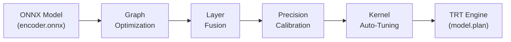
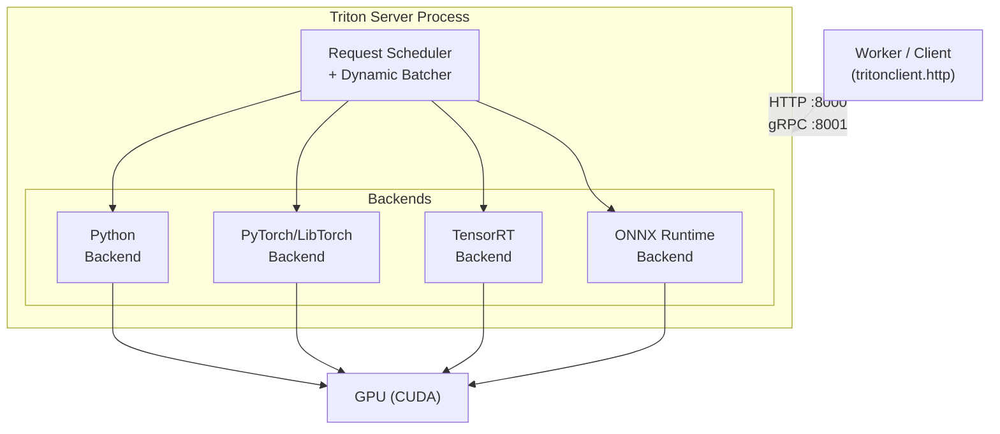
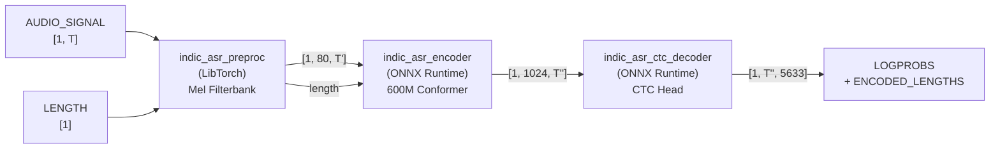
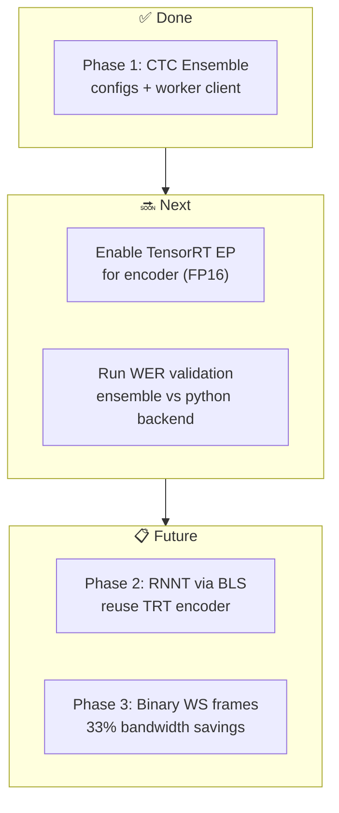

# Triton TensorRT Notes

> Contextualized to your **IndicConformer 600M Streaming ASR** pipeline.

---

## Part 1: NVIDIA TensorRT

### What is TensorRT?

TensorRT (TRT) is NVIDIA's **inference-only compiler and runtime** for deep learning models. It takes a trained model (ONNX, PyTorch, TensorFlow) and produces a hyper-optimized GPU **engine** (`.plan` file) that runs 2–10× faster than the original framework.

> [!IMPORTANT]
> TensorRT is **not** for training. It is purely an inference optimizer. You train in PyTorch/NeMo, export to ONNX, then compile to TRT.

### How TensorRT Optimizes — The 5 Key Stages



#### 1. Graph Optimization
- Removes dead branches, folds constants, eliminates identity ops
- Simplifies the computation graph without changing math

#### 2. Layer/Kernel Fusion
The **biggest win**. TRT fuses multiple ops into single GPU kernels:

```
Before (PyTorch/ONNX):          After (TRT):
┌──────────┐                    ┌─────────────────────┐
│ Conv1D   │                    │                     │
├──────────┤                    │  Fused Conv+BN+ReLU │
│ BatchNorm│        →           │  (single kernel)    │
├──────────┤                    │                     │
│ ReLU     │                    └─────────────────────┘
└──────────┘
```

Without fusion: 3 kernel launches, 3 memory read/writes.
With fusion: 1 kernel launch, 1 memory read/write. **Memory bandwidth is the #1 bottleneck on GPUs.**

#### 3. Precision Calibration (FP32 → FP16 / INT8)

| Precision | Bits | Speed vs FP32 | Accuracy Loss |
|-----------|------|---------------|---------------|
| FP32      | 32   | 1×            | None          |
| FP16      | 16   | ~2×           | Negligible    |
| INT8      | 8    | ~4×           | Needs calibration dataset |

For your encoder, FP16 is the sweet spot — see the commented block in your [config.pbtxt](file:///home/ubuntu/CredResolve_Production_grade_Streaming_ASR/triton/model_repository/indic_asr_encoder/config.pbtxt#L53-L65).

#### 4. Kernel Auto-Tuning
TRT benchmarks **hundreds of kernel implementations** for each layer on **your specific GPU** and picks the fastest. This is why:
- TRT engines are **GPU-specific** (an engine built on T4 won't work on A100)
- First build takes minutes (it's profiling)
- Subsequent loads are instant (cached)

#### 5. Engine Serialization
The output is a `.plan` file — a binary blob containing fused kernels, memory layouts, and execution schedule. This is what Triton loads.

### Your Encoder Through TRT

Your 600M conformer encoder is the prime TRT candidate:

```bash
# Build command (inside Triton container)
trtexec \
  --onnx=/models/indic_asr_encoder/1/model.onnx \
  --fp16 \
  --minShapes=audio_signal:1x80x100,length:1 \
  --optShapes=audio_signal:1x80x800,length:1 \
  --maxShapes=audio_signal:1x80x3000,length:1 \
  --saveEngine=/models/indic_asr_encoder/1/model.plan
```

The `--minShapes/--optShapes/--maxShapes` handle **dynamic input lengths** (audio varies from 1s to 30s). TRT builds optimized paths for each shape range.

---

## Part 2: NVIDIA Triton Inference Server

### What is Triton?

Triton is a **production inference server** that:
- Serves models over HTTP/gRPC
- Supports multiple frameworks (ONNX, TensorRT, PyTorch, TensorFlow, Python)
- Handles batching, scheduling, GPU memory, and model versioning
- Runs multiple models concurrently on the same GPU

### Architecture



### Model Repository — Your Layout

Triton discovers models from a **model repository** directory:

```
triton/model_repository/
├── indic_asr/                    ← Python backend (RNNT + legacy CTC)
│   ├── config.pbtxt
│   └── 1/
│       ├── model.py              ← TritonPythonModel class
│       └── indic_asr_model.py    ← Vendored ASR logic
├── indic_asr_preproc/            ← LibTorch backend (mel filterbank)
│   ├── config.pbtxt
│   └── 1/
│       └── model.pt              ← TorchScript preprocessor
├── indic_asr_encoder/            ← ONNX Runtime backend (600M encoder)
│   ├── config.pbtxt
│   └── 1/
│       ├── model.onnx            ← Encoder graph
│       └── layers.*              ← External weight blobs
├── indic_asr_ctc_decoder/        ← ONNX Runtime backend (CTC head)
│   ├── config.pbtxt
│   └── 1/
│       └── model.onnx
└── indic_asr_ctc/                ← Ensemble (wires the above 3)
    └── config.pbtxt
```

Each model has:
- `config.pbtxt` — declares backend, inputs/outputs, instance groups, batching
- `1/` — version 1 of the model artifact

### The config.pbtxt Anatomy

Using your encoder as example:

```protobuf
name: "indic_asr_encoder"        # Model name (matches directory)
backend: "onnxruntime"            # Which backend loads this
default_model_filename: "model.onnx"
max_batch_size: 0                 # 0 = model manages its own batch dim

input [
  { name: "audio_signal"  data_type: TYPE_FP32  dims: [-1, 80, -1] },
  { name: "length"        data_type: TYPE_INT64  dims: [-1] }
]

output [
  { name: "outputs"          data_type: TYPE_FP32  dims: [-1, 1024, -1] },
  { name: "encoded_lengths"  data_type: TYPE_INT64  dims: [-1] }
]

instance_group [
  { kind: KIND_GPU  count: 1 }   # 1 instance on GPU
]
```

### Backends — What Runs Your Model

| Backend | Loads | Used For (in your project) |
|---------|-------|---------------------------|
| `onnxruntime` | `.onnx` files | Encoder, CTC decoder |
| `pytorch` (libtorch) | `.pt` TorchScript | Mel preprocessor |
| `tensorrt` | `.plan` engines | Encoder (future, FP16) |
| `python` | `model.py` class | Full RNNT pipeline (legacy) |

### Ensemble Scheduling — Your CTC Pipeline

Your [indic_asr_ctc](file:///home/ubuntu/CredResolve_Production_grade_Streaming_ASR/triton/model_repository/indic_asr_ctc/config.pbtxt) ensemble wires 3 models into a single logical inference call:



Triton handles all intermediate tensor passing **in GPU memory** — no CPU round-trips between steps. This is a major win over the Python backend approach.

### Dynamic Batching

When multiple requests arrive simultaneously, Triton can batch them:

```
Request 1 (audio 2s)  ─┐
Request 2 (audio 5s)  ─┤──→  Batched [2, 80, T_max]  ──→  Single GPU kernel
Request 3 (audio 3s)  ─┘
```

Config: `dynamic_batching { preferred_batch_size: [1,2,4], max_queue_delay_microseconds: 1500 }`

---

## Part 3: The Full Inference Data Flow

### End-to-End: Browser → Transcript

```mermaid
sequenceDiagram
    participant Browser
    participant Gateway
    participant Worker
    participant Triton
    participant GPU

    Browser->>Gateway: WebSocket (JSON + base64 audio)
    Gateway->>Worker: Forward audio chunks
    Worker->>Worker: Accumulate audio buffer
    
    Note over Worker: When enough audio accumulated:
    
    Worker->>Triton: HTTP POST /v2/models/indic_asr_ctc/infer<br/>(binary audio tensor + length)
    
    rect rgb(40, 40, 60)
        Note over Triton,GPU: Inside Triton (all on GPU)
        Triton->>GPU: Step 1: Preproc (mel spectrogram)
        GPU-->>Triton: [1, 80, T']
        Triton->>GPU: Step 2: Encoder (600M conformer)
        GPU-->>Triton: [1, 1024, T'']
        Triton->>GPU: Step 3: CTC decoder head
        GPU-->>Triton: logprobs [1, T'', 5633]
    end
    
    Triton-->>Worker: logprobs + encoded_lengths
    Worker->>Worker: Language mask → argmax → dedup → vocab lookup
    Worker-->>Gateway: Transcript text
    Gateway-->>Browser: WebSocket JSON response
```



### What Happens at Each Stage

#### Stage 1: Audio Preprocessing (Mel Filterbank)
- **Input**: Raw waveform `[1, T_samples]` at 16kHz
- **Operation**: Short-Time Fourier Transform → 80-bin mel spectrogram
- **Output**: `[1, 80, T_frames]` — 80 mel features per time frame
- **Runs on**: CPU (TorchScript)

#### Stage 2: Encoder (Conformer)
- **Input**: Mel spectrogram `[1, 80, T_frames]`
- **Operation**: 600M parameter Conformer network (self-attention + convolution blocks)
- **Output**: `[1, 1024, T_encoded]` — 1024-dim encoding per output frame
- **Runs on**: GPU (ONNX Runtime / future: TensorRT FP16)
- **This is 90%+ of compute time**

#### Stage 3: CTC Decoder Head
- **Input**: Encoder output `[1, 1024, T_encoded]`
- **Operation**: Linear projection to vocabulary logits
- **Output**: `[1, T_encoded, 5633]` — log-probabilities over 5633 tokens
- **Runs on**: GPU

#### Stage 4: Post-processing (in Worker, not Triton)
Done in [worker/app/triton.py](file:///home/ubuntu/CredResolve_Production_grade_Streaming_ASR/worker/app/triton.py#L238-L258):

```python
# 1. Apply language mask (e.g., keep only Hindi tokens)
mask = self.language_masks[language]        # e.g., 257 Hindi token indices
masked = logprobs[:, :, mask]              # [1, T, 257]

# 2. Log-softmax over masked vocab
masked_t = torch.from_numpy(masked).log_softmax(dim=-1)

# 3. Greedy argmax
path = masked_t[0][:T].argmax(dim=-1)     # [T] token IDs

# 4. CTC collapse (remove consecutive duplicates + blanks)
collapsed = torch.unique_consecutive(path)
tokens = [vocab[i] for i in collapsed if i != BLANK_ID]

# 5. Detokenize
text = "".join(tokens).replace("▁", " ").strip()
```

---

## Part 4: Why This Architecture?

### Python Backend (Current RNNT) vs Native Backends (CTC Ensemble)

| Aspect | Python Backend | Native Ensemble |
|--------|---------------|-----------------|
| Encoder execution | ORT session inside Python | Triton-managed ORT/TRT |
| Data between steps | CPU `.numpy()` round-trips | GPU memory (zero-copy) |
| GIL contention | Yes (Python) | No (C++ backends) |
| Dynamic batching | Manual | Triton-managed |
| Estimated speedup | Baseline | 1.3–2.5× |

### Why RNNT Can't Be an Ensemble

RNNT has a **data-dependent loop**: for each time frame, it emits tokens until it predicts `<blank>`. The number of iterations varies per frame. Triton ensembles are **static DAGs** — they can't express loops. So RNNT stays on the Python backend but reuses the TRT-optimized encoder via BLS (Business Logic Scripting = internal model-to-model calls).

### TensorRT vs ONNX Runtime on GPU

| | ONNX Runtime (CUDA EP) | TensorRT |
|---|---|---|
| Setup | Drop in `.onnx`, works | Build `.plan` per GPU |
| Speed | Good | ~2× faster (FP16) |
| Portability | Any CUDA GPU | GPU-specific engine |
| Dynamic shapes | Native | Needs shape profiles |
| Recommended for | Dev/test, fallback | Production at scale |

---

## Part 5: Key Concepts Glossary

| Term | Meaning |
|------|---------|
| **Engine / Plan** | TRT's compiled binary — fused kernels for a specific GPU |
| **Backend** | Triton plugin that knows how to load+run a model format |
| **Ensemble** | Virtual model that chains real models in a DAG |
| **BLS** | Business Logic Scripting — Python backend calling other Triton models |
| **EP (Execution Provider)** | ORT's abstraction for hardware targets (CUDA EP, TRT EP, CPU EP) |
| **Dynamic Batching** | Triton combines concurrent requests into one batch |
| **Instance Group** | How many copies of a model to load (and on which device) |
| **Model Repository** | Directory structure Triton scans to discover models |
| **External Tensors** | ONNX weights stored as separate files (your `layers.*` blobs) |
| **Opset** | ONNX operator version; your models use opset 16–17 |

---

## Part 6: Your Current State & Next Steps



**Immediate action**: Deploy the CTC ensemble inside the Triton container, copy model artifacts per the [deploy runbook](triton_native_serving_plan.md#deploy-runbook), validate WER parity, then enable TRT EP for the encoder.
